# Fixly — Production System Design

**Product:** On-demand home maintenance platform (Electricity, Plumbing, AC, Painting, Furniture)
**Market:** Jordan (Amman) → KSA, Egypt, UAE
**Author:** System Architecture
**Version:** 1.13
**Status:** Implementation-ready (MVP / Phase 1)

**Version history** (one line per version — full narratives preserved verbatim in **Appendix B**):

| v | Theme |
|---|---|
| 1.1 | Review fixes: outbox, race-safe ledger, optimistic locking, idempotent capture, backups/DR, PII encryption |
| 1.2 | Right-sizing + locked decisions: Skip single codebase, Twilio→WhatsApp OTP, HyperPay hosted checkout, Fargate-only infra |
| 1.3 | Lowest-cost infra (Cloudflare + one Graviton box + RDS micro), Google Maps both platforms, clean/hexagonal architecture |
| 1.4 | §16 free local dev tier ($0 end-to-end) + §14 Tier-0 free hosting |
| 1.5 | Business alignment: trust tiers + vetting, extra-work gate, anti-disintermediation, SLA + late compensation, subscription, quotes |
| 1.6 | §17 MVP operating model: 5 fatal risks, Fixly Certified, SOPs, Ops Console, policies, KPIs, GTM, legal, readiness checklist |
| 1.7 | Existential decision #4 — scope & materials integrity: fixed_scope vs quote_first, quote_lines, material_catalog |
| 1.8 | Founder-thread audit: brand (Fixly/فِكسلي), financial frame, §0.4b revenue model, emergency surcharge, 24h tech-review SLA |
| 1.9 | A: Jordan materials governance (golden rule, 5-class taxonomy) · B: delivery reality (§0.6 solo founder + Claude Code) · C: reconciliation of the concurrent-session collision |
| 1.10 | Operable materials: official price sources + cadence/confidence, variance dispute protocol, zero-risk supplier trial, licensing + GST/JoFotara, §17.19 residual risks |
| 1.11 | The ~$2k capital constraint: Asset-Light restaging, referral commission replaces margin, invoice-proof on every material, all-categories intent |
| 1.12 | Closing the materials file: edge-case register, Jordanian catalogue + bands, regional benchmarks, index-linked pricing formulas, provenance rule |
| 1.13 | **Structural refactor only** — header slimmed, §17.5 renumbered monotonic, duplicate concepts unified. **No content changes.** |

> **Payment gateway note (Jordan reality check):** "Kinnamon" is not a known Jordanian PSP. The verified, integrable options in Jordan are: **HyperPay** (cards, Apple Pay, mada/Visa/Mastercard — recommended primary), **MadfooatCom / eFAWATEERcom** (bill-style, bank-rail), **Dinarak**, **Zain Cash**, and **Orange Money** (mobile wallets). This design integrates **HyperPay** as the primary card gateway behind a `PaymentProvider` interface so any of the above can be swapped/added without touching business logic. Replace `HyperPay` with your contracted PSP if different.

---

## Table of Contents
0. [Business Context & Product Strategy](#0-business-context--product-strategy)
1. [High-Level Architecture](#1-high-level-architecture)
2. [Database Design](#2-database-design)
3. [API Design](#3-api-design)
4. [Technology Stack](#4-technology-stack)
5. [Security Design](#5-security-design)
6. [Scalability Design](#6-scalability-design)
7. [File Structure](#7-file-structure)
8. [Data Flow Diagrams](#8-data-flow-diagrams)
9. [Infrastructure Design](#9-infrastructure-design)
10. [Deployment Strategy](#10-deployment-strategy)
11. [Performance Requirements](#11-performance-requirements)
12. [Monitoring & Logging](#12-monitoring--logging)
13. [Testing Strategy](#13-testing-strategy)
14. [Cost Estimates](#14-cost-estimates)
15. [Code Templates](#15-code-templates)
16. [Local Development (Free Tier)](#16-local-development-free-tier--run-the-whole-app-for-0)
17. [MVP Operating Model — Business & Operations Requirements](#17-mvp-operating-model--business--operations-requirements)
18. [Appendix A — Phasing & Open Decisions](#appendix-a--phasing--open-decisions)
19. [Appendix B — Changelog narratives](#appendix-b--changelog-narratives-historical-record)

---

## 0. Business Context & Product Strategy

> This section is the **why** behind the build. It captures the founder research (market, competitors, and the make-or-break decisions) so implementation optimizes for what actually determines success — not just a feature checklist. Every claim below maps to a concrete table/endpoint later in this document.

### 0.1 Positioning

Fixly is a **trust-first** on-demand home-maintenance platform for Jordan (Amman first → KSA, Egypt, UAE). The market is real and underserved:

- **Demand is proven & rails are ready.** On-demand home-services is growing double digits; Jordan's digital-payment infrastructure is mature (high consumer trust in digital pay, rapid e-wallet growth). The old "people won't pay online" objection is effectively gone — **digital-only payment is viable**.
- **Local competitors are weak.** Mahara (مهارة) ≈3.1★ with documented complaints (high/opaque prices, technicians pushing customers to off-platform cash, weak support); Aoun (عون) barely adopted; HomeFix (هوم فيكس) has no app and does not operate Fridays. **No strong local app exists — the gap is real.**
- **The real threat is regional and time-boxed.** Urban Company — full-stack (trains technicians, uniforms, insurance, guarantee, live tracking) — entered KSA and UAE in 2025. Not in Jordan yet. If Fixly proves the market, a funded regional entrant could follow. **Window ≈ 18–24 months** to build durable brand loyalty.

**Strategic implication for the build:** win on **execution of trust**, fast — quality + guarantee, not feature sprawl. Ship the trust mechanisms first; they are the moat and the P&L risk.

**Materials golden rule for Jordan (v1.9 — grounds §17.5 in how Amman actually works).** In Jordan, technicians source small/medium repair materials from neighbourhood retail shops (electrical, plumbing and paint stores in areas like Tla' Al-Ali, Mecca St, downtown), price them verbally with their own margin, and customers usually know neither the item names nor fair prices. Fixly must **not** rely on technician discretion alone, and must **not** try to replace this market structure on day one (no central warehouse, no forced supplier). Instead it **organizes** it: the technician keeps buying from the local market, but **Fixly governs the material type (quality floor), the price band, and how it is shown to the customer** — internal catalogue + price caps + BOM transparency + approval rules (§17.5). Solutions incompatible with this market reality are rejected by policy.

**Brand (v1.8 — decided in founder research).** Name: **Fixly (فِكسلي)** — chosen over the Arabic-dialect candidates (صلحني، فني قريب، صيانتي) and over "Fixi" because it works equally in Arabic and English (3 syllables, فِك-س-لي), carries an obvious meaning ("fix"), reads as a modern consumer brand (Careem/Spotify register), and scales to KSA/Egypt/UAE without a local-dialect ceiling. Taglines: AR **"فِكسلي — فنيك القريب، ضمانك الحقيقي"** · EN **"Fixly — your nearby technician, real guarantee."** Names to avoid (taken/conflicting): عون، تمام، اجير. **Pre-launch name clearance (open item):** domain (fixly.com/.io/.app), App Store + Google Play collision check (JO/KSA), Jordan Ministry of Industry & Trade trade-name registry, and a 10-person street test in Amman.

### 0.2 The four existential decisions (design-in, never bolt-on)

The research is blunt that these problems kill platforms like this. Each maps to a concrete mechanism in this design; treat these as non-negotiable MVP scope. (#1–#3 were identified in the founder research; **#4 was surfaced later** by working the Painting category through the model and finding that #3's mechanism does not cover it — see the note under the table.)

| # | Existential problem | Why it kills | System's answer (this doc) |
|---|---|---|---|
| 1 | **Technician quality / trust** | Customers fear an unknown worker in their home; document-screening alone never built trust. Urban Company won by training + uniforms + insurance. A weak vetting bar turns the 30-day guarantee into a loss-making liability instead of an asset. | **Multi-stage vetting + trust tiers.** `technician_profiles.trust_tier` (`probation`→`verified`→`pro`→`elite`) + `bg_check_status` + `skills_test_passed_at` + `is_insured`. New techs start on **probation** (throttled/narrow-radius dispatch, closer monitoring, fast suspension on valid complaints). A nightly job recomputes tier from rating + volume + upheld `conduct_reports`. Only proven techs reach priority dispatch — bounding guarantee liability. (Formal training/insurance program = Phase 2; the model carries it now.) |
| 2 | **Customer poaching / disintermediation** | After the first visit the technician has the customer's number and goes direct next time — the platform loses the relationship. Mahara and Handy never solved this. | **Make leaving costly + staying valuable.** Masked calling (Twilio proxy — real numbers never shared) + in-app-only chat; `conduct_reports` for off-platform solicitation raise `off_platform_flags` → tier demotion/suspension; loyalty that only lives on-platform (Protection subscription, service credits, **guarantee valid only for on-platform jobs**). |
| 3 | **Fixed-price integrity** | Fixed price is the #1 differentiator, but real jobs sometimes need more work. If a technician can silently add charges, the "no surprises" promise dies. | **Extra work needs explicit customer approval before it can be billed.** Technician proposes extra scope + price → `bookings.extra_status='proposed'`; customer approves/declines in-app; capture may include `extra_fils` **only if** `extra_status='approved'`. Decline → base price only (or cancel per policy). The promise holds. |
| 4 | **Scope & materials integrity** (v1.7) | #3 protects the price of a job whose **scope is knowable up front**. Many real jobs are not: a paint job's cost is driven by wall area, coat count, surface prep, paint type/brand tier and colour — none of which a catalogue price can know. Sell that as an instant flat price and you get price disputes, **material padding**, complaints, a guarantee you cannot fund, and the platform degrades into "the traditional market with an app UI" — the exact thing Fixly exists to replace. **#3's extra-work gate does not save you here**, because materials are part of the *agreed base price*, not a post-agreement surprise (§17.5.11). | **Split the catalogue by pricing archetype, and govern materials explicitly.** `services.pricing_model`: `fixed_scope` (instant booking at a catalogue price — Electricity/Plumbing/AC) vs `quote_first` (no instant price; disclosed **inspection fee** → site/media assessment → **itemized firm quote** the customer approves digitally → that quote becomes the booking price). Materials are never a technician's private arithmetic: they are **`quote_lines` / `booking_materials` rows priced against the `material_catalog` price book**, capped, reviewed above a threshold, and split from labour on the invoice. **v1.9 makes this concrete for Jordan** via the **Material Price Engine** (§17.5.6): wholesale supply contracts give Fixly a real cost basis, a monthly-refreshed tiered catalogue removes "what does it cost today?" from the technician's mouth, **the customer chooses the brand**, a **mandatory pre-execution Bill of Materials** replaces after-the-fact receipts, **>15% variance auto-escalates**, and the technician's material margin is a **published 10–12%** instead of a hidden one. Full model: **§17.5**. |

> **Why #4 is existential and not merely operational.** #1–#3 protect trust in *who* shows up, *whether they stay on-platform*, and *whether the price holds*. #4 protects trust in **what was actually agreed**. It is the extension of #3 to variable-scope work, and it is listed separately because #3's mechanism provably does not cover it — a platform can honour every fixed price it quotes and still lose the customer's trust by padding the paint bill. This decision determines whether Fixly remains a trust platform or becomes a directory with better styling.

### 0.3 Differentiator feature map

Features that make customers *prefer* Fixly (from the research), each mapped to a mechanism and a phase:

| Differentiator | Mechanism in this design | Phase |
|---|---|---|
| Real 30-day guarantee + **instant, no-argument refund** | `guarantee_tickets` + admin decide + PSP refund/void | **MVP** |
| **Fixed price**, shown before booking (**`fixed_scope` categories**) | `services.base_price_fils` snapshot + extra-work gate (§0.2 #3) | **MVP** |
| **Itemized firm quote** before booking (**`quote_first` categories**) — labour and materials split, approved digitally | `booking_quotes` + `quote_lines` + `material_catalog` (§0.2 #4, §17.5) | **Gate for category expansion** — required before Painting/material-heavy categories switch on (§17.13) |
| **Materials never priced by the technician alone** — catalogue-priced, capped, ops-reviewed above threshold | `material_catalog` price book + `quote_lines` + §17.5.12 controls | **Ships with the first `quote_first` category** |
| **Digital-only payment** (no cash to technician) | HyperPay; customer pays platform; tech paid via `payouts` | **MVP** |
| **Bidirectional ratings** (customer↔technician) | `reviews` (both directions) | **MVP** |
| **Technician trust / vetting** | trust tiers + multi-stage vetting (§0.2 #1) | **MVP** |
| **Arrival SLA + late compensation** (auto credit if the tech is >30 min past the promised window) | `bookings.sla_arrive_by`/`arrived_at` + `service_credits` (`late_compensation`) | **MVP-light** |
| **24/7 human Arabic support** + emergency dispatch (30-min emergency arrival; disclosed **+10 JOD night/emergency surcharge**, §17.5.2) | `support_tickets` + priority queue; subscriber VIP path; surcharge as its own invoice line | **MVP** (support), VIP Phase 2 |
| **Monthly Protection subscription** (5 JOD: priority dispatch, 15% off every job, quarterly free inspection, guarantee extended to 90 days, VIP support) | `subscriptions` + `subscription_charges` + priority flag at dispatch | **Phase 2** |
| **Video pre-check → firm quote before booking** | `booking_quotes` (customer uploads problem media → firm price that becomes the booking price) | **Phase 2 for `fixed_scope` convenience; MANDATORY (not optional) for `quote_first` categories** — see §0.2 #4 |
| **Technician intro video + verified credentials + video reviews** | `technician_profiles.intro_video_url` + cert docs + review media | **Phase 2** |

### 0.4 Year-1 success metrics + financial frame (what we optimize for)

1,000 customers + 100 approved technicians in Amman; ~500 completed bookings/month; **70% customer retention** (measured via PostHog `repeat_booking`); 4.5★+ average technician rating. **Watch the guarantee-claim and dispute rates closely** — if vetting (§0.2 #1) is weak, the guarantee flips from trust asset to the platform's biggest cost. The whole MVP is engineered so the guarantee stays net-positive.

**Financial frame (founder research, v1.8 — planning context, not accounting):** MVP build ≈ **27,500 JOD (~$39k)** (the "~$40k budget" the infra choices in §9/§14 are sized against); **year-1 operating capital 50,000–100,000 JOD** (team §17.11 + marketing §17.12 + guarantee reserve); estimated **~70% first-year success odds in Amman** *conditional on* the §0.5 scope discipline (Amman-only, 3 categories, real guarantee, funded year 1) — dropping to ~50–55% for regional expansion; indicative **3-year value 2–5M JOD** if Amman proves out. These numbers justify the lowest-cost infra posture (§1.3/§9) and the narrow launch scope; they are inputs to fundraising, not commitments in code.

### 0.4b Revenue model (all streams, phased)

| Stream | Mechanics | Phase |
|---|---|---|
| **Job commission — the core** | **20%** platform fee on labour (`bookings.platform_fee_fils`); technician nets 80%. For `quote_first` jobs the commission basis is **labour** — materials are a governed pass-through at catalogue price (§17.5), not a margin-padding surface. PSP fee (~2–3%) is a platform cost. **v1.10 — model it net, not gross:** commission is service revenue subject to **16% General Sales Tax**, and each collected commission requires a **JoFotara** e-invoice (§17.15). The real contribution per job is therefore materially below 20% — plan the guarantee reserve and CAC against the net figure. | **MVP** |
| **Customer Protection subscription** | 5 JOD/mo (§0.3: priority, 15% off, 90-day guarantee, quarterly inspection, VIP support) | **Phase 2** |
| **Technician Pro subscription** | **15 JOD/mo**: higher dispatch visibility (ranking boost within same trust tier — never above a higher tier), reduced commission (**15%** vs 20%), priority payout support. Reuses the `subscriptions` machinery (`plan_slug='tech_pro'`; technicians are `users`) + a per-tech commission override at capture. **Never sells trust:** tier ordering (§0.2 #1) always dominates paid visibility. | **Phase 3** |
| **B2B advertising** | Appliance/tool vendors and suppliers (est. 500–1,000 JOD/mo per placement) in non-intrusive surfaces (post-completion screen, maintenance-history tips). | **Phase 3 — explicitly NOT MVP** (trust surface first; ads only after brand is established) |

### 0.5 The 6 fatal risks + MVP scope discipline

> **Guiding principle: a "near-perfect" MVP is NOT feature-rich — it is risk-complete.** In a trust-dependent, home-services marketplace the real product is not the app; it is the **controlled end-to-end experience**. The MVP is judged by whether it neutralizes the risks that kill this class of business from day one — not by screen count. §17 specifies the operating model that does this; this section states the risks and the scope discipline that keep the MVP shippable.

**The 6 fatal risks.** Risks 1–5 must be addressed **at launch**; risk 6 is **neutralized at launch by scope discipline** (no material-heavy category ships in the MVP) and must be **fully built before that scope widens**. The four "existential decisions" of §0.2 are the hardest four of these six; the full set is:

| # | Fatal risk | Primary mitigation in this design |
|---|-----------|-----------------------------------|
| 1 | **No trust** (customer fears an unknown worker) | Fixly Certified vetting + trust tiers (§0.2 #1, §17.3); technician name/photo/rating shown before arrival (§17.1); 30-day structured guarantee (§8.4) |
| 2 | **Off-platform leakage** (tech/customer go direct) | Masked calling + `conduct_reports` + on-platform-only loyalty (§0.2 #2, §17.8 off-platform policy) |
| 3 | **Poor quality** (bad job → lost customer + guarantee cost) | Certification + probation + SOP checklists + Quality engine (redo/complaint rate) (§17.2, §17.3, §17.4) |
| 4 | **Undisciplined pricing** (surprise bills break the promise) | Fixed-scope pricing + callout fee + governed add-on approval (§0.2 #3, §17.5) |
| 5 | **Non-scalable operations** (no visibility → system breaks silently) | Ops Console + comprehensive order-event log + week-1 KPI dashboard (§17.6, §17.7, §17.10). **v1.9:** with a one-person operation this risk is sharper — every review queue therefore has a founder-on-a-phone path **and an automatic fallback if the founder doesn't act within 2 hours** (§0.6.2). A queue nobody is watching is an outage. |
| 6 | **Variable-scope / materials mispricing** (v1.7) — selling a material-heavy job (painting) at a catalogue flat price ⇒ disputes, material padding, an unfundable guarantee | Pricing-archetype split (`fixed_scope` vs `quote_first`) + **Materials Policy** + catalogue-priced, capped, ops-reviewed `quote_lines` (§0.2 #4, §17.5). **Neutralized at launch by scope, not by code:** all three launch categories are `fixed_scope`, so this risk is *deferred* — but it becomes live the moment Painting turns on, which is precisely why that switch is gated (§17.13). |

**MVP scope discipline (deliberately narrow — expansion before quality control hurts the brand).**

- **One city: Amman only.** North + Central Amman for the first ~6 months.
- **Three launch categories only: Electricity, Plumbing, AC.** The catalogue/schema supports more (Painting, Furniture are seeded), but they are **switched on progressively after quality is proven** — not offered at launch.
- **Platform depth at launch:** **Android app + Backend + Ops/Admin console + a simple landing/booking web** carry the launch. iOS, the full customer web app, and equal-depth multi-platform come after the model is proven (Skip already produces both mobile targets from one codebase — see §4 — but effort/QA focus stays on Android first).

**Explicitly NOT in the MVP (guard against scope creep — see §17.17 for the full list):** early VIP subscription push, loyalty gamification, a full AI support chatbot, 10 categories, and building iOS + Android + Web at equal depth on day one. (The Protection subscription and video pre-check are **built but Phase-2-gated** — see §0.3.)

### 0.6 Delivery model & operating constraints (the founder-operator reality)

> **This section overrides any earlier assumption of a staffed engineering or operations team.** It was added after the founder stated the actual conditions of the venture. Every "who builds it / who runs it" statement elsewhere in this document must be read through this section.

**The four facts that govern every design decision from here on:**

| Fact | Consequence for this design |
|---|---|
| **Solo founder building with Claude Code.** There is no engineering team and no CTO. | **Engineering effort is no longer the scarce resource.** Schema breadth (an extra column, table, or enum) costs effectively nothing to author. What *is* scarce is **human operating capacity** — anything that requires a person to look at something, every day, is the real constraint. Design accordingly: prefer automation and hard rules over "ops will check it." |
| **Development budget is not a constraint; recurring monthly cost is a hard one.** | **Do not move to more expensive infrastructure.** Any recommendation implying a bigger server, a managed add-on, or a new monthly subscription is out of scope unless it is free or near-free. Resilience must be bought with *engineering* (backups, health-checks, rebuildability), not with *spend* — see §0.6.3. |
| **Technicians are freelancers registered on the platform (an Uber-for-technicians model), not employees.** | No internal training department can exist, and no employment relationship may be implied. Certification is **sourced from the market** (§17.3), and the legal basis is an **independent-contractor agreement** (§17.15). |
| **The venture starts with an audience of one operator: the founder.** | Every workflow that would normally queue to an ops team must have a **founder-on-a-phone path** and a **defined automatic fallback if the founder does not act in time** (§0.6.2). A queue with no one watching it is an outage. |

**The governing principle:** *automation compensates for the absent team, and the server stays cheap because early real load is genuinely small.* The bottleneck is not the code and not the hardware — it is founder attention. Spend it only where it cannot be replaced.

#### 0.6.1 Progressive feature flagging — how a broad schema stays a narrow product

The apparent tension between "MVP scope discipline" (§0.5) and the breadth of this document (trust tiers, subscriptions, quotes, materials) dissolves once engineering effort stops being the constraint. The resolution is **not to delete design** — it is to **ship the full schema and gate the surface**:

- **Build the complete v1.9 schema from day one.** Columns, enums, and tables cost almost nothing to author with Claude Code, and retrofitting them later into live data is what actually costs money.
- **Expose only what the operation can support**, via environment flags:

```
FEATURE_QUOTE_FIRST=false        # quote engine + materials (needs the readiness gate, §17.5.15)
FEATURE_SUBSCRIPTIONS=false      # Protection plan (Phase 2)
FEATURE_TRUST_TIER_ADVANCED=false# pro/elite tiers; launch runs probation + verified only
FEATURE_TECH_PRO=false           # technician Pro subscription (Phase 3, §0.4b)
FEATURE_ADS=false                # B2B advertising (Phase 3, §0.4b)
FEATURE_DIRECT_SUPPLY=false      # Fixly Direct Supply for materials (§17.5.6)
```

- **A flag is off until the *operating* prerequisite is met, not until the code exists.** `FEATURE_QUOTE_FIRST` turns on when `category_readiness_gate.state = 'ready'` — not when the endpoints compile.

The honest restatement of §0.5's discipline: **the schema is broad, the product surface is narrow, and the gate between them is operational readiness.**

#### 0.6.2 Operating without an ops team — founder-in-the-loop with automatic fallback

Any review queue (quote review, material variance, technician documents, guarantee decisions) is designed in three stages so it never depends on a team that does not exist:

| Stage | Trigger | Mechanism |
|---|---|---|
| **Stage 0 — founder on a phone** (months 1–~4) | Any item needing a decision | Push/WhatsApp/Telegram notification to the founder with a **one-tap approve/reject deep link** into the Ops Console. Target handling time ~2–3 minutes per item. At launch this is rare by construction: all three launch categories are `fixed_scope`, so quote review barely occurs. |
| **Stage 0 fallback — the 2-hour auto-rule** | Item unreviewed for **2 hours** | The system resolves it automatically rather than leaving the customer waiting: a material/quote line **auto-approves at the catalogue-capped maximum** (`price_max_fils`, never above), and the event is logged for after-the-fact audit. **A customer is never held hostage to founder availability.** Lines that cannot be safely auto-resolved (off-catalogue with no invoice, safety flags) expire and notify the customer with an explanation instead. |
| **Stage 1 — first paid help** | Sustained **15–20 review items/day** | Hire a remote **Virtual Assistant (~200–300 JOD/month)** for quote/document review. This threshold is the trigger — not a calendar date, and not before. |
| **Stage 2 — first local ops hire** | Field complaints outgrow remote handling (~month 7–9, gated on the model working) | Part-time Amman ops person for field escalations (§17.11). |

#### 0.6.3 Resilience without new monthly cost (single-box risk, answered)

The single-Graviton-box decision (§1.3, §9) is a genuine single point of failure. It is **not** fixed by moving to a bigger or redundant server — that violates the cost constraint. It is fixed by making the box **disposable and its data recoverable**, using only free tiers:

| Control | Mechanism | Monthly cost |
|---|---|---|
| **Frequent off-box backups** | Automated PostgreSQL dump **every 6 hours** to **Cloudflare R2** (already in the stack; zero egress). Restore onto a fresh box in minutes, not days. Complements RDS PITR where RDS is used. | **$0** |
| **Cheapest viable primary** | **Oracle Cloud Always Free** ARM (up to 4 OCPU / 24 GB RAM, no time limit) is *stronger* than the paid `t4g.small` — moving here **reduces** monthly cost toward zero rather than raising it (§14 Tier 0). Capacity can be region-limited at signup; the §14 fallback combo applies. | **$0** |
| **Liveness detection** | Free **Cloudflare Worker** health-check on a 1-minute cadence → immediate **WhatsApp/Telegram alert** to the founder + auto-restart hook. Converts "down for hours, unnoticed" into "down for minutes." | **$0** |
| **Cold standby database** | A **free-tier PostgreSQL** (Neon / Supabase) refreshed **weekly** from backup as a last-resort DR target. Nothing is paid until it is actually needed. | **$0** |
| **Box as cattle** | Whole stack rebuildable from image + compose (already specified §9); Redis is cache, money lives in PG. | **$0** |

**Residual risk, stated honestly:** this yields a low **RPO** (≤ 6 h worst case on the free path, ≤ 5 min where RDS PITR is in play) and an **RTO measured in minutes-to-an-hour** — appropriate for a pre-revenue and early-revenue service, *not* an HA guarantee. Multi-AZ / redundancy remains a **§6 scale-up trigger tied to revenue**, exactly where it belongs.

#### 0.6.4 Realistic solo-founder delivery timeline

This **replaces** the earlier "14 weeks / 2 devs" framing (Appendix), which assumed a team that does not exist:

| Window | What gets built / done | Who |
|---|---|---|
| **Months 1–2** | Backend core, 3 `fixed_scope` categories, auth, payments, basic Ops Console | Founder + Claude Code |
| **Month 3** | Android app, matching/dispatch engine, **basic trust tiers only (`probation` + `verified`)** | Founder + Claude Code |
| **Month 4** | **Operational pilot**: 20–30 technicians, 100–200 customers, **one Amman district** | Founder (operations) + part-time VA |
| **Months 5–6** | Guarantee live; quantitative monitoring (dispute rate, price deviation); begin vocational-centre certification partnerships (§17.3) | Founder + VA |
| **Month 7+** | Open `quote_first` **only if the readiness gate passes** (§17.5.15); then widen category or district | Founder + first part-time ops hire |

**Where the 27,500–39,000 JOD actually goes (v1.9) — and the v1.11 reality check.** That figure was scoped for a hired build team; with Claude Code doing the build it would re-allocate to the **guarantee reserve**, **first ~500 customers**, **certification subsidies**, and the **first part-time operator**.

> **⚠️ v1.11 — the actual available capital is ~US$2,000, not 27,500–39,000 JOD.** The founder has stated the real constraint plainly: *no commercial relationships and about two thousand dollars* total. Every earlier figure in this document sourced from the market research (50–100k JOD year-one operating capital, 27.5–39k build budget, 200–300 JOD/month VA, certification subsidies) describes a **funded** version of this venture that does not currently exist. Treat those as the **fundraising target**, never as the plan of record. The plan of record must satisfy three hard rules:
>
> 1. **Nothing that requires buying inventory, pre-paying suppliers, or signing a supply contract.** This is why the materials model is **Asset-Light** (§17.5.6) — Fixly is a *transparency and verification layer over the market that already exists*, not a materials trader.
> 2. **No new recurring monthly cost** beyond the near-zero infrastructure of §0.6.3.
> 3. **Paid help is deferred until revenue funds it** — the VA trigger in §0.6.2 is an *earned* milestone, not a month-4 line item.
>
> The guarantee reserve does not disappear as a requirement — it becomes the **first claim on early revenue**, and the reason launch scope stays deliberately tiny (§0.5). A guarantee the platform cannot fund is worse than no guarantee at all.

---

## 1. High-Level Architecture

### 1.1 Component Diagram

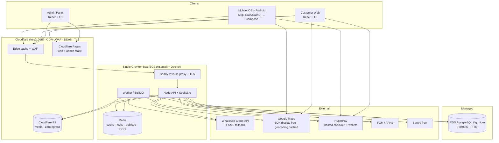

### 1.2 Authentication Flow (WhatsApp/SMS OTP → backend JWT)

```mermaid
sequenceDiagram
    participant C as Client App
    participant API as Fixly Backend
    participant OTP as WhatsApp Cloud API / SMS
    participant DB as PostgreSQL

    Note over C,API: client sends App Attest / Play Integrity token (anti-pump)
    C->>API: POST /auth/otp/request { phone, attestation }
    API->>API: rate-limit (phone+IP+device), verify attestation, gen code (hash in Redis, TTL 5m)
    API->>OTP: send code (WhatsApp template; SMS fallback)
    OTP-->>C: OTP delivered
    API-->>C: { otpToken } (opaque ref, no code)
    C->>API: POST /auth/otp/verify { phone, code, otpToken }
    API->>API: check hash + attempts + expiry (constant-time)
    API->>DB: upsert user by phone, load role
    API-->>C: { accessToken (15m), refreshToken (30d), user }
    Note over C,API: Subsequent calls: Authorization: Bearer <accessToken>
    C->>API: POST /auth/refresh (refresh cookie / token)
    API-->>C: new accessToken (rotates refresh token)
```

### 1.3 Real-Time Flow (Socket.io + Redis adapter)

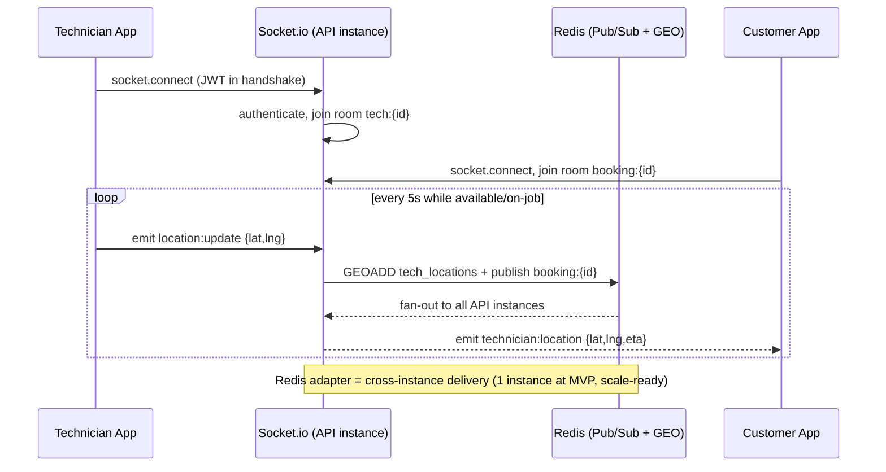

---

## 2. Database Design

PostgreSQL 15 + **PostGIS** (geo queries for nearby technicians). UUID PKs. `snake_case`. All money in **fils** (integer, 1 JOD = 1000 fils) to avoid float errors. All timestamps `TIMESTAMPTZ` in UTC.

### 2.1 ERD

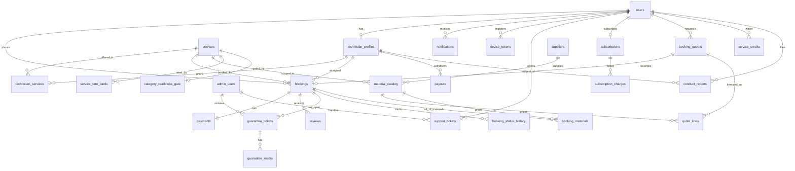

### 2.2 Schema (DDL)

```sql
-- ============ EXTENSIONS ============
CREATE EXTENSION IF NOT EXISTS "uuid-ossp";
CREATE EXTENSION IF NOT EXISTS postgis;
CREATE EXTENSION IF NOT EXISTS pg_trgm;

-- ============ ENUMS ============
CREATE TYPE user_role        AS ENUM ('customer','technician');
CREATE TYPE user_status      AS ENUM ('active','blocked','deleted');
CREATE TYPE tech_status      AS ENUM ('pending','approved','rejected','suspended');
CREATE TYPE booking_type     AS ENUM ('immediate','scheduled');
CREATE TYPE booking_status   AS ENUM (
  'pending','searching','accepted','technician_arriving',
  'in_progress','completed','cancelled','expired'
);
CREATE TYPE payment_status   AS ENUM (
  'pending','authorized','captured','partially_refunded','refunded','failed','voided'
);
CREATE TYPE payout_status    AS ENUM ('requested','processing','paid','failed');
CREATE TYPE guarantee_status AS ENUM ('open','under_review','approved','rejected','resolved');
CREATE TYPE ticket_status    AS ENUM ('open','in_progress','resolved','closed');
CREATE TYPE notif_channel    AS ENUM ('push','sms','in_app');
-- v1.5 business enums (§0)
CREATE TYPE subscription_status AS ENUM ('active','past_due','cancelled','expired');
CREATE TYPE quote_status        AS ENUM ('pending','quoted','accepted','declined','expired');
CREATE TYPE trust_tier          AS ENUM ('probation','verified','pro','elite');
CREATE TYPE credit_reason       AS ENUM ('late_compensation','referral','goodwill','promo','adjustment');
CREATE TYPE extra_work_status   AS ENUM ('none','proposed','approved','declined');
-- v1.7 pricing & materials enums (§0.2 #4, §17.5)
CREATE TYPE pricing_model    AS ENUM ('fixed_scope','quote_first');
CREATE TYPE quote_line_kind  AS ENUM ('labour','material','prep','fee');
CREATE TYPE material_tier    AS ENUM ('economy','standard','premium');
-- "who sources this item" is material_source (below) on BOTH quote_lines and booking_materials —
-- one concept, one enum. (v1.13 unification; the old supplied_by enum is gone.)
-- ---- v1.9 materials governance (SINGLE source of truth; see the merge note below) ----
-- The five-class service taxonomy that supersedes v1.7's implicit two-archetype split.
-- Read with §0.1 "materials golden rule": the technician keeps buying from the Amman retail
-- market; Fixly governs TYPE (quality floor), PRICE BAND, and how it is shown to the customer.
CREATE TYPE material_mode        AS ENUM ('labour_only','micro_included','governed_addons','quote_first_bom','project_staged');
-- WHO procured the material. 'platform_arranged' is the L3/Fixly-Direct-Supply path (§17.5.6)
-- and stays unused until a supply contract exists — the day-one default is technician_procured.
CREATE TYPE material_source      AS ENUM ('technician_procured','customer_supplied','platform_arranged');
-- Line lifecycle. 'pending_review' + 'locked' carry the price-variance gate and the
-- "BOM frozen once work starts" rule (§17.5.9); 'replaced'/'unused' carry substitution + surplus.
CREATE TYPE material_line_status AS ENUM ('pending','pending_review','approved','declined','replaced','unused','locked');
-- WHERE a catalogue price came from. 'retail_observed' is the day-one reality (shop price
-- observations); 'supplier_quote' only appears at L3 once wholesale contracts exist.
CREATE TYPE catalog_source       AS ENUM ('retail_observed','supplier_quote','internal_standard');
CREATE TYPE readiness_state      AS ENUM ('collecting','ready','blocked');
-- v1.10 price-book maintenance (§17.5.13). Categories are graded by the RELIABILITY of the
-- source that is actually available — not forced to a fake weekly precision no source supports.
CREATE TYPE refresh_cadence  AS ENUM ('monthly','quarterly','semiannual');
CREATE TYPE price_confidence AS ENUM ('confirmed','estimated','under_review');
CREATE TYPE price_index_kind AS ENUM ('dos_cpi','dos_cpi_maintenance','memr_fuel','chamber_of_industry');
-- v1.10 variance dispute protocol (§17.5.14)
CREATE TYPE variance_reason      AS ENUM ('special_type','imported_brand','access_difficulty','other');
CREATE TYPE verification_status  AS ENUM ('open','invoice_provided','upheld','deducted','withdrawn');
CREATE TYPE substitution_policy  AS ENUM ('same_or_higher_tier','not_allowed');
CREATE TYPE surplus_policy       AS ENUM ('customer_keeps','documented_in_bom','goodwill_micro');

-- ============ USERS ============
CREATE TABLE users (
  id              UUID PRIMARY KEY DEFAULT uuid_generate_v4(),
  phone           VARCHAR(20)  NOT NULL UNIQUE,        -- E.164 +962...; verified via OTP (WhatsApp/SMS)
  full_name       VARCHAR(120),
  email           VARCHAR(160),
  role            user_role    NOT NULL DEFAULT 'customer',
  status          user_status  NOT NULL DEFAULT 'active',
  avatar_url      TEXT,
  locale          VARCHAR(5)   NOT NULL DEFAULT 'ar',
  -- push tokens normalized into device_tokens (multi-device); see below
  last_login_at   TIMESTAMPTZ,
  deleted_at      TIMESTAMPTZ,                        -- soft-delete; PII anonymized on purge
  created_at      TIMESTAMPTZ  NOT NULL DEFAULT now(),
  updated_at      TIMESTAMPTZ  NOT NULL DEFAULT now()
);
-- phone UNIQUE constraint already creates its index — no separate idx_users_phone needed
CREATE INDEX idx_users_role    ON users(role) WHERE status = 'active';

-- ============ TECHNICIAN PROFILES ============
CREATE TABLE technician_profiles (
  id                  UUID PRIMARY KEY DEFAULT uuid_generate_v4(),
  user_id             UUID NOT NULL UNIQUE REFERENCES users(id) ON DELETE CASCADE,
  status              tech_status NOT NULL DEFAULT 'pending',
  national_id_enc     BYTEA,                          -- AES-256-GCM (app-side, KMS data key); not indexable
  id_doc_url          TEXT,
  cert_doc_url        TEXT,
  selfie_url          TEXT,
  hourly_rate_fils    INTEGER CHECK (hourly_rate_fils BETWEEN 40000 AND 60000),
  is_available        BOOLEAN NOT NULL DEFAULT false,
  current_location    GEOGRAPHY(POINT,4326),          -- last-known SNAPSHOT only (accept/start/complete + 60s sampler). Live position = Redis GEO; see §2.4
  location_updated_at TIMESTAMPTZ,
  rating_avg          NUMERIC(3,2) NOT NULL DEFAULT 0, -- maintained by trg_review_rating (see below)
  rating_count        INTEGER NOT NULL DEFAULT 0,
  balance_fils        INTEGER NOT NULL DEFAULT 0,      -- cached balance; mutated only under row lock (see §2.5)
  consecutive_rejects SMALLINT NOT NULL DEFAULT 0,
  -- v1.5 trust & quality (§0.2 #1). trust_tier drives dispatch priority + guarantee liability.
  trust_tier          trust_tier  NOT NULL DEFAULT 'probation',
  bg_check_status     VARCHAR(12) NOT NULL DEFAULT 'pending',  -- pending | passed | failed
  skills_test_passed_at TIMESTAMPTZ,
  is_insured          BOOLEAN NOT NULL DEFAULT false,
  intro_video_url     TEXT,                                    -- profile trust video (Phase 2)
  jobs_completed      INTEGER NOT NULL DEFAULT 0,              -- lifetime; feeds nightly tier recompute
  off_platform_flags  SMALLINT NOT NULL DEFAULT 0,             -- upheld disintermediation reports (§0.2 #2)
  approved_by         UUID,
  approved_at         TIMESTAMPTZ,
  reject_reason       TEXT,
  created_at          TIMESTAMPTZ NOT NULL DEFAULT now(),
  updated_at          TIMESTAMPTZ NOT NULL DEFAULT now()
);
-- GiST index for "nearby technician" geo queries
CREATE INDEX idx_tech_location  ON technician_profiles USING GIST(current_location);
CREATE INDEX idx_tech_available ON technician_profiles(is_available, status)
  WHERE is_available = true AND status = 'approved';

-- ============ SERVICES (catalogue, split by pricing archetype — §0.2 #4, §17.5) ============
CREATE TABLE services (
  id                  UUID PRIMARY KEY DEFAULT uuid_generate_v4(),
  slug                VARCHAR(40) NOT NULL UNIQUE,   -- electricity, plumbing, ac, painting, furniture
  name_ar             VARCHAR(80) NOT NULL,
  name_en             VARCHAR(80) NOT NULL,
  description_ar      TEXT,
  icon_url            TEXT,
  -- v1.7: pricing archetype. fixed_scope = instant booking at base_price_fils.
  -- quote_first = NO instant price; inspection/media → itemized firm quote (§17.5).
  pricing_model       pricing_model NOT NULL DEFAULT 'fixed_scope',
  base_price_fils     INTEGER,                       -- REQUIRED for fixed_scope; NULL for quote_first
  inspection_fee_fils INTEGER,                       -- quote_first: disclosed diagnosis/visit fee (≠ callout/no-show fee)
  -- Per-service materials rules live in service_material_policies (mode, thresholds,
  -- customer-supply, substitution, quote validity) — §17.5.5. No coarse flag here.
  est_duration_min    INTEGER NOT NULL DEFAULT 60,
  is_active           BOOLEAN NOT NULL DEFAULT true,
  sort_order          SMALLINT NOT NULL DEFAULT 0,
  created_at          TIMESTAMPTZ NOT NULL DEFAULT now(),
  -- archetype integrity: an instant-bookable service MUST have a price;
  -- a quote-first service MUST NOT pretend to have one.
  CONSTRAINT chk_pricing_archetype CHECK (
    (pricing_model = 'fixed_scope' AND base_price_fils IS NOT NULL) OR
    (pricing_model = 'quote_first' AND base_price_fils IS NULL AND inspection_fee_fils IS NOT NULL)
  )
);

CREATE TABLE technician_services (
  technician_id UUID NOT NULL REFERENCES technician_profiles(id) ON DELETE CASCADE,
  service_id    UUID NOT NULL REFERENCES services(id) ON DELETE CASCADE,
  PRIMARY KEY (technician_id, service_id)
);

-- ============ BOOKINGS ============
CREATE TABLE bookings (
  id                 UUID PRIMARY KEY DEFAULT uuid_generate_v4(),
  ref_code           VARCHAR(12) NOT NULL UNIQUE,       -- human ref e.g. FX-8KД3
  customer_id        UUID NOT NULL REFERENCES users(id),
  technician_id      UUID REFERENCES technician_profiles(id),
  service_id         UUID NOT NULL REFERENCES services(id),
  type               booking_type   NOT NULL DEFAULT 'immediate',
  status             booking_status NOT NULL DEFAULT 'pending',
  version            INTEGER NOT NULL DEFAULT 0,        -- optimistic lock for status transitions
  scheduled_at       TIMESTAMPTZ,
  price_fils         INTEGER NOT NULL,                  -- snapshot of fixed price
  extra_fils         INTEGER NOT NULL DEFAULT 0,        -- additional work approved by customer
  platform_fee_fils  INTEGER NOT NULL DEFAULT 0,        -- 20% of total
  location           GEOGRAPHY(POINT,4326) NOT NULL,
  address_text       TEXT NOT NULL,
  notes              TEXT,                              -- "Gate code 1234"
  accepted_at        TIMESTAMPTZ,
  started_at         TIMESTAMPTZ,
  completed_at       TIMESTAMPTZ,
  cancelled_at       TIMESTAMPTZ,
  cancel_reason      TEXT,
  -- v1.5 SLA + fixed-price integrity + subscriber priority (§0.2 #3, §0.3)
  is_priority        BOOLEAN NOT NULL DEFAULT false,           -- subscriber priority dispatch
  sla_arrive_by      TIMESTAMPTZ,                              -- immediate bookings: accepted_at + 30m
  arrived_at         TIMESTAMPTZ,                              -- set by /tech/bookings/{id}/arrive
  late_comp_fils     INTEGER NOT NULL DEFAULT 0,               -- auto credit granted if arrival > SLA + 30m
  extra_status       extra_work_status NOT NULL DEFAULT 'none',-- extra-work approval gate (§0.2 #3)
  extra_note         TEXT,
  quote_id           UUID,                                     -- originating booking_quotes.id (no FK: avoids circular DDL)
  -- v1.7 labour/materials split (§0.2 #4). For fixed_scope: labour = price_fils, materials = 0.
  -- For quote_first: copied from the accepted quote's line totals; price_fils = labour + materials.
  labour_fils        INTEGER NOT NULL DEFAULT 0,
  materials_fils     INTEGER NOT NULL DEFAULT 0,               -- shown split from labour on the invoice
  -- v1.11 materials governance on the booking itself
  quote_valid_until  TIMESTAMPTZ,                              -- expired quote ⇒ capture blocked; reprice + renotify
  material_source_summary material_source,                     -- dominant source, for warranty adjudication at a glance
  customer_supplied_material_acknowledged BOOLEAN NOT NULL DEFAULT false, -- in-app acceptance of workmanship-only cover
  created_at         TIMESTAMPTZ NOT NULL DEFAULT now(),
  updated_at         TIMESTAMPTZ NOT NULL DEFAULT now()
);
CREATE INDEX idx_bookings_customer ON bookings(customer_id, created_at DESC);
CREATE INDEX idx_bookings_tech     ON bookings(technician_id, created_at DESC);
CREATE INDEX idx_bookings_status   ON bookings(status) WHERE status IN ('pending','searching','accepted','in_progress');
CREATE INDEX idx_bookings_location ON bookings USING GIST(location);

-- Append-only status audit
CREATE TABLE booking_status_history (
  id          BIGSERIAL PRIMARY KEY,
  booking_id  UUID NOT NULL REFERENCES bookings(id) ON DELETE CASCADE,
  from_status booking_status,
  to_status   booking_status NOT NULL,
  actor_id    UUID,
  meta        JSONB,
  created_at  TIMESTAMPTZ NOT NULL DEFAULT now()
);
CREATE INDEX idx_bsh_booking ON booking_status_history(booking_id, created_at);

-- ============ PAYMENTS ============
CREATE TABLE payments (
  id               UUID PRIMARY KEY DEFAULT uuid_generate_v4(),
  booking_id       UUID NOT NULL UNIQUE REFERENCES bookings(id),
  provider         VARCHAR(30) NOT NULL DEFAULT 'hyperpay',
  provider_ref     VARCHAR(120),                  -- gateway checkout/transaction id
  status           payment_status NOT NULL DEFAULT 'pending',
  amount_fils      INTEGER NOT NULL,              -- authorized amount
  captured_fils    INTEGER NOT NULL DEFAULT 0,
  refunded_fils    INTEGER NOT NULL DEFAULT 0,
  currency         CHAR(3) NOT NULL DEFAULT 'JOD',
  method           VARCHAR(12) NOT NULL DEFAULT 'card', -- card | applepay | googlepay
  checkout_id      VARCHAR(120),                  -- PSP hosted-checkout session id
  saved_token      VARCHAR(120),                  -- PSP registration token (card-on-file, 1-tap repeat)
  card_brand       VARCHAR(20),                   -- tokenized metadata only
  card_last4       CHAR(4),
  auth_expires_at  TIMESTAMPTZ,                   -- pre-auth hold TTL (PSP-dependent ~5-7d); reconciler acts before expiry
  capture_key      VARCHAR(80) UNIQUE,            -- idempotency: at most one capture per booking, ever
  authorized_at    TIMESTAMPTZ,
  captured_at      TIMESTAMPTZ,
  raw_callback     JSONB,                         -- gateway webhook payload (audit)
  created_at       TIMESTAMPTZ NOT NULL DEFAULT now(),
  updated_at       TIMESTAMPTZ NOT NULL DEFAULT now()
);
CREATE INDEX idx_payments_status   ON payments(status);
CREATE INDEX idx_payments_provider ON payments(provider_ref);

-- ============ REVIEWS (bidirectional: customer↔technician) ============
-- Only technician aggregates are denormalized (trg_review_rating updates technician_profiles).
-- Customer ratings are queried on demand — no hot path needs a customer rating_avg.
CREATE TABLE reviews (
  id            UUID PRIMARY KEY DEFAULT uuid_generate_v4(),
  booking_id    UUID NOT NULL REFERENCES bookings(id),
  author_id     UUID NOT NULL REFERENCES users(id),     -- who wrote it
  target_id     UUID NOT NULL REFERENCES users(id),     -- who is rated
  rating        SMALLINT NOT NULL CHECK (rating BETWEEN 1 AND 5),
  comment       TEXT,
  photo_urls    TEXT[],
  created_at    TIMESTAMPTZ NOT NULL DEFAULT now(),
  UNIQUE (booking_id, author_id)                          -- one review per side
);
CREATE INDEX idx_reviews_target ON reviews(target_id);

-- ============ GUARANTEES (30-day) ============
CREATE TABLE guarantee_tickets (
  id            UUID PRIMARY KEY DEFAULT uuid_generate_v4(),
  booking_id    UUID NOT NULL REFERENCES bookings(id),
  customer_id   UUID NOT NULL REFERENCES users(id),
  status        guarantee_status NOT NULL DEFAULT 'open',
  description   TEXT NOT NULL,
  expires_at    TIMESTAMPTZ NOT NULL,                    -- completed_at + 30d
  reviewed_by   UUID,
  admin_notes   TEXT,
  resolution    TEXT,
  followup_booking_id UUID REFERENCES bookings(id),       -- free return visit
  created_at    TIMESTAMPTZ NOT NULL DEFAULT now(),
  updated_at    TIMESTAMPTZ NOT NULL DEFAULT now()
);
CREATE INDEX idx_guarantee_status ON guarantee_tickets(status);

CREATE TABLE guarantee_media (
  id            UUID PRIMARY KEY DEFAULT uuid_generate_v4(),
  ticket_id     UUID NOT NULL REFERENCES guarantee_tickets(id) ON DELETE CASCADE,
  media_url     TEXT NOT NULL,
  media_type    VARCHAR(10) NOT NULL,                    -- image | video
  created_at    TIMESTAMPTZ NOT NULL DEFAULT now()
);

-- ============ PAYOUTS (technician withdrawals) ============
CREATE TABLE payouts (
  id              UUID PRIMARY KEY DEFAULT uuid_generate_v4(),
  technician_id   UUID NOT NULL REFERENCES technician_profiles(id),
  amount_fils     INTEGER NOT NULL CHECK (amount_fils >= 20000), -- min 20 JOD
  status          payout_status NOT NULL DEFAULT 'requested',
  bank_iban       VARCHAR(34),
  bank_name       VARCHAR(80),
  provider_ref    VARCHAR(120),
  requested_at    TIMESTAMPTZ NOT NULL DEFAULT now(),
  processed_at    TIMESTAMPTZ,
  failure_reason  TEXT
);
CREATE INDEX idx_payouts_tech ON payouts(technician_id, requested_at DESC);

-- Ledger: append-only journal; authoritative balance = SUM(amount_fils).
-- NO stored running balance (it races under concurrency). technician_profiles.balance_fils
-- is a CACHE updated in the SAME tx under SELECT ... FOR UPDATE on the tech row. See §2.5.
CREATE TABLE ledger_entries (
  id            BIGSERIAL PRIMARY KEY,
  technician_id UUID NOT NULL REFERENCES technician_profiles(id),
  booking_id    UUID REFERENCES bookings(id),
  payout_id     UUID REFERENCES payouts(id),
  entry_type    VARCHAR(20) NOT NULL,   -- earning | fee | payout | refund | adjustment
  amount_fils   INTEGER NOT NULL,       -- signed (+earning, -fee, -payout)
  ref_key       VARCHAR(80) UNIQUE,     -- dedupe key (e.g. 'capture:{bookingId}') => exactly-once posting
  created_at    TIMESTAMPTZ NOT NULL DEFAULT now()
);
CREATE INDEX idx_ledger_tech ON ledger_entries(technician_id, created_at);

-- ============ NOTIFICATIONS ============
CREATE TABLE notifications (
  id          UUID PRIMARY KEY DEFAULT uuid_generate_v4(),
  user_id     UUID NOT NULL REFERENCES users(id) ON DELETE CASCADE,
  channel     notif_channel NOT NULL DEFAULT 'push',
  title_ar    VARCHAR(160) NOT NULL,
  body_ar     TEXT NOT NULL,
  data        JSONB,
  is_read     BOOLEAN NOT NULL DEFAULT false,
  sent_at     TIMESTAMPTZ,
  created_at  TIMESTAMPTZ NOT NULL DEFAULT now()
);
CREATE INDEX idx_notif_user ON notifications(user_id, is_read, created_at DESC);

-- ============ SUPPORT ============
CREATE TABLE support_tickets (
  id           UUID PRIMARY KEY DEFAULT uuid_generate_v4(),
  user_id      UUID NOT NULL REFERENCES users(id),
  booking_id   UUID REFERENCES bookings(id),
  subject      VARCHAR(160),
  status       ticket_status NOT NULL DEFAULT 'open',
  handled_by   UUID,
  created_at   TIMESTAMPTZ NOT NULL DEFAULT now(),
  updated_at   TIMESTAMPTZ NOT NULL DEFAULT now()
);
CREATE TABLE support_messages (
  id           BIGSERIAL PRIMARY KEY,
  ticket_id    UUID NOT NULL REFERENCES support_tickets(id) ON DELETE CASCADE,
  sender_id    UUID NOT NULL,
  body         TEXT NOT NULL,
  created_at   TIMESTAMPTZ NOT NULL DEFAULT now()
);
CREATE INDEX idx_supportmsg_ticket ON support_messages(ticket_id, created_at);

-- ============ ADMIN ============
CREATE TABLE admin_users (
  id            UUID PRIMARY KEY DEFAULT uuid_generate_v4(),
  email         VARCHAR(160) NOT NULL UNIQUE,
  password_hash VARCHAR(255) NOT NULL,           -- argon2id
  full_name     VARCHAR(120),
  role          VARCHAR(30) NOT NULL DEFAULT 'ops', -- super_admin | ops | finance | support
  is_active     BOOLEAN NOT NULL DEFAULT true,
  last_login_at TIMESTAMPTZ,
  created_at    TIMESTAMPTZ NOT NULL DEFAULT now()
);

-- ============ REFRESH TOKENS (rotation + revocation) ============
CREATE TABLE refresh_tokens (
  id           UUID PRIMARY KEY DEFAULT uuid_generate_v4(),
  user_id      UUID NOT NULL REFERENCES users(id) ON DELETE CASCADE,
  token_hash   VARCHAR(255) NOT NULL,            -- store hash, never raw
  expires_at   TIMESTAMPTZ NOT NULL,
  revoked_at   TIMESTAMPTZ,
  device_info  VARCHAR(200),
  created_at   TIMESTAMPTZ NOT NULL DEFAULT now()
);
CREATE INDEX idx_refresh_user ON refresh_tokens(user_id) WHERE revoked_at IS NULL;

-- ============ DEVICE TOKENS (multi-device push) ============
CREATE TABLE device_tokens (
  id           UUID PRIMARY KEY DEFAULT uuid_generate_v4(),
  user_id      UUID NOT NULL REFERENCES users(id) ON DELETE CASCADE,
  token        TEXT NOT NULL UNIQUE,
  platform     VARCHAR(10) NOT NULL,             -- ios | android | web
  last_seen_at TIMESTAMPTZ NOT NULL DEFAULT now(),
  created_at   TIMESTAMPTZ NOT NULL DEFAULT now()
);
CREATE INDEX idx_devtok_user ON device_tokens(user_id);

-- ============ OUTBOX (transactional outbox; fixes dual-write) ============
-- Domain writes + outbox row commit in ONE tx. A relay worker polls unprocessed
-- rows and performs side effects (PSP calls, realtime emits, push) exactly-once.
CREATE TABLE outbox_events (
  id            BIGSERIAL PRIMARY KEY,
  aggregate     VARCHAR(40) NOT NULL,            -- booking | payment | payout ...
  aggregate_id  UUID NOT NULL,
  event_type    VARCHAR(60) NOT NULL,            -- booking.created | payment.capture.requested ...
  payload       JSONB NOT NULL,
  status        VARCHAR(12) NOT NULL DEFAULT 'pending', -- pending | processing | done | failed
  attempts      SMALLINT NOT NULL DEFAULT 0,
  next_retry_at TIMESTAMPTZ NOT NULL DEFAULT now(),
  created_at    TIMESTAMPTZ NOT NULL DEFAULT now()
);
CREATE INDEX idx_outbox_poll ON outbox_events(status, next_retry_at) WHERE status IN ('pending','failed');

-- ============ SUBSCRIPTIONS (Protection plan — §0.3, Phase 2) ============
CREATE TABLE subscriptions (
  id                    UUID PRIMARY KEY DEFAULT uuid_generate_v4(),
  customer_id           UUID NOT NULL REFERENCES users(id) ON DELETE CASCADE,
  plan_slug             VARCHAR(30) NOT NULL DEFAULT 'protect',
  status                subscription_status NOT NULL DEFAULT 'active',
  price_fils            INTEGER NOT NULL DEFAULT 5000,        -- 5 JOD / month
  discount_bps          INTEGER NOT NULL DEFAULT 1500,        -- 15% off each booking
  guarantee_days        SMALLINT NOT NULL DEFAULT 90,         -- extended guarantee window for members
  priority_dispatch     BOOLEAN NOT NULL DEFAULT true,
  inspection_every_days SMALLINT NOT NULL DEFAULT 90,         -- free quarterly inspection
  next_inspection_at    TIMESTAMPTZ,
  current_period_end    TIMESTAMPTZ NOT NULL,
  payment_token         VARCHAR(120),                         -- PSP card-on-file for recurring charge
  provider_ref          VARCHAR(120),
  cancelled_at          TIMESTAMPTZ,
  created_at            TIMESTAMPTZ NOT NULL DEFAULT now(),
  updated_at            TIMESTAMPTZ NOT NULL DEFAULT now()
);
-- at most one ACTIVE subscription per customer
CREATE UNIQUE INDEX idx_sub_active ON subscriptions(customer_id) WHERE status = 'active';

CREATE TABLE subscription_charges (
  id              UUID PRIMARY KEY DEFAULT uuid_generate_v4(),
  subscription_id UUID NOT NULL REFERENCES subscriptions(id) ON DELETE CASCADE,
  amount_fils     INTEGER NOT NULL,
  status          payment_status NOT NULL DEFAULT 'pending',
  provider_ref    VARCHAR(120),
  period_start    TIMESTAMPTZ NOT NULL,
  period_end      TIMESTAMPTZ NOT NULL,
  charged_at      TIMESTAMPTZ,
  created_at      TIMESTAMPTZ NOT NULL DEFAULT now()
);
CREATE INDEX idx_subcharge_sub ON subscription_charges(subscription_id, created_at DESC);

-- ============ BOOKING QUOTES (video pre-check + quote-first — §0.3, §0.2 #4, §17.5) ============
-- Two uses of one machine:
--  a) fixed_scope convenience (Phase 2): customer uploads a problem video → firm price.
--  b) quote_first categories (MANDATORY): inspection/media assessment → ITEMIZED firm quote
--     (labour + materials as quote_lines) the customer approves digitally; that quote
--     becomes the booking price. v1.6's bare quoted_fils scalar was insufficient for
--     material-heavy work — totals are now derived from quote_lines.
CREATE TABLE booking_quotes (
  id             UUID PRIMARY KEY DEFAULT uuid_generate_v4(),
  customer_id    UUID NOT NULL REFERENCES users(id) ON DELETE CASCADE,
  service_id     UUID NOT NULL REFERENCES services(id),
  status         quote_status NOT NULL DEFAULT 'pending',
  video_url      TEXT,                              -- customer's problem video (R2, private)
  site_media_urls TEXT[],                           -- v1.7: photos/video of the site (walls, room, damage)
  description    TEXT,
  -- v1.7 customer-supplied scope inputs (painting: room count, approx dimensions, colour, tier)
  dimensions_note TEXT,                             -- approx wall area / room sizes as given by customer
  requested_tier material_tier,                     -- economy | standard | premium (brand/quality tier)
  -- v1.7 labour/materials split — derived from quote_lines, denormalized for reads
  labour_fils    INTEGER,
  materials_fils INTEGER,
  quoted_fils    INTEGER,                           -- FIRM total = labour + materials; becomes booking price
  quoted_by      UUID,                              -- technician or ops actor who priced it
  -- v1.7 ops-review gate: quotes above OPS_REVIEW_THRESHOLD_FILS (or with any
  -- non-catalogue material line) require ops approval before they are sent (§17.5.12)
  ops_reviewed_by UUID,
  ops_reviewed_at TIMESTAMPTZ,
  location       GEOGRAPHY(POINT,4326),
  address_text   TEXT,
  booking_id     UUID REFERENCES bookings(id),      -- set when accepted → booking
  expires_at     TIMESTAMPTZ NOT NULL,
  created_at     TIMESTAMPTZ NOT NULL DEFAULT now(),
  updated_at     TIMESTAMPTZ NOT NULL DEFAULT now()
);
CREATE INDEX idx_quotes_customer ON booking_quotes(customer_id, created_at DESC);
CREATE INDEX idx_quotes_status   ON booking_quotes(status) WHERE status IN ('pending','quoted');

-- ============ QUOTE LINES (itemized labour/material lines — §0.2 #4, §17.5) ============
-- Materials are never a technician's private arithmetic: every chargeable component of a
-- quote is a line the customer sees and approves. Material lines price against the
-- material_catalog price book; unit_price_fils must respect the catalogue cap.
CREATE TABLE quote_lines (
  id             UUID PRIMARY KEY DEFAULT uuid_generate_v4(),
  quote_id       UUID NOT NULL REFERENCES booking_quotes(id) ON DELETE CASCADE,
  kind           quote_line_kind NOT NULL,          -- labour | material | prep | fee
  material_id    UUID,                              -- REFERENCES material_catalog(id); NULL for labour/fee lines
  description    TEXT NOT NULL,                     -- "Paint, standard tier, white — 2 buckets"
  qty            NUMERIC(8,2) NOT NULL DEFAULT 1,
  unit           VARCHAR(20),                       -- bucket | m2 | hour | piece
  unit_price_fils INTEGER NOT NULL,
  total_fils     INTEGER NOT NULL,                  -- qty * unit_price_fils (server-computed)
  source         material_source NOT NULL DEFAULT 'technician_procured', -- who sources this item (§17.5.6)
  created_at     TIMESTAMPTZ NOT NULL DEFAULT now()
);
CREATE INDEX idx_quote_lines_quote ON quote_lines(quote_id);

-- ============ SUPPLIERS (wholesale partners — §17.5.6) ============
-- Fixly's own supply relationships are what make the price book REAL rather than a guess.
-- Wholesale contracts (e.g. Jordan Central for Building Materials, Al-Muqabalain) give the
-- platform true cost basis, so the technician can never be the source of price truth.
CREATE TABLE suppliers (
  id               UUID PRIMARY KEY DEFAULT uuid_generate_v4(),
  name             VARCHAR(160) NOT NULL,
  contact_phone    VARCHAR(20),
  categories       TEXT[],                        -- paint | electrical | plumbing | building
  contract_ref     VARCHAR(80),                   -- supply-agreement reference (L3 only)
  -- v1.10 zero-risk referral pilot (§17.5.16): the first suppliers are 2–3 SMALL/MEDIUM RETAIL
  -- shops, not large wholesalers, engaged with NO contract and NO obligation — commission is
  -- owed only on an actual sale. Nothing is signed until the 30-day field test says it works.
  is_pilot            BOOLEAN NOT NULL DEFAULT true,
  referral_commission_bps INTEGER,                -- v1.11: 500–800 bps (5–8%) paid BY the shop TO Fixly on a referred sale
  agreement_kind      VARCHAR(20) DEFAULT 'verbal', -- verbal | message | written — deliberately NOT a wholesale contract
  trial_started_at    TIMESTAMPTZ,
  trial_ends_at       TIMESTAMPTZ,                -- 30-day evaluation window
  commission_paid_ok  BOOLEAN,                    -- test result: did they actually pay?
  price_manipulation_observed BOOLEAN,            -- test result: did they quote the customer differently in person?
  trial_notes         TEXT,
  is_active        BOOLEAN NOT NULL DEFAULT true,
  created_at       TIMESTAMPTZ NOT NULL DEFAULT now()
);

-- ============ MATERIAL CATALOG (the Fixly price book — §17.5.15 L2, §17.5.6) ============
-- Internal price book: tiered materials with wholesale basis, brand, coverage assumptions,
-- and price caps. A material line must reference a row here (or be flagged off-catalogue and
-- reviewed), and its unit price must sit within [min,max] — this is what stops material padding.
-- Prices are REFRESHED MONTHLY from supplier contracts (§17.5.6) — Jordan material prices move.
CREATE TABLE material_catalog (
  id                 UUID PRIMARY KEY DEFAULT uuid_generate_v4(),
  service_id         UUID REFERENCES services(id),  -- NULL = shared across services
  supplier_id        UUID REFERENCES suppliers(id), -- L3 only: wholesale contract backing this price (NULL day-one)
  catalog_source     catalog_source NOT NULL DEFAULT 'retail_observed', -- day-one prices come from Amman shop observations
  last_priced_at     TIMESTAMPTZ,                   -- freshness of the observed/contracted price
  -- v1.10: cadence and confidence are per-item, set by which source actually exists (§17.5.13).
  refresh_cadence    refresh_cadence NOT NULL DEFAULT 'monthly',
  price_confidence   price_confidence NOT NULL DEFAULT 'confirmed', -- 'estimated'/'under_review' MUST be disclosed to the customer
  index_kind         price_index_kind,              -- index this item is re-based against when no direct observation exists
  base_reference_fils INTEGER,                      -- v1.12: the anchor the index formula multiplies (§17.5.13)
  indexed_at         TIMESTAMPTZ,                   -- last automatic re-base against index_kind
  slug               VARCHAR(60) NOT NULL UNIQUE,   -- paint-standard-interior, breaker-abb-16a, primer
  subcategory        VARCHAR(60),                   -- v1.11: breakers | wiring | pipes | fittings | sealants …
  allowed_for_services UUID[],                      -- v1.11: services this item may appear on (a breaker cannot land on a paint job)
  name_ar            VARCHAR(120) NOT NULL,
  name_en            VARCHAR(120) NOT NULL,
  brand              VARCHAR(60),                   -- v1.9: brand is a CUSTOMER choice, never the tech's (§17.5.8)
  tier               material_tier NOT NULL DEFAULT 'standard',
  unit               VARCHAR(20) NOT NULL,          -- bucket | m2 | kg | piece
  wholesale_fils     INTEGER,                       -- v1.9: contracted wholesale cost basis
  tech_margin_bps    INTEGER NOT NULL DEFAULT 0,   -- v1.11: ZERO under Asset-Light (Fixly earns the shop's 5–8% referral commission,
                                                   -- not a markup on the technician's purchase). Retained for a funded future only.
  unit_price_fils    INTEGER NOT NULL,              -- customer-facing reference price
  price_min_fils     INTEGER NOT NULL,              -- allowed band (cap) for quote/BOM lines
  price_max_fils     INTEGER NOT NULL,
  variance_alert_bps INTEGER NOT NULL DEFAULT 1500, -- v1.9: >15% over reference ⇒ auto-escalate to review (§17.5.9)
  coverage_note      TEXT,                          -- "1 bucket ≈ 24 m² per coat" — quantity sanity checks
  price_refreshed_at TIMESTAMPTZ,                   -- v1.9: monthly refresh stamp; stale rows flagged in Ops Console
  is_active          BOOLEAN NOT NULL DEFAULT true,
  created_at         TIMESTAMPTZ NOT NULL DEFAULT now(),
  updated_at         TIMESTAMPTZ NOT NULL DEFAULT now(),
  CONSTRAINT chk_price_band CHECK (price_min_fils <= unit_price_fils AND unit_price_fils <= price_max_fils)
);
CREATE INDEX idx_material_service ON material_catalog(service_id) WHERE is_active = true;

-- ============ SERVICE RATE CARDS (tiered unit rates — §17.5.8) ============
-- For area/quantity-driven work (painting per m²), the quote is COMPUTED from a published
-- rate card, not invented per job: price = measured qty × tier rate (+ prep lines).
-- This removes pricing discretion even inside a quote-first category.
CREATE TABLE service_rate_cards (
  id                UUID PRIMARY KEY DEFAULT uuid_generate_v4(),
  service_id        UUID NOT NULL REFERENCES services(id) ON DELETE CASCADE,
  tier              material_tier NOT NULL,          -- economy | standard | premium
  unit              VARCHAR(20) NOT NULL,            -- m2 | piece | point
  rate_fils         INTEGER NOT NULL,                -- all-in rate (labour + materials) per unit
  includes_materials BOOLEAN NOT NULL DEFAULT true,
  description_ar    TEXT,                            -- what the tier means in plain Arabic (coats, brand class, prep)
  is_active         BOOLEAN NOT NULL DEFAULT true,
  effective_from    DATE NOT NULL DEFAULT CURRENT_DATE,
  created_at        TIMESTAMPTZ NOT NULL DEFAULT now(),
  UNIQUE (service_id, tier, effective_from)
);

-- ============ BILL OF MATERIALS (per booking, BEFORE execution — §17.5.9) ============
-- Mandatory for any job consuming materials. Created and approved BEFORE work starts —
-- never reconstructed after the fact. Off-catalogue items require a supplier-invoice photo
-- and force ops review. Locked at approval: post-approval needs go through the extra-work gate.
CREATE TABLE booking_materials (
  id                  UUID PRIMARY KEY DEFAULT uuid_generate_v4(),
  booking_id          UUID NOT NULL REFERENCES bookings(id) ON DELETE CASCADE,
  material_id         UUID REFERENCES material_catalog(id),   -- NULL = off-catalogue item (needs invoice proof)
  source              material_source NOT NULL DEFAULT 'technician_procured', -- day-one default (§0.1 golden rule)
  status              material_line_status NOT NULL DEFAULT 'pending',
  description         TEXT NOT NULL,
  brand               VARCHAR(60),                            -- customer-selected where applicable
  qty                 NUMERIC(8,2) NOT NULL DEFAULT 1,
  unit                VARCHAR(20),
  unit_price_fils     INTEGER NOT NULL,
  total_fils          INTEGER NOT NULL,                       -- server-computed
  reference_price_fils INTEGER,                               -- catalogue price at time of drafting (audit trail)
  variance_bps        INTEGER,                                -- deviation vs reference; > variance_alert_bps ⇒ pending_review
  -- v1.10 variance dispute protocol (§17.5.14). Above variance_justify_bps (~20%) the technician
  -- MUST state a reason BEFORE the invoice can be completed, and the customer must approve the
  -- side-by-side comparison BEFORE the work is executed — never after.
  variance_reason     variance_reason,
  variance_reason_note TEXT,
  customer_ack_at     TIMESTAMPTZ,                            -- digital approval of the reference-vs-requested comparison
  is_micro            BOOLEAN NOT NULL DEFAULT false,         -- below the per-service micro threshold ⇒ folded into labour, not itemized
  replaces_line_id    UUID REFERENCES booking_materials(id),  -- substitution link (same-or-higher tier only)
  supplier_invoice_url TEXT,                                  -- REQUIRED for off-catalogue items
  reviewed_by         UUID,
  reviewed_at         TIMESTAMPTZ,
  created_at          TIMESTAMPTZ NOT NULL DEFAULT now(),
  updated_at          TIMESTAMPTZ NOT NULL DEFAULT now(),
  -- an off-catalogue item without a supplier invoice can never reach an approved state
  CONSTRAINT chk_offcat_invoice CHECK (
    material_id IS NOT NULL OR supplier_invoice_url IS NOT NULL
      OR status IN ('pending','pending_review','declined','unused')
  )
);
CREATE INDEX idx_bom_booking ON booking_materials(booking_id);
CREATE INDEX idx_bom_review  ON booking_materials(status) WHERE status = 'pending_review';

-- ============ SERVICE MATERIAL POLICIES (per-service materials rules — §17.5) ============
-- The five mandatory Materials-Policy questions (§17.5.5), answered per service and enforced
-- by the system rather than left to an ops document.
CREATE TABLE service_material_policies (
  service_id             UUID PRIMARY KEY REFERENCES services(id) ON DELETE CASCADE,
  mode                   material_mode NOT NULL DEFAULT 'labour_only',
  micro_threshold_fils   INTEGER NOT NULL DEFAULT 3000,   -- ≈2–3 JOD: below this, consumables fold into labour (no itemization)
  allow_customer_supply  BOOLEAN NOT NULL DEFAULT true,   -- customer may provide materials (warranty then workmanship-only)
  substitution           substitution_policy NOT NULL DEFAULT 'same_or_higher_tier',
  quote_required_above_fils INTEGER,                      -- above this value a firm quote is mandatory
  quote_validity_hours   SMALLINT NOT NULL DEFAULT 168,   -- v1.11: 7 days — Amman prices move with fuel and imports;
                                                          -- an expired quote cannot be captured: reprice + renotify
  quality_floor_grade    material_tier NOT NULL DEFAULT 'economy', -- v1.11: minimum acceptable grade; fitting below it is a quality violation
  surplus_belongs_to_customer BOOLEAN NOT NULL DEFAULT true,
  updated_at             TIMESTAMPTZ NOT NULL DEFAULT now()
);

-- ============ SUPPLIER PRICE OBSERVATIONS (Amman retail price-refresh loop — §17.5.6) ============
-- Day-one price truth is OBSERVED, not contracted: 3–5 shops per trade, reviewed monthly, so the
-- catalogue band tracks real Amman prices (and inflation) instead of drifting into fiction.
CREATE TABLE supplier_price_observations (
  id             BIGSERIAL PRIMARY KEY,
  material_id    UUID NOT NULL REFERENCES material_catalog(id) ON DELETE CASCADE,
  supplier_id    UUID REFERENCES suppliers(id),          -- NULL = informal shop, recorded by name below
  shop_name      VARCHAR(160),
  area           VARCHAR(80),                            -- Tla' Al-Ali, Mecca St, downtown …
  observed_fils  INTEGER NOT NULL,
  observed_at    TIMESTAMPTZ NOT NULL DEFAULT now(),
  observed_by    UUID,                                   -- ops/founder actor
  note           TEXT
);
CREATE INDEX idx_price_obs_material ON supplier_price_observations(material_id, observed_at DESC);

-- ============ MATERIAL VERIFICATION REQUESTS (price-dispute resolution — §17.5.14) ============
-- One-step resolution, deliberately: the customer disputes a price, the technician has 24 HOURS
-- to upload the original purchase invoice. No invoice in time ⇒ the difference is deducted from
-- their dues automatically. Money moves, so this is a first-class audited record, not a note.
CREATE TABLE material_verification_requests (
  id                UUID PRIMARY KEY DEFAULT uuid_generate_v4(),
  booking_material_id UUID NOT NULL REFERENCES booking_materials(id) ON DELETE CASCADE,
  booking_id        UUID NOT NULL REFERENCES bookings(id),
  technician_id     UUID NOT NULL REFERENCES technician_profiles(id),
  status            verification_status NOT NULL DEFAULT 'open',
  reference_price_fils INTEGER NOT NULL,                      -- what the catalogue said
  charged_price_fils   INTEGER NOT NULL,                      -- what the technician entered
  delta_fils        INTEGER NOT NULL,                         -- amount at stake if unproven
  invoice_url       TEXT,                                     -- technician's original purchase invoice
  deadline_at       TIMESTAMPTZ NOT NULL,                     -- opened_at + 24h (enforced by a job)
  resolved_by       UUID,
  resolved_at       TIMESTAMPTZ,
  ledger_ref_key    VARCHAR(80),                              -- 'matverif:{id}' — exactly-once deduction guard
  created_at        TIMESTAMPTZ NOT NULL DEFAULT now()
);
CREATE INDEX idx_matverif_open ON material_verification_requests(status, deadline_at) WHERE status = 'open';

-- ============ PRICE INDEX READINGS (official Jordanian sources — §17.5.13) ============
-- The monthly re-basing inputs, captured by hand in ~15 minutes on a fixed calendar day.
-- Official + free: Department of Statistics CPI (incl. the housing-maintenance-services group,
-- republished in detail by Petra), Ministry of Energy monthly fuel prices, and Jordan Chamber of
-- Industry statements for price-critical inputs (steel/aluminium/copper).
CREATE TABLE price_index_readings (
  id            BIGSERIAL PRIMARY KEY,
  kind          price_index_kind NOT NULL,
  period_month  DATE NOT NULL,                                -- first day of the month the reading covers
  value_numeric NUMERIC(12,4) NOT NULL,                       -- index level, % change, or fils depending on kind
  unit          VARCHAR(20),                                  -- index | pct | fils_per_litre
  source_url    TEXT,
  recorded_by   UUID,
  recorded_at   TIMESTAMPTZ NOT NULL DEFAULT now(),
  note          TEXT,
  UNIQUE (kind, period_month)
);

-- ============ CATEGORY READINESS GATE (quantitative L1→L2 trigger — §17.5.15) ============
-- Replaces "the founder feels ready" with an auto-computed rule. A quote_first category
-- cannot be switched on until all three thresholds are met simultaneously.
CREATE TABLE category_readiness_gate (
  service_id            UUID PRIMARY KEY REFERENCES services(id) ON DELETE CASCADE,
  state                 readiness_state NOT NULL DEFAULT 'collecting',
  quotes_required       SMALLINT NOT NULL DEFAULT 50,     -- closed: accepted → executed → no dispute
  quotes_closed         SMALLINT NOT NULL DEFAULT 0,
  max_dispute_bps       INTEGER NOT NULL DEFAULT 800,     -- < 8%
  dispute_bps           INTEGER NOT NULL DEFAULT 0,
  max_price_deviation_bps INTEGER NOT NULL DEFAULT 1500,  -- < 15% avg |final − estimated| / estimated
  price_deviation_bps   INTEGER NOT NULL DEFAULT 0,
  last_evaluated_at     TIMESTAMPTZ,
  opened_at             TIMESTAMPTZ,                      -- set when state → ready and the category is switched on
  updated_at            TIMESTAMPTZ NOT NULL DEFAULT now()
);

-- ============ CUSTOMER SERVICE CREDITS (late comp / referral / goodwill — §0.3) ============
-- Customer wallet. Balance = SUM(amount_fils). Redemptions post negative rows.
-- Exactly-once grants via ref_key (e.g. 'latecomp:{bookingId}'); redemption never exceeds amount due.
CREATE TABLE service_credits (
  id            BIGSERIAL PRIMARY KEY,
  customer_id   UUID NOT NULL REFERENCES users(id) ON DELETE CASCADE,
  amount_fils   INTEGER NOT NULL,                  -- signed: + granted, - redeemed
  reason        credit_reason NOT NULL,
  booking_id    UUID REFERENCES bookings(id),
  ref_key       VARCHAR(80) UNIQUE,                -- exactly-once guard
  expires_at    TIMESTAMPTZ,
  created_at    TIMESTAMPTZ NOT NULL DEFAULT now()
);
CREATE INDEX idx_credits_customer ON service_credits(customer_id, created_at DESC);

-- ============ CONDUCT REPORTS (anti-disintermediation + quality — §0.2 #2) ============
CREATE TABLE conduct_reports (
  id              BIGSERIAL PRIMARY KEY,
  reporter_id     UUID NOT NULL REFERENCES users(id),
  subject_tech_id UUID REFERENCES technician_profiles(id),
  booking_id      UUID REFERENCES bookings(id),
  kind            VARCHAR(30) NOT NULL,            -- off_platform_solicit | no_show | quality | safety | other
  details         TEXT,
  status          VARCHAR(12) NOT NULL DEFAULT 'open', -- open | reviewing | upheld | dismissed
  resolved_by     UUID,
  created_at      TIMESTAMPTZ NOT NULL DEFAULT now()
);
CREATE INDEX idx_conduct_status  ON conduct_reports(status, created_at);
CREATE INDEX idx_conduct_subject ON conduct_reports(subject_tech_id);

-- ============ updated_at trigger ============
CREATE OR REPLACE FUNCTION set_updated_at() RETURNS trigger AS $$
BEGIN NEW.updated_at = now(); RETURN NEW; END; $$ LANGUAGE plpgsql;

CREATE TRIGGER trg_users_updated   BEFORE UPDATE ON users
  FOR EACH ROW EXECUTE FUNCTION set_updated_at();
CREATE TRIGGER trg_bookings_updated BEFORE UPDATE ON bookings
  FOR EACH ROW EXECUTE FUNCTION set_updated_at();
-- (repeat for technician_profiles, payments, guarantee_tickets, support_tickets, subscriptions, booking_quotes)

-- ============ rating maintenance (atomic, race-safe) ============
-- Recompute target's rating_avg/count from source rows on every review insert.
-- AVG over the table is correct under concurrency (no read-modify-write of a counter).
CREATE OR REPLACE FUNCTION refresh_target_rating() RETURNS trigger AS $$
BEGIN
  UPDATE technician_profiles tp
     SET rating_avg = sub.avg, rating_count = sub.cnt
    FROM (SELECT round(AVG(rating)::numeric,2) AS avg, COUNT(*) AS cnt
            FROM reviews WHERE target_id = NEW.target_id) sub
   WHERE tp.user_id = NEW.target_id;
  RETURN NEW;
END; $$ LANGUAGE plpgsql;

CREATE TRIGGER trg_review_rating AFTER INSERT ON reviews
  FOR EACH ROW EXECUTE FUNCTION refresh_target_rating();
```

### 2.3 Sample / Seed Data

```sql
-- v1.7 seed correction: Painting is quote_first (materials-driven — NO instant flat price;
-- the old 70 JOD flat price was a promise the business cannot keep, §0.2 #4). It stays
-- is_active=false until the quote engine + price book are live (§17.13 gate).
INSERT INTO services (slug,name_ar,name_en,pricing_model,base_price_fils,inspection_fee_fils,est_duration_min,is_active,sort_order) VALUES
 ('electricity','كهرباء','Electricity','fixed_scope',50000,NULL,60,true,1),
 ('plumbing','سباكة','Plumbing','fixed_scope',40000,NULL,60,true,2),
 ('ac','تكييف','AC Cleaning','fixed_scope',30000,NULL,45,true,3),
 ('painting','دهان','Painting','quote_first',NULL,10000,180,false,4),
 ('furniture','أثاث','Furniture Assembly','fixed_scope',35000,NULL,90,false,5);

-- Per-service materials rules (the five Materials-Policy questions — §17.5.5)
INSERT INTO service_material_policies (service_id, mode)
SELECT id, CASE slug
  WHEN 'electricity' THEN 'governed_addons'::material_mode   -- boxes/fuses/wire as capped add-ons
  WHEN 'plumbing'    THEN 'governed_addons'::material_mode   -- siphons/hoses/fittings as capped add-ons
  WHEN 'ac'          THEN 'micro_included'::material_mode    -- gas/filters folded into the package
  WHEN 'painting'    THEN 'quote_first_bom'::material_mode   -- itemized BOM quote, always
  ELSE 'labour_only'::material_mode                          -- furniture assembly
END FROM services;

-- Painting price-book starter rows (tiers + coverage assumptions + caps — §17.5.15)
INSERT INTO material_catalog (slug,name_ar,name_en,tier,unit,unit_price_fils,price_min_fils,price_max_fils,coverage_note) VALUES
 ('paint-economy-interior','دهان داخلي اقتصادي','Interior paint (economy)','economy','bucket',12000,10000,14000,'1 bucket ≈ 20 m² per coat'),
 ('paint-standard-interior','دهان داخلي متوسط','Interior paint (standard)','standard','bucket',18000,15000,21000,'1 bucket ≈ 24 m² per coat'),
 ('paint-premium-interior','دهان داخلي ممتاز','Interior paint (premium)','premium','bucket',28000,24000,32000,'1 bucket ≈ 28 m² per coat'),
 ('primer','برايمر','Primer','standard','bucket',12000,10000,14000,'1 bucket ≈ 30 m²'),
 ('putty','معجون','Putty','standard','kg',3000,2500,3500,NULL),
 ('masking-kit','مواد حماية وتغطية','Masking / protection kit','standard','piece',4000,3000,5000,NULL);

-- v1.9 Painting rate card — the customer picks a TIER, the price is COMPUTED from measured m²
-- (all-in: labour + materials). Rates bracket the observed Jordan market (§17.5.8):
-- economy 1.5–2.5 · standard 2.5–4 · premium 4–7 JOD/m². Brand class + coat count per tier
-- are stated in description_ar so "premium" is a defined product, not a sales word.
INSERT INTO service_rate_cards (service_id,tier,unit,rate_fils,includes_materials,description_ar)
SELECT id,'economy','m2',2000,true,'طبقتان، دهان اقتصادي معتمد، تحضير أساسي للسطح' FROM services WHERE slug='painting'
UNION ALL SELECT id,'standard','m2',3200,true,'طبقتان، دهان متوسط معتمد، معجون وصنفرة وبرايمر' FROM services WHERE slug='painting'
UNION ALL SELECT id,'premium','m2',5500,true,'ثلاث طبقات، دهان ممتاز ماركة مختارة، تحضير كامل وضمان تشطيب' FROM services WHERE slug='painting';

-- v1.9 readiness gate — Painting stays closed until the three thresholds are met (§17.5.15)
INSERT INTO category_readiness_gate (service_id)
SELECT id FROM services WHERE slug = 'painting';

INSERT INTO users (id,phone,full_name,role) VALUES
 ('11111111-1111-1111-1111-111111111111','+962790000001','أحمد العلي','customer'),
 ('22222222-2222-2222-2222-222222222222','+962790000002','محمد الخطيب','technician');

INSERT INTO technician_profiles (user_id,status,hourly_rate_fils,is_available,current_location,rating_avg,rating_count)
 VALUES ('22222222-2222-2222-2222-222222222222','approved',50000,true,
         ST_SetSRID(ST_MakePoint(35.9106,31.9539),4326),4.8,42);  -- Amman center

INSERT INTO admin_users (email,password_hash,role) VALUES
 ('ops@fixly.jo','$argon2id$v=19$m=65536,t=3,p=4$...','super_admin');
```

### 2.4 Location source of truth + nearby matching

**Live position lives in Redis only** (written every 5s via `location:update`). PostGIS
`current_location` is a **last-known snapshot** written on accept/start/complete and by a
60s sampler — it is for the admin map / audit, NOT live dispatch. This removes the
two-writers drift bug (Redis fresh vs PG stale, which made the old `location_updated_at > now()-30s`
filter return zero rows).

Dispatch matching reads Redis (sub-ms, always fresh):

```typescript
// nearby available techs within 10km using live positions
const near = await redis.geoSearch('tech_locations',
  { longitude: lng, latitude: lat },
  { radius: 10, unit: 'km' });                 // members = technician ids
// intersect with per-service availability set, then rank by distance
const eligible = await redis.sInter([`svc:${serviceId}:available`, /* near as a temp set */]);
```

A companion `last_seen` sorted-set TTLs members; a tech missing a heartbeat >30s is pruned
by the `location-pruner` job and dropped from dispatch. The PostGIS GiST index +
`idx_tech_available` are retained for the **admin live map** and cold-start fallback if Redis is down.

### 2.5 Money mutations — race-safe pattern

Every balance change posts a ledger row **and** updates the cached
`technician_profiles.balance_fils` inside one transaction, serialized per technician:

```sql
BEGIN;
  SELECT balance_fils FROM technician_profiles WHERE id = $tech FOR UPDATE;  -- row lock
  -- exactly-once guard: ref_key UNIQUE => duplicate posting raises, tx rolls back
  INSERT INTO ledger_entries (technician_id, booking_id, entry_type, amount_fils, ref_key)
    VALUES ($tech, $booking, 'earning', $net, 'capture:'||$booking);
  UPDATE technician_profiles SET balance_fils = balance_fils + $net WHERE id = $tech;
COMMIT;
-- balance_fils is only a cache; SUM(amount_fils) is authoritative and reconciled nightly.
```

### 2.6 Business-domain rules (trust · SLA · extra-work · subscription · quotes · credits)

These are the operational rules the tables above enforce. They are the heart of the product (§0) — implement them exactly.

- **Technician trust tiers & dispatch (§0.2 #1).** `trust_tier`: `probation` (new tech — dispatched only within a tight radius, lower job concurrency, auto-suspend on 2 upheld complaints), `verified` (passed docs + skills test + background check), `pro` (sustained ≥4.7 rating + volume), `elite` (top — first in priority ordering). A nightly `trust-tier-recompute` job derives tier from `rating_avg`, `jobs_completed`, and upheld `conduct_reports`/`off_platform_flags`. **Guarantee liability is bounded by only promoting proven techs.**
- **Arrival SLA & late compensation (§0.3).** For `immediate` bookings, on accept set `sla_arrive_by = accepted_at + interval '30 min'`. The tech calls `/tech/bookings/{id}/arrive` (or a geofence auto-marks) → `arrived_at`. If `arrived_at > sla_arrive_by + interval '30 min'`, grant a `late_compensation` credit of **20 JOD (20000 fils)** to the customer **exactly once** (`service_credits.ref_key = 'latecomp:'||booking_id`) and set `bookings.late_comp_fils`. Credits are redeemed at checkout **before** charging the card.
- **Extra-work approval — fixed-price integrity (§0.2 #3).** Tech `/tech/bookings/{id}/extra` `{ amountFils, note }` → `extra_status='proposed'` + notify customer. Customer `/bookings/{id}/extra/decide` `{ decision }` → `approved`|`declined`. At completion, capture may include `extra_fils` **only if `extra_status='approved'`**. Declined → base price only (or cancel per policy). **Never capture unapproved extra.**
- **Protection subscription (§0.3, Phase 2).** One `active` `subscriptions` row per customer (enforced by `idx_sub_active`), recurring via card-on-file (`payment_token`), billed monthly by the `subscription-biller` job into `subscription_charges` (fail → `past_due` → retry → `cancelled`/`expired`). Benefits applied **at booking time**: `is_priority=true` (dispatch ordering), `discount_bps` off `price_fils`, `guarantee_days=90`, quarterly free-inspection via `next_inspection_at`. **Subscription revenue is platform revenue — it does NOT post to `ledger_entries`** (that ledger is technician money only).
- **Video pre-check quotes (§0.3, Phase 2).** Customer uploads a problem video → `booking_quotes` (`pending`). A qualified tech/ops sets a **firm** `quoted_fils` (`quoted`). Customer `/quotes/{id}/accept` creates a booking with `price_fils = quoted_fils` and links `booking_quotes.booking_id`. Preserves "no surprises" for non-standard jobs.
- **Material Price Engine (v1.9 — §17.5.6, governed by the §0.1 golden rule).** Fixly governs the *type and price band* of materials; the technician sources them but never prices them. Every material a job consumes is a `booking_materials` (Bill of Materials) row created and approved **before execution**, referencing `material_catalog` — which carries a customer-facing `unit_price_fils` with a `[price_min, price_max]` band priced from **observed Amman retail** (`catalog_source='retail_observed'`, `supplier_price_observations`, refreshed **monthly** via `last_priced_at`), plus a **uniform disclosed `tech_margin_bps` (10–12%)**. Rules: (a) a line priced above the catalogue reference by more than `variance_alert_bps` (default **15%**) is auto-set `pending_review` and cannot be approved without review; (b) an **off-catalogue** line (no `material_id`) **requires** `supplier_invoice_url` — enforced by `chk_offcat_invoice`; (c) **brand is a customer choice**, recorded on the line, never substituted by the technician (substitutions are explicit, `replaces_line_id`, same-or-higher tier only); (d) **micro-materials** below the per-service threshold (`service_material_policies.micro_threshold_fils`, ≈2–3 JOD) are folded into labour and not itemized (`is_micro`); (e) the BOM is **locked** at approval — anything discovered afterwards goes through the extra-work gate (§0.2 #3), never a silent line edit. For area-driven work the quote is **computed** from `service_rate_cards` (measured qty × tier rate), not invented per job. `wholesale_fils` / `supplier_id` / `material_source='platform_arranged'` are **Stage B (L3)** and stay unused until supply contracts exist.
- **Materials capture rules (v1.11 — the six that actually close the edge cases; §17.5.10).** Implement these verbatim, they are the enforcement surface:
  1. **No material cost may be captured** unless it is (a) part of the fixed service scope, (b) covered by a governed add-on, or (c) explicitly approved as a `booking_materials` line or a `quote_lines` item. There is no fourth path.
  2. **Micro-materials** below the per-service threshold may be included in labour pricing and need no itemization — *unless* repeated or unusually high in quantity, which routes them back to normal approval.
  3. **Customer-supplied materials** are allowed only for services flagged `allow_customer_supply`; the guarantee then covers **workmanship only, not material defects**, and the customer must acknowledge this in-app (`customer_supplied_material_acknowledged`).
  4. **Substitutions** are permitted only within the **same or higher quality tier** and must preserve **function, compatibility and safety**; any price increase **still requires customer approval**.
  5. **Quote-first jobs** must store a **BOM snapshot** and a **validity window**; an **expired quote can never be auto-used for payment capture** (`quote_valid_until`).
  6. **Unused chargeable surplus** must be **left with the customer** or explicitly documented under the per-service surplus policy.
- **Category readiness gate (v1.9 — §17.5.15).** A `quote_first` category cannot be switched on by judgement. `category_readiness_gate` is recomputed after every closed quote and must satisfy **all three** thresholds simultaneously: ≥ **50 closed quotes** (accepted → executed → no dispute), dispute rate < **8%**, and average price deviation |final − estimated| / estimated < **15%**. Only then does `state` become `ready` and the category become switchable.
- **Quote-first pricing & materials (§0.2 #4, §17.5).** A `quote_first` service (Painting) is **never instant-bookable**: the customer pays/acknowledges the disclosed `inspection_fee_fils`, submits `site_media_urls` + `dimensions_note` + `requested_tier`, and receives an **itemized** quote — `quote_lines` (labour · material · prep · fee), each material line priced against `material_catalog` and **within its `[price_min, price_max]` band**. Quotes over `OPS_REVIEW_THRESHOLD_FILS` or containing an off-catalogue material require `ops_reviewed_by` before send. Acceptance copies `labour_fils`/`materials_fils` onto the booking (`price_fils = labour + materials`) — the firm total. Post-agreement discoveries (hidden damp, deeper cracks) go through the **extra-work gate (§0.2 #3)**, never through silent line edits: quote = agreed base; extra work = anything that appears after agreement (§17.5.11). The technician **never sets material prices alone** and Model 2 "technician buys and marks up" is rejected outright (§17.5.6).
- **Customer service credits (§0.3).** `service_credits` is the customer wallet (late comp, referral, goodwill, promo). Balance = `SUM(amount_fils)` per customer; a redemption posts a negative row and is **capped at the amount due** (never makes a charge negative). Grants are exactly-once via unique `ref_key`.

---

## 3. API Design

Base URL: `https://api.fixly.jo/v1`. JSON only. Auth via `Authorization: Bearer <accessToken>`.

### 3.1 Standard Envelopes

```json
// Success
{ "success": true, "data": { } , "meta": { "page": 1, "total": 100 } }

// Error
{ "success": false, "error": { "code": "BOOKING_NOT_FOUND", "message_ar": "الحجز غير موجود", "message_en": "Booking not found", "details": [] } }
```

**Error codes:** `UNAUTHENTICATED` (401), `FORBIDDEN` (403), `VALIDATION_ERROR` (422), `NOT_FOUND` (404), `RATE_LIMITED` (429), `PAYMENT_FAILED` (402), `CONFLICT` (409), `INTERNAL` (500).

### 3.2 OpenAPI (excerpt — full spec in `docs/openapi.yaml`)

```yaml
openapi: 3.0.3
info: { title: Fixly API, version: "1.0.0" }
servers: [{ url: https://api.fixly.jo/v1 }]
components:
  securitySchemes:
    bearerAuth: { type: http, scheme: bearer, bearerFormat: JWT }
  schemas:
    Booking:
      type: object
      properties:
        id: { type: string, format: uuid }
        refCode: { type: string }
        status: { type: string, enum: [pending,searching,accepted,technician_arriving,in_progress,completed,cancelled,expired] }
        serviceId: { type: string, format: uuid }
        priceFils: { type: integer }
        location: { type: object, properties: { lat: {type: number}, lng: {type: number} } }
        addressText: { type: string }
        createdAt: { type: string, format: date-time }

paths:
  # ---------- AUTH ----------
  /auth/otp/request:
    post:
      summary: Send OTP (WhatsApp Cloud API primary, SMS fallback)
      security: []            # public
      x-rate-limit: 10/min/ip, 5/hr/phone
      requestBody:
        required: true
        content: { application/json: { schema: { type: object, required: [phone, attestation],
          properties: { phone: {type: string, description: "E.164 +962..."},
            channel: {type: string, enum: [whatsapp, sms], default: whatsapp},  # server tries WhatsApp first, SMS fallback
            attestation: {type: string, description: "App Attest (iOS) / Play Integrity (Android) / reCAPTCHA (web) token — anti-pump"} } } } }
      responses:
        "200": { description: "OTP sent", content: { application/json: { schema: { type: object, properties: { otpToken: {type: string} } } } } }
        "429": { description: Rate limited }

  /auth/otp/verify:
    post:
      summary: Verify OTP, issue app JWTs (upserts user)
      security: []            # public
      x-rate-limit: 10/min/ip
      requestBody:
        required: true
        content: { application/json: { schema: { type: object, required: [phone, code, otpToken],
          properties: { phone: {type: string}, code: {type: string}, otpToken: {type: string},
            role: {type: string, enum: [customer, technician]} } } } }
      responses:
        "200": { description: OK, content: { application/json: { schema: { type: object,
          properties: { accessToken: {type: string}, refreshToken: {type: string}, user: {type: object} } } } } }
        "401": { description: Invalid/expired code }

  /auth/refresh:
    post:
      summary: Rotate access + refresh tokens (web reads HttpOnly cookie; mobile sends body)
      security: []
      x-rate-limit: 20/min/ip
      requestBody: { required: false, content: { application/json: { schema: { type: object,
        properties: { refreshToken: {type: string, description: "mobile only; web uses the HttpOnly cookie"} } } } } }
      responses: { "200": { description: OK }, "401": { description: Invalid/expired } }

  /auth/logout:
    post: { summary: Revoke refresh token, security: [{bearerAuth: []}], responses: {"204": {description: No Content}} }

  # ---------- CUSTOMER ----------
  /services:
    get:
      summary: List active services (fixed prices)
      security: []
      x-rate-limit: 60/min/ip
      responses: { "200": { description: Array of Service } }

  /bookings:
    post:
      summary: Create booking; returns hosted-checkout URL (or charges saved card / wallet token)
      security: [{bearerAuth: []}]
      x-rate-limit: 20/min/user
      parameters: [{name: Idempotency-Key, in: header, required: true, schema: {type: string}}]
      requestBody:
        required: true
        content: { application/json: { schema: { type: object,
          required: [serviceId, type, location, addressText],
          properties: {
            serviceId: {type: string, format: uuid},
            type: {type: string, enum: [immediate, scheduled]},
            scheduledAt: {type: string, format: date-time},
            location: {type: object, properties: {lat: {type: number}, lng: {type: number}}},
            addressText: {type: string},
            notes: {type: string},
            payment: {type: object, description: "method=card -> hosted checkout; or savedToken / walletToken",
              properties: { method: {type: string, enum: [card, applepay, googlepay]},
                savedToken: {type: string}, walletToken: {type: string} } } } } } }
      responses:
        "201": { description: "Booking created (status=pending). Returns { booking, payment:{ checkoutUrl?, checkoutId } }. New card => open checkoutUrl in system browser; saved card / wallet => authorized server-to-server, no UI." }
        "422": { description: Validation error }
    get:
      summary: List my bookings (paginated)
      security: [{bearerAuth: []}]
      parameters: [{name: status, in: query, schema: {type: string}}, {name: page, in: query, schema: {type: integer}}]
      responses: { "200": { description: Paginated bookings } }

  /bookings/{id}:
    get: { summary: Booking detail, security: [{bearerAuth: []}], responses: {"200": {description: Booking}} }

  /bookings/{id}/cancel:
    post:
      summary: Cancel booking (applies refund policy)
      security: [{bearerAuth: []}]
      x-rate-limit: 10/min/user
      requestBody: { content: { application/json: { schema: { type: object, properties: { reason: {type: string} } } } } }
      responses: { "200": { description: Cancelled + refund info }, "409": { description: Cannot cancel in current status } }

  /bookings/{id}/review:
    post:
      summary: Submit rating for technician
      security: [{bearerAuth: []}]
      requestBody: { required: true, content: { application/json: { schema: { type: object, required: [rating],
        properties: { rating: {type: integer, minimum: 1, maximum: 5}, comment: {type: string}, photoUrls: {type: array, items: {type: string}} } } } } }
      responses: { "201": { description: Review created } }

  # ---------- PAYMENTS ----------
  /payments/webhook:
    post:
      summary: PSP server-to-server callback — AUTHORITATIVE payment result
      security: []            # public; verified by signature, NOT bearer
      description: HyperPay posts auth/capture/refund results here. Signature-verified, idempotent (dedupe on event id), raw body stored in payments.raw_callback, then booking advanced via outbox. Never trust the browser redirect for success — only this.
      responses: { "200": { description: Acknowledged } }

  /payments/wallet:
    post:
      summary: Authorize via Apple Pay / Google Pay token (native sheet)
      security: [{bearerAuth: []}]
      parameters: [{name: Idempotency-Key, in: header, required: true, schema: {type: string}}]
      requestBody: { required: true, content: { application/json: { schema: { type: object, required: [bookingId, provider, walletToken],
        properties: { bookingId: {type: string}, provider: {type: string, enum: [applepay, googlepay]}, walletToken: {type: string} } } } } }
      responses: { "200": { description: Authorized (hold placed) }, "402": { description: Wallet auth failed } }

  /payments/methods:
    get: { summary: List saved cards (card-on-file, masked), security: [{bearerAuth: []}], responses: {"200": {description: List}} }
    delete: { summary: Remove a saved card, security: [{bearerAuth: []}], responses: {"204": {description: Removed}} }

  /guarantees:
    post:
      summary: Open 30-day guarantee ticket
      security: [{bearerAuth: []}]
      requestBody: { required: true, content: { application/json: { schema: { type: object, required: [bookingId, description],
        properties: { bookingId: {type: string}, description: {type: string}, mediaUrls: {type: array, items: {type: string}} } } } } }
      responses: { "201": { description: Ticket opened }, "409": { description: Outside 30-day window } }

  /uploads/presign:
    post:
      summary: Get R2 presigned PUT URL for media (S3-compatible)
      security: [{bearerAuth: []}]
      x-rate-limit: 30/min/user
      requestBody: { content: { application/json: { schema: { type: object, properties: { contentType: {type: string}, kind: {type: string, enum: [guarantee, review, doc]} } } } } }
      responses: { "200": { description: "{ uploadUrl, fileUrl }" } }

  /notifications:
    get: { summary: List my notifications, security: [{bearerAuth: []}], responses: {"200": {description: List}} }

  /devices:
    post:
      summary: Register/refresh a push token (multi-device)
      security: [{bearerAuth: []}]
      requestBody: { required: true, content: { application/json: { schema: { type: object, required: [token, platform],
        properties: { token: {type: string}, platform: {type: string, enum: [ios, android, web]} } } } } }
      responses: { "204": { description: Registered } }
    delete: { summary: Deregister token (logout), security: [{bearerAuth: []}], responses: {"204": {description: Removed}} }

  /support/tickets:
    post: { summary: Open support ticket, security: [{bearerAuth: []}], responses: {"201": {description: Created}} }

  # ---------- TECHNICIAN ----------
  /tech/onboarding:
    post:
      summary: Submit onboarding docs (ID, cert, selfie)
      security: [{bearerAuth: []}]
      responses: { "201": { description: Profile pending approval } }

  /tech/availability:
    patch:
      summary: Toggle availability on/off
      security: [{bearerAuth: []}]
      requestBody: { content: { application/json: { schema: { type: object, properties: { isAvailable: {type: boolean} } } } } }
      responses: { "200": { description: OK } }

  /tech/bookings/nearby:
    get:
      summary: Nearby pending bookings (list + geo)
      security: [{bearerAuth: []}]
      x-rate-limit: 60/min/user
      responses: { "200": { description: Array with distance } }

  /tech/bookings/{id}/accept:
    post:
      summary: Accept a booking (idempotent, Redis lock)
      security: [{bearerAuth: []}]
      responses: { "200": { description: Assigned }, "409": { description: Already taken } }

  /tech/bookings/{id}/reject:
    post: { summary: Reject booking, security: [{bearerAuth: []}], responses: {"200": {description: OK}} }

  /tech/bookings/{id}/start:
    post: { summary: Start service, security: [{bearerAuth: []}], responses: {"200": {description: in_progress}} }

  /tech/bookings/{id}/complete:
    post:
      summary: Complete service (captures payment — idempotent)
      security: [{bearerAuth: []}]
      parameters: [{name: Idempotency-Key, in: header, required: true, schema: {type: string}}]
      requestBody: { content: { application/json: { schema: { type: object, properties: { extraFils: {type: integer}, extraNote: {type: string} } } } } }
      responses: { "200": { description: "completed + payment captured (replay returns same result, never double-charges)" }, "409": { description: Invalid state transition } }

  /tech/earnings:
    get: { summary: Earnings dashboard + balance, security: [{bearerAuth: []}], responses: {"200": {description: Earnings}} }

  /tech/payouts:
    post:
      summary: Request withdrawal (min 20 JOD, 1/24h)
      security: [{bearerAuth: []}]
      x-rate-limit: 5/day/user
      requestBody: { required: true, content: { application/json: { schema: { type: object, required: [amountFils, iban],
        properties: { amountFils: {type: integer, minimum: 20000}, iban: {type: string} } } } } }
      responses: { "201": { description: Payout requested }, "409": { description: Below min or within 24h } }

  # ---------- ADMIN ----------
  /admin/auth/login:
    post: { summary: Admin email+password login, security: [], x-rate-limit: 5/min/ip, responses: {"200": {description: JWT}} }

  /admin/technicians:
    get: { summary: List technicians by status, security: [{bearerAuth: []}], responses: {"200": {description: List}} }

  /admin/technicians/{id}/approve:
    post: { summary: Approve technician, security: [{bearerAuth: []}], responses: {"200": {description: Approved}} }

  /admin/technicians/{id}/reject:
    post: { summary: Reject with reason, security: [{bearerAuth: []}], responses: {"200": {description: Rejected}} }

  /admin/bookings/live:
    get: { summary: Live active bookings (map), security: [{bearerAuth: []}], responses: {"200": {description: List}} }

  /admin/guarantees/{id}/decide:
    post:
      summary: Approve/reject guarantee
      security: [{bearerAuth: []}]
      requestBody: { content: { application/json: { schema: { type: object, required: [decision],
        properties: { decision: {type: string, enum: [approved, rejected]}, notes: {type: string} } } } } }
      responses: { "200": { description: Decision recorded } }

  /admin/reports/financial:
    get:
      summary: Revenue/fees/payouts (CSV export)
      security: [{bearerAuth: []}]
      parameters: [{name: from, in: query}, {name: to, in: query}, {name: format, in: query, schema: {type: string, enum: [json, csv]}}]
      responses: { "200": { description: Report } }

  /admin/notifications/broadcast:
    post:
      summary: Bulk push to all/segment
      security: [{bearerAuth: []}]
      requestBody: { content: { application/json: { schema: { type: object,
        properties: { segment: {type: string, enum: [all, customers, technicians]}, titleAr: {type: string}, bodyAr: {type: string} } } } } }
      responses: { "202": { description: Queued } }
```

### 3.3 WebSocket (Socket.io) Events

| Event | Direction | Payload | Notes |
|-------|-----------|---------|-------|
| `connect` | C→S | `auth: { token }` in handshake | JWT verified in middleware |
| `location:update` | Tech→S | `{ lat, lng }` | every 5s when available |
| `technician:location` | S→Customer | `{ bookingId, lat, lng, etaSec }` | room `booking:{id}` |
| `booking:new` | S→Tech | `{ bookingId, serviceId, distanceM, priceFils }` | nearby techs |
| `booking:status` | S→both | `{ bookingId, status }` | status transitions |
| `booking:accepted` | S→Customer | `{ bookingId, technician }` | |
| `notification:new` | S→User | `{ id, titleAr, bodyAr, data }` | in-app badge |
| `support:message` | bi | `{ ticketId, body }` | live chat |
| `disconnect` | C→S | — | mark tech offline after grace |

Rate limiting on `location:update`: server samples max 1/2s per socket; excess dropped.

**v1.5 events (§0):** `booking:extra_proposed` (S→Customer `{ bookingId, amountFils, note }`), `booking:extra_decided` (S→Tech `{ bookingId, decision }`), `quote:ready` (S→Customer `{ quoteId, quotedFils }`), `credit:granted` (S→Customer `{ amountFils, reason }`).

### 3.4 Business-feature Endpoints (subscription · quotes · SLA · quality)

Same envelopes, auth, and error codes as §3.1–§3.2; `Idempotency-Key` required on any money-moving POST. Full definitions land in `docs/openapi.yaml`.

**Customer**
| Method + path | Purpose | Notes |
|---|---|---|
| `POST /subscriptions` | Start Protection plan | `{ paymentToken }` (card-on-file recurring) → `201 { subscription }`. *Phase 2* |
| `GET /subscriptions/me` | Current plan | period end, `nextInspectionAt`, benefits |
| `POST /subscriptions/cancel` | Cancel at period end | stays active until `current_period_end` |
| `GET /credits/me` | Service-credit balance + history | balance = `SUM(amount_fils)` |
| `POST /quotes` | Request a firm quote (video pre-check OR quote-first category) | `{ serviceId, videoUrl?, siteMediaUrls?, description, dimensionsNote?, requestedTier?, location, addressText }` → `201 { quote }`. For `quote_first` services the disclosed `inspectionFeeFils` is shown/charged here; `422` if a `quote_first` service is attempted via instant booking |
| `GET /quotes/{id}` | Quote status + itemized lines | returns `lines[]` (labour/material/prep/fee split), `labourFils`, `materialsFils`, `quotedFils` |
| `POST /quotes/{id}/accept` | Convert quote → booking at the firm total | booking gets `labour_fils`/`materials_fils`; then pay as normal; `409` if expired/declined |
| `POST /bookings/{id}/extra/decide` | Approve/decline proposed extra work | `{ decision: approve\|decline }` — guards fixed price (§0.2 #3) |
| `GET /services/{id}/material-policy` | What this service says about materials | mode, micro threshold, customer-supply allowance, substitution + surplus policy, quote validity — shown *before* booking |
| `GET /bookings/{id}/materials` | View the Bill of Materials | per-line brand, qty, price, and the disclosed technician margin — visible **before** work starts (§17.5.9). Lines that are not `confirmed` are labelled as estimated, subject to on-site confirmation (§17.5.13) |
| `POST /bookings/{id}/materials/decide` | Approve the BOM before execution | `{ decision }` → `locked` on approve; work cannot start on an unapproved BOM |
| `POST /bookings/{id}/materials/{lineId}/ack-variance` | Consent to an over-reference price | shows **reference vs requested** side by side; sets `customer_ack_at`. Declining opens a verification request (§17.5.14) |
| `POST /conduct-reports` | Report off-platform solicitation / issue | `{ subjectTechId?, bookingId?, kind, details }` |

**Technician**
| Method + path | Purpose | Notes |
|---|---|---|
| `POST /tech/bookings/{id}/arrive` | Mark arrival | sets `arrived_at`; triggers SLA/late-comp check. Idempotent |
| `POST /tech/bookings/{id}/materials` | Draft the Bill of Materials **before starting work** | `[{ materialId?, source, description, brand, qty, unit, unitPriceFils, supplierInvoiceUrl? }]`. Server computes `total_fils` + `variance_bps` vs catalogue; **>15% variance or off-catalogue ⇒ `pending_review`**; off-catalogue without an invoice photo is rejected (§17.5.9) |
| `GET /tech/materials/catalog` | Browse the approved price book | filtered by `allowed_for_services`; returns tiers, brands, unit prices, caps — **the technician selects, never prices** (§17.5.6) |
| `PATCH /tech/bookings/{id}/materials/{lineId}` | Amend a drafted BOM line | permitted only while `pending`/`pending_review`; blocked once `locked` |
| `POST /tech/bookings/{id}/materials/{lineId}/substitute` | Propose a substitution | same-or-higher tier only, function/compatibility/safety preserved; creates a linked line (`replaces_line_id`); any price increase re-enters customer approval (§17.5.10) |
| `POST /tech/bookings/{id}/extra` | Propose extra work | `{ amountFils, note }` → `extra_status='proposed'`; needs customer approval before capture |
| `POST /tech/quotes/{id}/lines` | Draft itemized quote lines (quote-first) | `[{ kind, materialId?, description, qty, unit, unitPriceFils, source }]` — material lines must reference `material_catalog` and price within its band; `422` on cap violation. Quote moves to `quoted` only after ops review when required (§17.5.12) |
| `POST /tech/intro-video` | Set profile intro video | `{ videoUrl }`. *Phase 2* |

**Admin (quality & growth)**
| Method + path | Purpose | Notes |
|---|---|---|
| `GET /admin/quality/techs` | Trust-tier board | tiers, bg-check queue, flag counts |
| `POST /admin/technicians/{id}/trust-tier` | Set/override tier | `{ tier, reason }` (audited) |
| `POST /admin/technicians/{id}/bg-check` | Record background-check result | `{ result: passed\|failed, notes }` |
| `GET /admin/conduct-reports` | Report queue | + `POST /admin/conduct-reports/{id}/resolve` `{ decision: upheld\|dismissed }` (upheld → `off_platform_flags += 1`) |
| `GET /admin/subscriptions` | MRR + active/past-due counts | growth dashboard |
| `GET /admin/quotes/review` | Ops-review queue for quotes (quote-first) | quotes over threshold / off-catalogue material lines (§17.5.12) |
| `POST /admin/quotes/{id}/review` | Approve/adjust/reject a drafted quote | `{ decision: approve\|reject, notes }` → sets `ops_reviewed_by/at`; approve → status `quoted` + notify customer |
| `GET /admin/materials` + `POST /admin/materials` | Manage the material price book | tiers, brands, wholesale basis, `[min,max]` caps, coverage notes, monthly refresh stamp (§17.5.6) |
| `GET /admin/bom/review` | BOM review queue | lines `pending_review`: variance > 15% over reference, or off-catalogue. Feeds the founder one-tap approve/reject deep link (§0.6.2) |
| `POST /admin/bom/{lineId}/review` | Approve / reject a BOM line | `{ decision, notes }`. Unactioned for **2 h** → auto-approve **capped at `price_max_fils`**, logged for audit; unsafe lines expire + notify customer instead |
| `GET /admin/categories/readiness` | Category readiness dashboard | per `quote_first` service: `quotes_closed/quotes_required`, `dispute_bps`, `price_deviation_bps`, `state` (§17.5.15) |
| `GET /admin/suppliers` + `POST /admin/suppliers` | Supplier records | pilot shops (no contract) + 30-day trial verdict fields; contracted wholesalers at Stage B (§17.5.6, §17.5.16) |
| `GET /admin/verifications` | Open price-verification requests | with the 24-hour countdown; overdue ⇒ auto-deduction (§17.5.14) |
| `POST /admin/verifications/{id}/resolve` | Settle a verification | `{ decision: upheld\|withdrawn, notes }`; `deducted` is set by the job, not by hand |
| `POST /admin/price-index` | Record the monthly index readings | `{ kind, periodMonth, value, sourceUrl }` — the 15-minute ritual (§17.5.13) |
| `GET /admin/catalog/staleness` | Price-book freshness board | items past their `refresh_cadence`, and anything `estimated`/`under_review` |

---

## 4. Technology Stack

| Layer | Technology | Version | Notes |
|-------|-----------|---------|-------|
| **Backend runtime** | Node.js | 20.x LTS | |
| | TypeScript | 5.4.x | strict mode |
| | Express | 4.19.x | |
| | Socket.io | 4.7.x | + `@socket.io/redis-adapter` 8.x |
| | Prisma ORM | 5.14.x | with PostGIS via raw queries |
| | Zod | 3.23.x | request validation |
| | BullMQ | 5.x | background jobs (Redis) |
| | Pino | 9.x | structured logging |
| | WhatsApp Cloud API (Meta) | Graph v20+ | primary OTP channel (cheap) — behind `OtpProvider` |
| | SMS fallback (Twilio / local aggregator) | — | fallback only; swappable |
| **Database** | PostgreSQL | 15.x | + PostGIS 3.4 (admin map / fallback only) |
| | Redis | 7.2.x | cache, locks, pub/sub, geo (runs on the app box) |
| **Web (Customer)** | React | 18.3.x | Vite 5.x |
| | TypeScript | 5.4.x | |
| | Tailwind CSS | 3.4.x | RTL configured |
| | shadcn/ui | latest | Radix-based |
| | Redux Toolkit | 2.2.x | + RTK Query |
| | socket.io-client | 4.7.x | |
| | react-i18next | 14.x | ar/en |
| **Admin Panel** | React + TS | 18.3 / 5.4 | same stack, separate app |
| | TanStack Table | 8.x | data grids |
| | Recharts | 2.x | financial charts |
| **Mobile (Skip)** | Swift / SwiftUI | 5.9+ / iOS 16+ | **single codebase** → transpiles to Kotlin + Jetpack Compose for Android |
| | Skip (skip.tools) | latest (OSS) | Swift→Compose transpiler; needs Xcode + Android Studio |
| | URLSession + async/await | — | networking (no Alamofire) |
| | Socket.IO-Client-Swift | 16.x | realtime (bridged on Android) |
| | Google Maps SDK (iOS) | 8.x | iOS map — `GMSMapView` via `UIViewRepresentable` (platform-specific) |
| | Google Maps Compose (Android) | `maps-compose` 6.x | Android map via Skip `ComposeView` (platform-specific) |
| | Apple Pay (PassKit) | — | native Swift, no bridge |
| | Google Pay | latest | Kotlin platform module (Skip `#if SKIP`) |
| | Push: APNs / FCM | — | per-platform native |
| **Infra** | Docker + docker-compose | 26.x | one Graviton box runs API + worker + Redis + Caddy |
| | AWS EC2 t4g.small (Graviton) | — | MVP compute (ARM, Bahrain) — instance IAM role for SSM/RDS; no ECS/EKS/ALB/NAT. (Lightsail is cheaper-flat but has no IAM roles → static keys, so EC2 preferred) |
| | Caddy | 2.x | reverse proxy + auto-TLS at origin |
| | Cloudflare (free) | — | DNS, CDN, WAF, DDoS, TLS; **Pages** (web/admin) + **R2** (media) |
| | RDS PostgreSQL | `db.t4g.micro` | only managed piece (money DB needs PITR) |
| | Terraform | 1.8.x | IaC |
| | GitHub Actions | — | CI/CD |
| **Observability** | Sentry (free tier) | latest | errors + light perf (replaces OTel/Prometheus at MVP) |
| | Cloudflare Analytics + UptimeRobot | free | traffic + uptime/health |

> **Lowest-cost MVP (see §6 + §9):** one Graviton box (Docker: API + worker + Redis + Caddy) behind **Cloudflare free** (CDN/WAF/TLS) + **Pages** (static) + **R2** (media); one **RDS `db.t4g.micro`** for the money DB. **Dropped as not-needed-yet:** ECS/EKS, ALB, NAT GW, ElastiCache, CloudFront, AWS WAF, MongoDB, Secrets Manager (→ free SSM Parameter Store), distributed tracing, self-host Prometheus/Grafana. All are documented **scale-up triggers** (§6), not launch items.

---

## 5. Security Design

### 5.1 Checklist

- [x] **AuthN:** **backend-issued OTP via WhatsApp Cloud API (primary) + SMS fallback** — client calls `/auth/otp/request` + `/auth/otp/verify`; on success backend issues short-lived **access JWT (15 min)** + **refresh token (30 d, rotated, hashed at rest)**. Refresh reuse detection revokes the whole token family. No Firebase (plain REST = Skip/web compatible).
- [x] **OTP abuse / SMS-pumping defense:** OTP flows through OUR API, so abuse controls live where we control them. **Backend generates the code and stores only its hash in Redis (TTL 5m, max 5 attempts)** — providers only DELIVER. `/auth/otp/request` requires a device-attestation token (**App Attest** iOS / **Play Integrity** Android / **reCAPTCHA Enterprise** web), enforces per-phone (5/hr) + per-IP (10/min) + global circuit-breaker caps, geo/prefix-restricts to +962 (reject premium/virtual ranges), and alerts on send-rate spikes. WhatsApp-first keeps cost down; SMS only on fallback.
- [x] **Token storage:** mobile = OS Keychain (iOS) / EncryptedSharedPreferences+Keystore (Android). **Web = access token in memory only; refresh token in `HttpOnly; Secure; SameSite=Strict` cookie** — never `localStorage` (XSS-exfiltratable). `/auth/refresh` reads the cookie.
- [x] **AuthZ:** Role-based middleware (`customer`/`technician`/`admin`). Resource ownership checks on every booking/payment route.
- [x] **JWT:** RS256 (asymmetric); private key in SSM Parameter Store (SecureString); `kid` rotation supported.
- [x] **Transport:** TLS 1.2+ everywhere; HSTS. Cloudflare edge TLS + **Caddy auto-TLS (Let's Encrypt)** at origin. Origin firewall allows **only Cloudflare IP ranges** (no direct origin access).
- [x] **Encryption at rest:** RDS (AWS KMS, AES-256) + R2 (encrypted) + encrypted box volume. National IDs / IBAN stored in `BYTEA` columns (`national_id_enc`), app-side **AES-256-GCM** with a KMS/SSM-held data key. Tradeoff: encrypted columns aren't searchable/indexable (acceptable — no lookup by national ID).
- [x] **PCI-DSS (SAQ-A):** **Card data never touches our servers or app.** Cards entered on HyperPay's **hosted checkout page**, opened in the **system browser** (SFSafariViewController / Chrome Custom Tabs / external browser — NOT an embedded WebView, and no JS injection into the card page). Apple Pay / Google Pay pass **encrypted wallet tokens** (not PAN) to the PSP. We store only `card_brand` + `last4` + PSP token. **Payment result is authoritative via signed webhook, never the browser redirect.**
- [x] **Apple Pay / Google Pay setup:** Apple **Merchant ID** + domain verification (`.well-known/apple-developer-merchantid-domain-association`) + merchant identity cert (PSP may be merchant-of-record). App Store: real-world home-maintenance services are **exempt from IAP** (like ride-hailing) — external payment is allowed.
- [x] **Input validation:** Zod schemas on every endpoint; reject unknown keys.
- [x] **SQL injection:** Prisma parameterized queries; raw geo queries use bound params only.
- [x] **XSS:** React auto-escaping; CSP header; sanitize user HTML (DOMPurify) in admin views.
- [x] **CORS:** allowlist (`app.fixly.jo`, `admin.fixly.jo`); credentials gated.
- [x] **Rate limiting:** Redis token-bucket per IP + per user (see API table). OTP endpoints hard-capped (10/min/IP, 5/hr/phone).
- [x] **CSRF:** API calls use the Bearer access token (immune). The refresh cookie is `httpOnly` + `SameSite=Strict`, which alone blocks cross-site submission — no separate double-submit token is issued. Admin panel = same pattern.
- [x] **File uploads:** **R2 presigned PUT** (S3-compatible), content-type + size validated, private bucket, served via Cloudflare signed URLs. (AV scanning deferred to scale-up — not required at MVP volume.)
- [x] **Secrets:** **SSM Parameter Store (SecureString, free)** + IAM role; injected at container start, not baked into images; `.env` git-ignored. JWT private key (PEM) loaded from Parameter Store as a file, not an env var.
- [x] **WAF / DDoS:** Cloudflare (free) managed rules + rate limiting + DDoS + bot mitigation at the edge — sheds abuse before it reaches the origin.
- [x] **Phone masking:** Call connect via Twilio proxy numbers — customer↔tech never see real numbers.
- [x] **Privacy / GDPR-style:** consent at signup; data export + delete endpoints; PII access audit-logged. Delete = soft-delete (`deleted_at`) → 30-day grace → **anonymize, not hard-delete**, for rows tied to financial/legal records (bookings, payments, ledger retained per JO tax law): strip name/phone/email/national-ID, keep the immutable money trail.
- [x] **Idempotency:** `Idempotency-Key` header on booking-create + payment-capture (Redis dedupe + unique `capture_key`). Side effects (PSP / realtime / push) run via **transactional outbox** (`outbox_events`) for exactly-once delivery — see §15.1.
- [x] **Audit log:** all admin actions + money movements → append-only `ledger_entries` + `booking_status_history` + structured Pino audit logs (Postgres + log sink). (No MongoDB.)

### 5.2 Booking Race Condition (double-accept prevention)

Technician accept uses a **Redis distributed lock + DB conditional update**:

```sql
UPDATE bookings
   SET technician_id=$tech, status='accepted', accepted_at=now(), version=version+1
WHERE id=$id AND status='searching' AND technician_id IS NULL AND version=$expectedVersion
RETURNING id;   -- zero rows => already taken / stale => 409
```

All other status transitions (start, complete, cancel) use the same `AND status=$from AND version=$expectedVersion` optimistic guard, so a concurrent cancel-vs-complete cannot both win.

---

## 6. Scalability Design

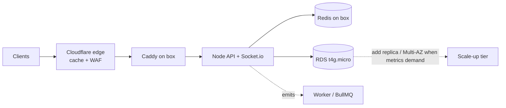

> **Right-size for actual load.** Year-1 = 1,000 users / 500 bookings **per month** ≈ **1–5 req/s peak**. One small box handles this with huge headroom. The work below is about **shedding load before it reaches the origin** and **not paying for idle capacity**.

**Load-shedding / efficiency (do at MVP — directive: reduce server load):**
- **Edge cache (Cloudflare, free):** `GET /services` + all static get `Cache-Control` + ETag → served from Cloudflare edge → **near-zero origin hits**. Biggest single win.
- **Multi-layer cache:** in-process LRU (per box, ms TTL) → Redis (shared) → Postgres. **Cache-aside** for services, technician profiles, booking read-models; invalidate on write.
- **HTTP caching:** ETag / `Cache-Control` on cacheable GETs; `304` revalidation.
- **Compression:** Brotli/gzip at Cloudflare + Caddy.
- **DB efficiency:** tuned Prisma pool; **no N+1** (explicit `select`/`include`); **keyset (cursor) pagination**, never `OFFSET` on big lists; partial indexes (already in schema); `EXPLAIN`-checked hot queries.
- **Work off the request path:** BullMQ for push/payout/reports/outbox.
- **Realtime efficiency:** location sampled 1/2s server-side; **Redis GEO** for matching (no PG geo on the hot path); Socket.io Redis adapter kept so scaling out is config-only.
- **Rate limiting at the edge** (Cloudflare) before origin; Redis token-bucket as a second layer.

**MVP tier (launch):**
- **Compute:** 1× Graviton box (EC2 `t4g.small`, instance IAM role), Docker: API + worker + Redis + Caddy.
- **DB:** 1× RDS `db.t4g.micro` (managed, for PITR). Redis on the box with **AOF persistence ON** — BullMQ jobs + distributed locks + OTP hashes live there (cache is rebuildable; money lives in PG).
- **Static/media:** Cloudflare Pages (web/admin) + R2 (media). No CloudFront/S3.
- **Queues / scheduled jobs (BullMQ):** `outbox-relay` (~1s), `dispatch-timeout` (90s → expand radius → `expired` + auto-void), `scheduled-dispatch`, `preauth-reconciler`, `balance-reconcile` (nightly), `location-pruner`, **`trust-tier-recompute`** (nightly — §0.2 #1), **`subscription-biller`** (monthly recurring charges — Phase 2), **`inspection-scheduler`** (subscriber quarterly free inspection — Phase 2), **`bom-review-timeout`** (2-hour founder-fallback: auto-approve capped at `price_max_fils`, audited — §0.6.2), **`verification-deadline`** (24-hour price-dispute settlement: no invoice ⇒ ledger deduction keyed `matverif:{id}` — §17.5.14), **`price-refresh-reminder`** (monthly ritual prompt + staleness report against `refresh_cadence` — §17.5.13), **`index-rebase`** (applies the CPI/fuel formulas to `base_reference_fils` once a new `price_index_readings` row lands; stamps `indexed_at` — §17.5.13), **`readiness-recompute`** (category gate after every closed quote — §17.5.15).

**Scale-up triggers (only when a metric says so):**
| Add | Trigger |
|-----|---------|
| Split API/worker to own boxes or Fargate | box CPU > 60% sustained |
| Managed Redis (ElastiCache) | Redis competes with API for box memory |
| RDS bigger + read replica | RDS CPU > 60% or report queries slow |
| RDS Multi-AZ | before serious revenue / SLA |
| ALB + 2+ API instances | need HA / horizontal scale |
| Distributed tracing, Prometheus/Grafana, AV scan | when debugging/compliance demands it |

At **10k users / 5k bookings-mo**: still one beefier box (or 2 small + ALB) + `db.t4g.medium` + maybe managed Redis. Modest.

---

## 7. File Structure

```
fixly/
├── backend/                       # Clean / hexagonal architecture (ports & adapters)
│   ├── src/
│   │   ├── domain/                # ENTITIES + value objects + PORTS (interfaces). Zero framework deps.
│   │   │   ├── booking/           # Booking entity, BookingRepository (port), transition policies
│   │   │   ├── payment/           # Payment entity, PaymentProvider (port)
│   │   │   ├── technician/  ledger/  guarantee/  review/  otp/
│   │   ├── application/           # USE CASES (orchestration) — depend ONLY on domain ports
│   │   │   ├── booking/           # CreateBooking, AcceptBooking, CompleteBooking, CancelBooking
│   │   │   ├── auth/              # RequestOtp, VerifyOtp, RefreshSession
│   │   │   └── payment/ guarantee/ payout/ ...
│   │   ├── infrastructure/        # ADAPTERS implementing ports
│   │   │   ├── db/                # Prisma repositories, migrations, seed
│   │   │   ├── cache/             # Redis + in-process LRU (cache-aside helpers)
│   │   │   ├── payment/           # HyperPayProvider (hosted checkout, wallet, webhook verify)
│   │   │   ├── otp/               # WhatsAppCloudProvider, SmsFallbackProvider (FallbackChain)
│   │   │   ├── realtime/          # socket.io + redis adapter
│   │   │   ├── queue/             # BullMQ queues + workers (outbox-relay, dispatch-timeout, …)
│   │   │   ├── push/  storage/    # FCM/APNs ; R2 (S3-compatible) client
│   │   │   └── config/            # env, ssm params, db/redis clients
│   │   ├── interface/             # delivery layer
│   │   │   ├── http/              # Express controllers, routes, zod DTOs
│   │   │   └── middleware/        # auth, rbac, rateLimit, idempotency, errorHandler
│   │   └── server.ts             # composition root (wires adapters → use cases)
│   ├── tests/                     # unit (domain + use-cases) + integration (supertest)
│   ├── prisma/schema.prisma
│   ├── Dockerfile  package.json  tsconfig.json
│
├── web/                           # Customer web (React + TS, Vite)
│   └── src/ app/  components/ui/(shadcn)  features/{booking,tracking,auth,payment}/  store/(rtk)  lib/  i18n/(ar,en)
├── admin/                         # Admin panel (React + TS): technicians/ bookings/ guarantees/ reports/ broadcast/
│
├── mobile/                        # SINGLE Skip codebase — Clean Architecture (pure Swift)
│   ├── Sources/Fixly/
│   │   ├── Presentation/          # SwiftUI Views + ViewModels (ObservableObject)
│   │   ├── Domain/                # Entities + UseCases + Repository PROTOCOLS (ports)
│   │   ├── Data/                  # Repository impls, APIClient (URLSession), DTOs, local cache
│   │   ├── DI/                    # composition root / dependency container
│   │   └── Platform/              # platform-specific (Skip #if SKIP)
│   │       ├── GoogleMap.ios.swift     # iOS: Google Maps SDK (GMSMapView)
│   │       ├── GoogleMap.android.kt    # Android: Google Maps Compose (ComposeView)
│   │       ├── ApplePay.swift          # native PassKit (iOS)
│   │       └── GooglePay.android.kt    # native Google Pay (Android)
│   ├── Skip/skip.yml   Package.swift   Android/
│
├── docs/                          # openapi.yaml, architecture.md, runbooks/
├── infra/
│   └── terraform/                 # lightsail/ec2, rds, cloudflare (dns/pages/r2/waf), ssm params
├── docker/
│   ├── docker-compose.yml         # local: postgres, redis, backend, worker
│   └── Caddyfile                  # prod reverse proxy + auto-TLS
│
└── .github/workflows/             # backend-ci, web-ci, admin-ci, mobile-ci
```

---

## 8. Data Flow Diagrams

### 8.1 Customer Booking Flow

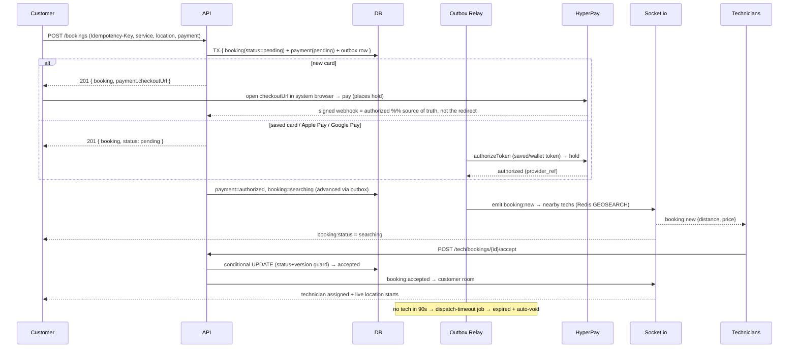

### 8.2 Technician Accept/Reject Flow

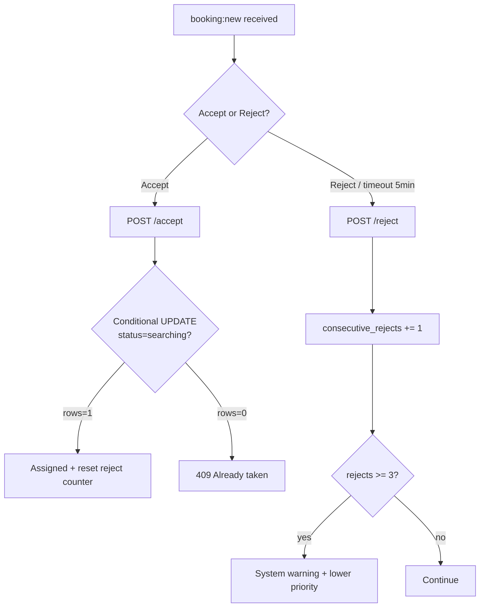

### 8.3 Payment Flow (pre-auth → capture → payout)

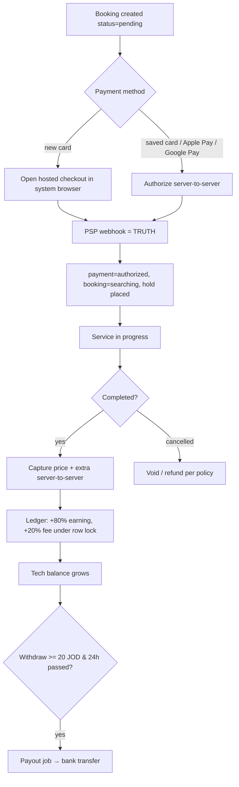

### 8.4 Guarantee Flow

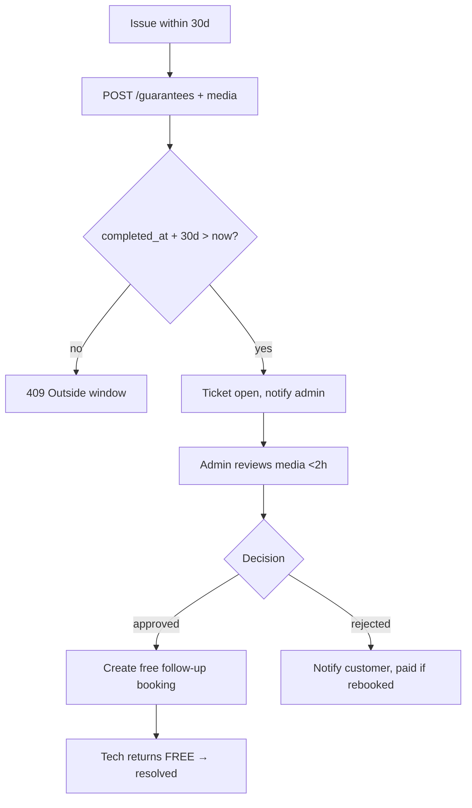

### 8.5 Real-Time Location Flow


### 8.6 Notification Flow

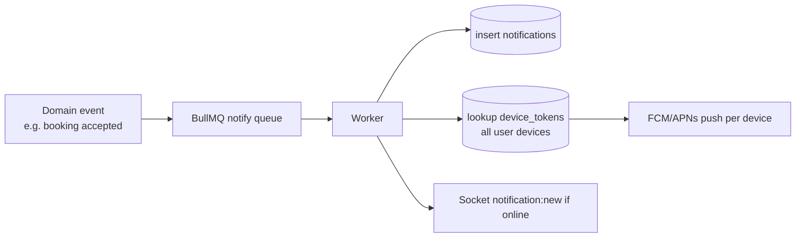

### 8.7 Extra-Work Approval (fixed-price integrity — §0.2 #3)

```mermaid
flowchart TD
    A[Tech finds bigger job than fixed price] --> B[POST /tech/bookings/{id}/extra amountFils+note]
    B --> C[extra_status=proposed + emit booking:extra_proposed]
    C --> D{Customer decides in-app}
    D -->|approve| E[extra_status=approved]
    D -->|decline| F[extra_status=declined]
    E --> G[On complete: capture price_fils + extra_fils]
    F --> H[Capture base price_fils ONLY<br/>or cancel per policy]
    G --> I[Promise intact — no silent charge]
    H --> I
```

### 8.8 Arrival SLA & Late Compensation (§0.3)

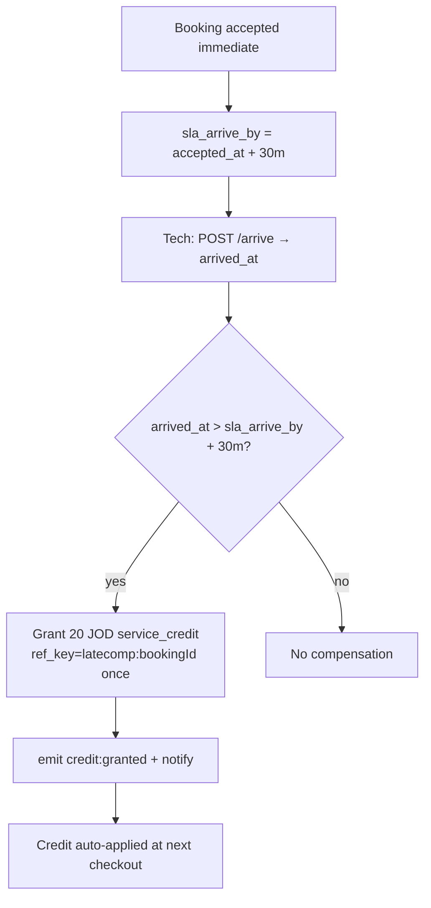

### 8.9 Video Pre-Check Quote (§0.3, Phase 2)

```mermaid
flowchart TD
    A[Customer uploads problem video] --> B[POST /quotes → status=pending]
    B --> C[Qualified tech/ops sets FIRM quoted_fils]
    C --> D[status=quoted + emit quote:ready]
    D --> E{Customer accepts before expiry?}
    E -->|yes| F[POST /quotes/{id}/accept → booking price_fils=quoted_fils]
    F --> G[Pay as normal → dispatch]
    E -->|no / expired| H[status=declined/expired]
```

### 8.10 Protection Subscription Lifecycle (§0.3, Phase 2)

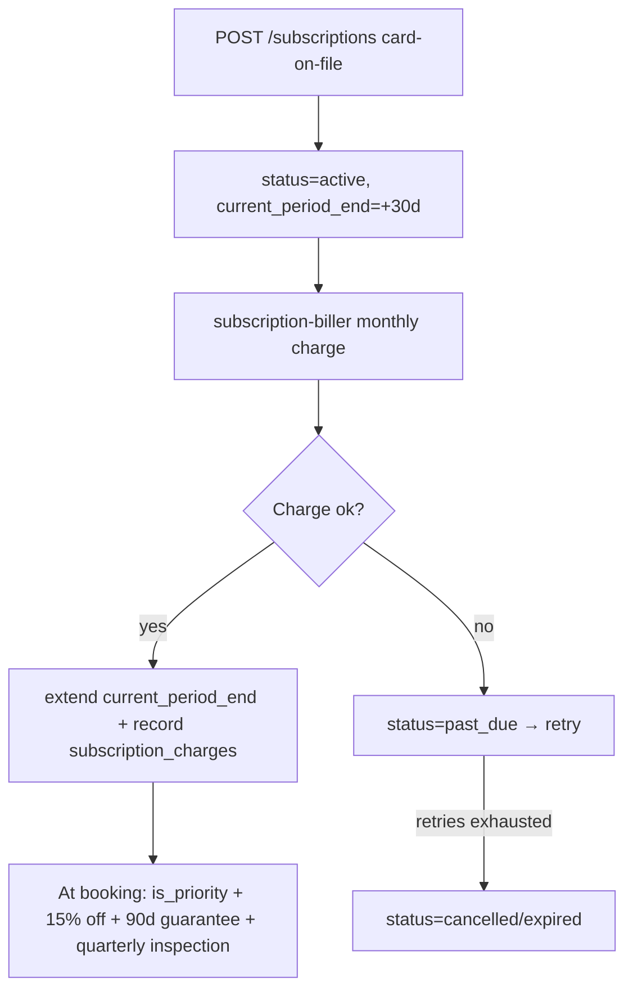

### 8.11 Quote-First Category Flow (materials integrity — §0.2 #4, §17.5)

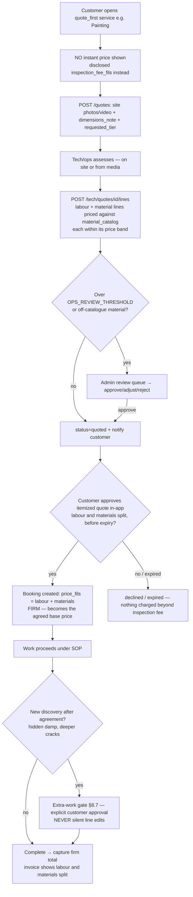

### 8.12 Bill of Materials & Price-Variance Gate (§17.5.6, §17.5.9)

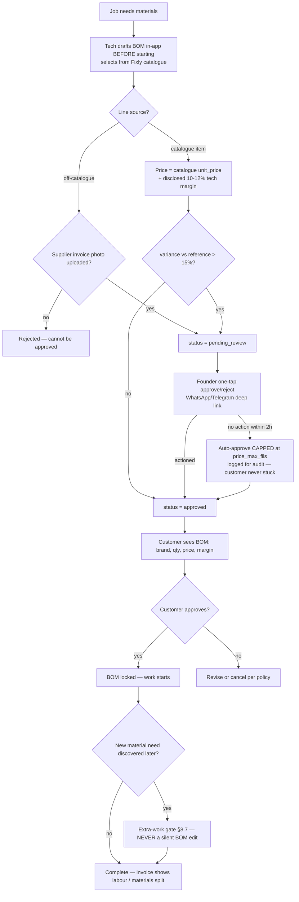

---

## 9. Infrastructure Design (lean MVP)

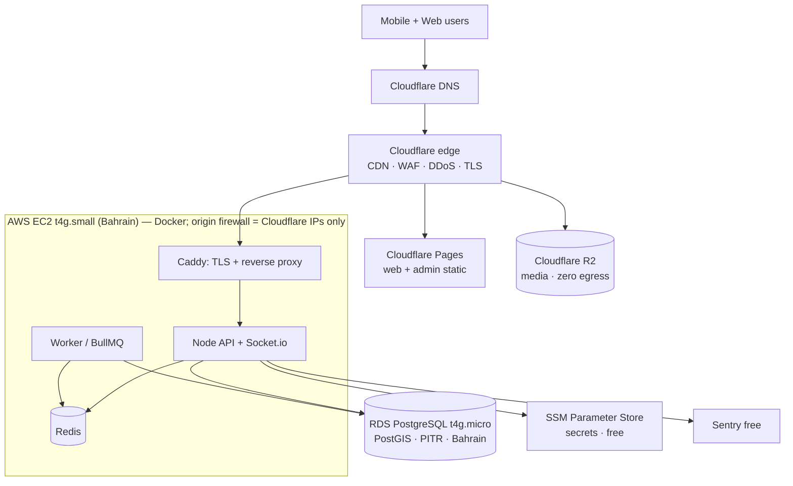

| Resource | MVP Spec | ~ $/mo |
|----------|----------|--------|
| Compute | 1× EC2 **t4g.small** (Graviton, 2GB, instance IAM role) — Docker: API+worker+Redis+Caddy | $12–18 |
| DB | RDS **db.t4g.micro** single-AZ, 20GB gp3, PostGIS, PITR | $13–18 |
| CDN/WAF/DNS/TLS | **Cloudflare free** | $0 |
| Web/admin hosting | **Cloudflare Pages** | $0 |
| Media storage | **Cloudflare R2** (zero egress) | $1–5 |
| Secrets | **SSM Parameter Store** (SecureString) | $0 |
| Errors / uptime | Sentry free + UptimeRobot free | $0 |
| Email/Slack alerts | SES / Slack webhook | ~$1 |
| **Infra subtotal** | | **~$30–45** |

**No ALB, no NAT Gateway, no ElastiCache, no CloudFront, no AWS WAF, no Secrets Manager, no Mongo** — each removed as not-needed-at-this-stage (all in §6 scale-up triggers).

**Origin access:** EC2 **instance IAM role** grants SSM Parameter Store + RDS access (no static keys — the reason EC2 is preferred over Lightsail). Security group allows **inbound only from Cloudflare IP ranges**. **Caddy TLS** via a Cloudflare **Origin CA cert** or ACME **DNS-01** (HTTP-01 fails behind the Cloudflare proxy).

**Backups/DR:** RDS automated backups + **PITR (7d)** + daily snapshot (35d). R2 versioning on media. Box is **cattle** (rebuildable from image + compose); Redis is cache (rebuildable). **RPO ≤ 5 min (PG), RTO ≤ 1 h.** Restore drill quarterly.

**R2 bucket layout:**
```
fixly-media/
  technician-docs/{userId}/...   (private, signed URL)
  guarantee/{ticketId}/...        (private, signed URL)
  reviews/{bookingId}/...         (public via Cloudflare)
```

---

## 10. Deployment Strategy

### 10.1 Backend CI/CD (GitHub Actions)

```yaml
name: backend-ci
on: { push: { branches: [main], paths: ['backend/**'] } }
jobs:
  test:
    runs-on: ubuntu-latest
    services:
      postgres: { image: postgis/postgis:15-3.4, env: { POSTGRES_PASSWORD: test }, ports: ['5432:5432'] }
      redis:    { image: redis:7, ports: ['6379:6379'] }
    steps:
      - uses: actions/checkout@v4
      - uses: actions/setup-node@v4
        with: { node-version: 20, cache: npm }
      - run: cd backend && npm ci
      - run: cd backend && npx prisma migrate deploy
      - run: cd backend && npm run lint && npm test
  deploy:
    needs: test
    runs-on: ubuntu-latest
    steps:
      - uses: actions/checkout@v4
      - name: Build + push image (GHCR, free)
        run: |
          echo "${{ secrets.GHCR_TOKEN }}" | docker login ghcr.io -u ${{ github.actor }} --password-stdin
          docker build -t ghcr.io/fixly/backend:${{ github.sha }} backend
          docker push ghcr.io/fixly/backend:${{ github.sha }}
      - name: Deploy to box over SSH
        uses: appleboy/ssh-action@v1
        with:
          host: ${{ secrets.BOX_HOST }}
          username: deploy
          key: ${{ secrets.BOX_SSH_KEY }}
          script: |
            cd /srv/fixly
            IMAGE_TAG=${{ github.sha }} docker compose pull backend
            docker compose run --rm backend npx prisma migrate deploy
            IMAGE_TAG=${{ github.sha }} docker compose up -d backend worker
```

> Use AWS region **`me-south-1` (Bahrain)** — lowest latency to Jordan among AWS regions.

### 10.2 Pipelines per platform
- **Web / Admin:** build (Vite) → **Cloudflare Pages** (git-connected auto-deploy + global CDN, free). No S3/CloudFront.
- **Mobile (one Skip codebase):** on a macOS runner — `skip export` transpiles → builds **both**: iOS (Fastlane → TestFlight → App Store) and Android (Gradle AAB → Play internal → production). **Build Android in RELEASE with ProGuard in CI** — the `ComposeView`/maps crash only surfaces in release.
- **Migrations:** `prisma migrate deploy` runs as ECS one-off task **before** service update. Expand-then-contract (backward-compatible) migrations only; never drop a column in the same release that stops writing it.

### 10.3 Environments
| Env | DB | Domain |
|-----|----|--------|
| development | local docker-compose | localhost |
| staging | shared box + RDS micro | staging-api.fixly.jo |
| production | box + RDS micro (Multi-AZ later) | api.fixly.jo |

`.env` keys (prod values in **SSM Parameter Store**): `DATABASE_URL`, `REDIS_URL`, `HYPERPAY_ENTITY_ID`, `HYPERPAY_TOKEN`, `HYPERPAY_WEBHOOK_SECRET`, `GOOGLE_MAPS_KEY_IOS`, `GOOGLE_MAPS_KEY_ANDROID`, `GOOGLE_MAPS_KEY_SERVER`, `WHATSAPP_PHONE_ID`, `WHATSAPP_TOKEN`, `SMS_FALLBACK_KEY`, `R2_ACCOUNT_ID`, `R2_ACCESS_KEY`, `R2_SECRET`, `R2_BUCKET`, `CLOUDFLARE_API_TOKEN`. **Loaded as files, not env vars:** `JWT_PRIVATE_KEY`/`JWT_PUBLIC_KEY` (PEM). (Firebase + AWS Secrets Manager removed.)

---

## 11. Performance Requirements

| Metric | Target | How achieved |
|--------|--------|--------------|
| API p95 latency | < 200 ms | edge cache, Redis cache, indexed queries, Prisma pool |
| DB query | < 50 ms | proper indexes, tuned Prisma pool (PgBouncer at scale), no N+1 |
| Location update e2e | < 1 s | Redis pub/sub + Socket.io adapter |
| Image upload | < 2 s | presigned direct-to-R2 (bypasses API) |
| App cold load | < 1 s | code-split, Cloudflare CDN, lazy routes |
| Nearby-tech query | < 50 ms | Redis GEO (in-memory) |
| Support first response | < 5 min | live chat + on-call rota |
| Guarantee response | < 2 h | admin SLA + priority queue |

Load target validated with **k6**: **50 RPS** sustained (≈10× Year-1 peak), p95 < 200ms. Re-test at higher targets only when real traffic approaches the ceiling — don't gold-plate for load you don't have.

---

## 12. Monitoring & Logging

- **Errors:** Sentry (free tier) — backend + mobile/Skip + web; release tracking, source maps. Watch Android **release** crashes (ProGuard + `ComposeView`).
- **Metrics/uptime:** Cloudflare Analytics (traffic, cache hit-rate — free) + UptimeRobot (health pings, free) + Sentry Performance (slow transactions). *(Self-host Prometheus/Grafana + distributed tracing = scale-up, not MVP.)*
- **Logs:** Pino JSON → box file → shipped to a free sink (Better Stack / Grafana Loki free tier). Correlation `requestId` per request, `bookingId` threaded through.
- **Product analytics:** **PostHog (free tier / self-hostable)** events (`signup`, `booking_created`, `booking_completed`, `repeat_booking`) — needed to measure the **70% retention** KPI.
- **Graceful shutdown:** on SIGTERM stop accepting new connections, drain in-flight HTTP, flush Socket.io rooms before exit. Prevents dropped websockets on deploy.
- **Health:** `GET /health` (liveness), `GET /health/ready` (checks PG + Redis). Caddy + UptimeRobot probe `/health`.
- **Alerts (Slack webhook + email, free):**
  - payment-success-rate < 95% (5 min) → page finance/on-call
  - p95 latency > 300ms (5 min)
  - error rate > 1%
  - no tech available in a zone > 10 min
  - RDS CPU > 80%, Redis evictions > 0
  - guarantee tickets breaching 2h SLA

---

## 13. Testing Strategy

| Level | Tool | Scope |
|-------|------|-------|
| Unit (backend) | **Jest** | services, money math, geo, fee calc, guarantee window logic |
| Integration | **Supertest** | full API routes against test PG/Redis |
| Contract | OpenAPI + **Dredd** | spec ↔ implementation parity |
| Mobile unit | **XCTest** (shared Swift) | view models, networking, money — runs once, covers both platforms |
| Mobile smoke | **Skip parity check** | build + run key screens on iOS sim AND Android emulator (release) |
| E2E web | **Playwright / React Testing Library** | booking flow happy path |
| Load | **k6** | 50 RPS, soak 30min (≈10× peak) |
| Security | **OWASP ZAP** + `npm audit` + Snyk | weekly + pre-release |

Critical test cases: double-accept race (version guard), refund-on-cancel policy, guarantee 30-day boundary (day 30 vs 31), payout min/24h gate, payment-capture idempotency (replay returns same result, no double charge), fixed-price snapshot immutability, **outbox exactly-once across a crash mid-relay**, **ledger balance == SUM(entries) under concurrent earnings**, dispatch-timeout auto-expire+void, pre-auth-expiry reconciler, multi-device push fan-out, **Skip Android release-build map render + moving marker (the ComposeView/ProGuard trap)**, payment webhook = source of truth (ignore spoofed redirect). **v1.5 business rules (§0):** extra-work gate — unapproved `extra_fils` is NEVER captured; late-compensation credit granted exactly-once (`ref_key`) only when `arrived_at > sla_arrive_by + 30m`; service-credit redemption capped at amount due (never negative charge); subscriber discount + `is_priority` applied at booking; probation-tier tech excluded from priority/wide-radius dispatch; upheld conduct report increments `off_platform_flags` and can demote tier; video quote → booking carries `price_fils = quoted_fils`; subscription revenue never posts to `ledger_entries`.

---

## 14. Cost Estimates (Monthly)

### Tier 0 — FREE ($0/mo · demo + early real users)
Host the **real** app for **$0** until you have traffic/revenue — every paid piece has a free tier.

| Item | Free option | $/mo |
|------|-------------|------|
| Compute + Postgres + Redis | **Oracle Cloud Always Free** ARM VM (up to 4 cores / 24 GB / 200 GB) — Docker runs API + worker + Postgres + Redis + Caddy on one box | $0 |
| CDN / DNS / TLS + web/admin hosting | **Cloudflare** free + **Pages** | $0 |
| Media storage | **Cloudflare R2** free (10 GB) | $0 |
| Maps | **MapLibre + OpenStreetMap** (no key); or Google Maps **$200/mo free credit** | $0 |
| OTP | mock (dev) / **WhatsApp Cloud API** free tier (~1k convos/mo) | $0 |
| Push · email · errors · uptime · analytics | FCM · Resend free · Sentry free · UptimeRobot free · PostHog free | $0 |
| **Tier 0 total** | | **$0** |

*No-server alt: **Neon** Postgres + **Upstash** Redis + **Render/Fly** free API + Cloudflare — all free tiers. Caveat: free API cold-starts and free DB pauses when idle (fine for demo, not 24/7 SLA). Oracle Always Free capacity can be region-limited at signup; fall back to this combo if so.*

> The only unavoidable costs are **deferred**: HyperPay (% per txn) begins when you take real payments; Apple/Google store fees when you publish. Until then the running app = **$0/mo**.

### Tier 1 — PAID (~$30–45/mo · when you outgrow free / want 24/7 SLA)

| Item | Est. Cost (USD) | Basis |
|------|-----------------|-------|
| EC2 **t4g.small** (Graviton) | $12–18 | API + worker + Redis + Caddy on one box |
| RDS **db.t4g.micro** single-AZ + 20GB | $13–18 | only managed piece (money DB + PITR) |
| Cloudflare (CDN/WAF/DNS/TLS/Pages) | $0 | free tier |
| Cloudflare R2 (media) | $1–5 | zero egress |
| SSM Parameter Store / Sentry / UptimeRobot / PostHog | $0 | free tiers |
| Email/Slack alerts (SES) | ~$1 | |
| **Fixed infra subtotal** | **~$30–45/mo** | down from ~$475–1,150 |
| Google Maps API | $30–150 | **map display via SDK = free**; only geocoding (cached) + 1 Directions call at accept |
| OTP — WhatsApp Cloud API + SMS fallback | $10–60 | WhatsApp auth msgs cheap; SMS only on fallback |
| Call masking (Twilio proxy, optional) | $0–40 | or in-app VoIP / deferred |
| HyperPay (PSP) | ~2.5–2.9% + ~$0.30/txn | pass-through per transaction |
| **Total fixed (excl. PSP %)** | **~$70–255/mo** | first 6 months |

> Maps is the main variable — slashed by using the **free mobile SDK for display** (no Static-Maps / per-load tiles), **caching geocoding** results, and calling **Directions once at accept** (ETA between ticks = straight-line distance ÷ avg speed, or self-hosted OSRM on the box). Restrict map API keys by bundle ID / referrer + daily quota caps.

---

## 15. Code Templates

### 15.1 Backend — Booking creation (Express + Prisma + Zod)

```typescript
// backend/src/interface/http/booking.controller.ts  (delivery layer → calls a use case)
import { Router } from 'express';
import { z } from 'zod';
import { requireAuth } from '../middleware/auth';
import { idempotent } from '../middleware/idempotency';
import { CreateBooking } from '../../application/booking/CreateBooking';

const router = Router();

const CreateBookingDto = z.object({
  serviceId: z.string().uuid(),
  type: z.enum(['immediate', 'scheduled']),
  scheduledAt: z.string().datetime().optional(),
  location: z.object({ lat: z.number(), lng: z.number() }),
  addressText: z.string().min(3).max(500),
  notes: z.string().max(500).optional(),
  payment: z.object({                          // new card -> hosted checkout; token -> repeat/wallet
    method: z.enum(['card', 'applepay', 'googlepay']).default('card'),
    savedToken: z.string().optional(),
    walletToken: z.string().optional(),
  }),
});

router.post('/bookings', requireAuth('customer'), idempotent, async (req, res, next) => {
  try {
    const dto = CreateBookingDto.parse(req.body);
    const key = req.header('Idempotency-Key');
    if (!key) throw new ValidationError('Idempotency-Key header required'); // a random key per retry = no dedupe
    const booking = await CreateBooking.exec(req.user.id, dto, key);
    res.status(201).json({ success: true, data: booking });
  } catch (err) { next(err); }
});

export default router;
```

```typescript
// backend/src/application/booking/CreateBooking.ts  (USE CASE — depends only on domain ports)
// OUTBOX pattern: NO external call in the request path. Booking + payment + outbox row
// commit atomically; the outbox-relay worker authorizes payment + emits booking:new.
// Fixes the dual-write hole (crash between PSP auth and DB commit = orphaned hold).
import { prisma } from '../../infrastructure/config/db';
import { genRefCode } from '../../domain/booking/ref';

export const CreateBooking = {
  async exec(customerId: string, dto: CreateBookingDto, idempotencyKey: string) {
    return prisma.$transaction(async (tx) => {
      const service = await tx.service.findUniqueOrThrow({ where: { id: dto.serviceId } });

      const b = await tx.booking.create({
        data: {
          refCode: genRefCode(),
          customerId,
          serviceId: dto.serviceId,
          type: dto.type,
          scheduledAt: dto.scheduledAt,
          status: 'pending',                       // -> 'searching' after auth succeeds
          priceFils: service.basePriceFils,
          platformFeeFils: Math.round(service.basePriceFils * 0.2),
          addressText: dto.addressText,
          notes: dto.notes,
        },
      });
      await tx.$executeRaw`UPDATE bookings SET location =
        ST_SetSRID(ST_MakePoint(${dto.location.lng}, ${dto.location.lat}),4326) WHERE id = ${b.id}::uuid`;

      await tx.payment.create({
        data: { bookingId: b.id, provider: 'hyperpay', status: 'pending',
                amountFils: service.basePriceFils },
      });

      // Same-tx outbox row => relay creates hosted checkout OR authorizes saved/wallet token.
      await tx.outboxEvent.create({
        data: {
          aggregate: 'booking', aggregateId: b.id, eventType: 'booking.created',
          payload: { bookingId: b.id, payment: dto.payment, idempotencyKey },
        },
      });
      // New-card path: relay returns checkoutUrl (surfaced via booking:status / GET booking).
      return b; // status=pending; client subscribes to booking:status (+ opens checkoutUrl if present)
    });
  },
};
```

```typescript
// backend/src/jobs/outbox-relay.ts — repeatable ~1s; SKIP LOCKED for safe concurrency
export async function relayOnce() {
  const rows = await prisma.$queryRaw<OutboxRow[]>`
    UPDATE outbox_events SET status='processing'
    WHERE id IN (SELECT id FROM outbox_events
                 WHERE status IN ('pending','failed') AND next_retry_at <= now()
                 ORDER BY id FOR UPDATE SKIP LOCKED LIMIT 50)
    RETURNING *`;
  for (const ev of rows) {
    try {
      await handlers[ev.event_type](ev.payload);          // e.g. authorize hold + emit booking:new
      await prisma.outboxEvent.update({ where: { id: ev.id }, data: { status: 'done' } });
    } catch (e) {
      await prisma.outboxEvent.update({ where: { id: ev.id },
        data: { status: 'failed', attempts: { increment: 1 }, nextRetryAt: backoff(ev.attempts) } });
      // after N attempts -> dead-letter + alert
    }
  }
}
```

```typescript
// domain/payment/payment.port.ts (interface) + infrastructure/payment/HyperPayProvider.ts (impl)
export interface PaymentProvider {
  createCheckout(p: { amountFils: number; currency: 'JOD'; paymentType: 'PA'; returnUrl: string })
    : Promise<{ checkoutId: string; redirectUrl: string }>;           // hosted page (new card)
  authorizeToken(p: { amountFils: number; token: string })           // saved card OR wallet token
    : Promise<{ ref: string }>;
  capture(p: { ref: string; amountFils: number }): Promise<void>;
  refund(p: { ref: string; amountFils: number }): Promise<void>;
  void(p: { ref: string }): Promise<void>;
  verifyWebhook(rawBody: Buffer, signature: string): boolean;        // signed callback = truth
}
export const payments: PaymentProvider = new HyperPayProvider();

// domain/otp/otp.port.ts (interface) + infrastructure/otp/* (impls)
// Code is generated + hashed in Redis by the VerifyOtp use case; providers only DELIVER.
export interface OtpProvider { send(p: { phone: string; code: string }): Promise<void>; }
// Primary = WhatsApp Cloud API (cheap); fallback = SMS (Twilio / local aggregator).
export const otp: OtpProvider = new FallbackChain([
  new WhatsAppCloudProvider(),
  new SmsProvider(/* Twilio or Unifonic/Infobip */),
]);
```

### 15.2 Mobile (Skip) — Clean Architecture (Presentation → Domain → Data)

ViewModel depends on **Domain use cases (protocols)**, never on the network — keeps it testable and Skip-portable. Use-case impls live in the Data layer and call `APIClient`.

```swift
// Presentation/Booking/BookingViewModel.swift — depends on DOMAIN use cases, not on networking.
import Foundation
import CoreLocation

@MainActor
final class BookingViewModel: ObservableObject {
    @Published var services: [Service] = []
    @Published var selectedService: Service?
    @Published var isLoading = false
    @Published var errorMessage: String?

    private let loadServices: LoadServicesUseCase     // injected (DI), defined in Domain
    private let createBooking: CreateBookingUseCase

    init(loadServices: LoadServicesUseCase, createBooking: CreateBookingUseCase) {
        self.loadServices = loadServices; self.createBooking = createBooking
    }

    func onAppear() async {
        isLoading = true; defer { isLoading = false }
        do { services = try await loadServices() }
        catch { errorMessage = error.localizedDescription }
    }

    func book(at coord: CLLocationCoordinate2D, address: String,
              notes: String?, method: PaymentMethod) async -> BookingResult? {
        guard let service = selectedService else { return nil }
        do { return try await createBooking(.init(service: service, coord: coord,
                                                  address: address, notes: notes, method: method)) }
        catch { errorMessage = error.localizedDescription; return nil }
    }
}

// Domain/Booking/UseCases.swift — ports (no implementation here)
protocol LoadServicesUseCase { func callAsFunction() async throws -> [Service] }
protocol CreateBookingUseCase { func callAsFunction(_ input: NewBooking) async throws -> BookingResult }

// Data/Booking/BookingRepository.swift — impl calls APIClient (URLSession) + caches.
// On a returned checkoutUrl: open in SFSafariViewController (system browser) —
// never an embedded WebView (wallets + 3DS + PCI SAQ-A).
```

```swift
// mobile/Sources/Fixly/Features/Booking/Views/ServiceListView.swift
import SwiftUI

struct ServiceListView: View {
    @StateObject private var vm = BookingViewModel()
    var body: some View {
        NavigationStack {
            List(vm.services) { service in
                NavigationLink(value: service) {
                    HStack {
                        AsyncImage(url: URL(string: service.iconUrl)) { $0.resizable() }
                            placeholder: { ProgressView() }
                            .frame(width: 44, height: 44)
                        VStack(alignment: .leading) {
                            Text(service.nameAr).font(.headline)
                            Text("\(service.basePriceFils / 1000) دينار").foregroundStyle(.secondary)
                        }
                    }
                }
            }
            .navigationTitle("اختر الخدمة")
            // RTL comes from app localization (Localizable ar) + system locale,
            // NOT a hardcoded override — hardcoding .rightToLeft breaks the English build.
            .task { await vm.loadServices() }
        }
    }
}
```

### 15.3 Mobile (Skip) — Google Maps on BOTH platforms (the hard part)

**Google Maps both sides** (no Apple Maps) for identical behavior + styling: iOS uses the **Google Maps SDK** (`GMSMapView` via `UIViewRepresentable`), Android uses **Google Maps Compose** via Skip's `ComposeView`. One shared Swift `TechMapView`; business logic written once.

```swift
// mobile/Sources/Fixly/Platform/GoogleMap.ios.swift  (iOS — Google Maps SDK)
import SwiftUI
import GoogleMaps                                // pod 'GoogleMaps'

struct GoogleMapIOS: UIViewRepresentable {
    let lat: Double; let lng: Double
    func makeUIView(context: Context) -> GMSMapView {
        let v = GMSMapView(); v.camera = .camera(withLatitude: lat, longitude: lng, zoom: 15); return v
    }
    func updateUIView(_ map: GMSMapView, context: Context) {
        map.clear()
        let m = GMSMarker(position: .init(latitude: lat, longitude: lng))
        m.title = "Technician"; m.map = map
        map.animate(toLocation: .init(latitude: lat, longitude: lng))   // smooth marker move on socket tick
    }
}

struct TechMapView: View {                        // shared surface
    let lat: Double; let lng: Double
    var body: some View {
        #if SKIP
        ComposeView { ctx in GoogleMapAndroid(lat: lat, lng: lng, ctx: ctx) }
        #else
        GoogleMapIOS(lat: lat, lng: lng)
        #endif
    }
}
```
```kotlin
// mobile/Sources/Fixly/Platform/GoogleMap.android.kt  (Android — Google Maps Compose)
// Skip/skip.yml gradle dep: com.google.maps.android:maps-compose:6.x
@Composable fun GoogleMapAndroid(lat: Double, lng: Double, ctx: ComposeContext) {
    val pos = LatLng(lat, lng)
    val cam = rememberCameraPositionState { position = CameraPosition.fromLatLngZoom(pos, 15f) }
    GoogleMap(cameraPositionState = cam) { Marker(state = MarkerState(position = pos), title = "Technician") }
}
```
> ⚠️ Map **display via the mobile SDK is free** (no per-load tile cost) — keep ETA/Directions API calls minimal (once at accept). **Validate in a RELEASE Android build with ProGuard ON** — `ComposeView`/maps is the documented release-only crash spot (needs `proguard-rules.pro` keep rules). This is the Skip go/no-go gate (appendix).

### 15.4 Web — RTK Query slice (React + TS)

```typescript
// frontend-web/src/store/api.ts
import { createApi, fetchBaseQuery } from '@reduxjs/toolkit/query/react';

export const api = createApi({
  reducerPath: 'api',
  baseQuery: fetchBaseQuery({
    baseUrl: import.meta.env.VITE_API_URL,
    credentials: 'include',                 // send HttpOnly refresh cookie to /auth/refresh
    prepareHeaders: (headers) => {
      // access token kept in memory (module/redux state), NEVER localStorage (XSS-safe)
      const token = getAccessTokenFromMemory();
      if (token) headers.set('Authorization', `Bearer ${token}`);
      return headers;
    },
  }),
  tagTypes: ['Booking'],
  endpoints: (b) => ({
    getServices: b.query<Service[], void>({ query: () => '/services',
      transformResponse: (r: ApiResponse<Service[]>) => r.data }),
    createBooking: b.mutation<Booking, CreateBookingDto>({
      query: (body) => ({ url: '/bookings', method: 'POST', body }),
      invalidatesTags: ['Booking'],
    }),
  }),
});
export const { useGetServicesQuery, useCreateBookingMutation } = api;
```

### 15.5 Realtime — Socket.io server with Redis adapter + JWT auth

```typescript
// backend/src/realtime/index.ts
import { Server } from 'socket.io';
import { createAdapter } from '@socket.io/redis-adapter';
import { pubClient, subClient } from '../config/redis';
import { verifyAccessToken } from '../modules/auth/jwt';

export function initRealtime(httpServer) {
  const io = new Server(httpServer, { cors: { origin: ALLOWLIST } });
  io.adapter(createAdapter(pubClient, subClient));

  io.use((socket, next) => {
    try {
      const { token } = socket.handshake.auth;
      socket.data.user = verifyAccessToken(token);
      next();
    } catch { next(new Error('UNAUTHENTICATED')); }
  });

  io.on('connection', (socket) => {
    const { id, role } = socket.data.user;
    socket.join(role === 'technician' ? `tech:${id}` : `user:${id}`);

    socket.on('location:update', async ({ lat, lng }) => {
      await pubClient.geoAdd('tech_locations', { member: id, longitude: lng, latitude: lat });
      const bookingId = await getActiveBooking(id);
      if (bookingId) io.to(`booking:${bookingId}`).emit('technician:location', { bookingId, lat, lng });
    });
  });

  return io;
}
```

### 15.6 docker-compose (local dev)

```yaml
# docker/docker-compose.yml  (local dev; prod compose adds caddy, no mongo)
version: '3.9'
services:
  postgres:
    image: postgis/postgis:15-3.4
    environment: { POSTGRES_DB: fixly, POSTGRES_PASSWORD: dev }
    ports: ['5432:5432']
    volumes: ['./postgres/init.sql:/docker-entrypoint-initdb.d/init.sql']
  redis:
    image: redis:7
    ports: ['6379:6379']
  backend:
    build: ../backend
    env_file: ../backend/.env
    ports: ['4000:4000']
    depends_on: [postgres, redis]
  worker:
    build: ../backend
    command: node dist/infrastructure/queue/worker.js
    env_file: ../backend/.env
    depends_on: [postgres, redis]
```

---

## 16. Local Development (Free Tier) — run the whole app for $0

Goal: see all 4 apps working end-to-end **before** any paid contract or store account. Every production dependency has a free local stand-in, wired behind the same `PaymentProvider` / `OtpProvider` / storage / map interfaces — so going to production later is a **config flip, not a rewrite**.

| Production (paid / contract) | Free local dev replacement | Account needed? |
|------------------------------|----------------------------|-----------------|
| AWS RDS PostgreSQL | `postgis/postgis:15` in Docker | none |
| ElastiCache Redis | `redis:7` in Docker | none |
| Cloudflare R2 / S3 media | **MinIO** (S3-compatible) in Docker | none |
| HyperPay payments | **MockPaymentProvider** (auto authorize/capture, returns a fake `checkoutUrl` that succeeds); optional **Stripe test mode** for realism | none / free |
| WhatsApp Cloud API + SMS OTP | **MockOtpProvider** — prints the code to the server console; verify accepts dev code `000000` | none |
| Google Maps (display + geocode) | **MapLibre GL + OpenStreetMap** tiles (no key) + **Nominatim** geocoding | none |
| FCM / APNs push | in-app **Socket.io** notifications only for the demo (FCM later — free tier) | none |
| Cloudflare CDN/WAF, SSM secrets | Vite dev server + local `.env` file | none |
| Sentry / monitoring | Pino pretty → console | none |

**Switch via env:** `ENV=local` selects the mock/free providers; `ENV=production` selects HyperPay / WhatsApp / Google Maps / R2. The interfaces (`PaymentProvider`, `OtpProvider`, storage, `MapProvider`) already exist (§15.1) — only the concrete implementation swaps. No business-logic changes.

**Fastest path to SEE a full working app:** run **backend + web app** in the browser — zero device or store accounts. The **mobile (Skip)** app runs on the iOS Simulator / Android Emulator with only the **free** Xcode + Android Studio (no paid Apple/Google account needed until you ship to stores).

> When you later sign HyperPay / Apple / Google Play, flip the four providers from mock → real and add keys to SSM. Nothing else changes.

---

## 17. MVP Operating Model — Business & Operations Requirements

> **Read this first.** §1–§16 specify the *software*. This section specifies the *business the software runs*. The correct mental model is **not "build an app that works" but "build a micro-operating-system for home maintenance in Amman."** The market does not reward the prettiest UI — it rewards whoever turns an unorganized, low-trust service into a reliable, controlled experience (this is exactly what separated managed marketplaces like Urban Company from simple directories). Every requirement below is either **MVP** (ship at launch) or **Phase 2** (built-but-gated / after quality is proven), and is mapped to the concrete system that implements it.

### 17.1 What the customer must notice immediately (the brand's 4 pillars)

A "near-perfect" MVP makes four things obvious to the customer from the first booking. If any is missing, Fixly is just another directory app.

1. **Fixed, transparent pricing** — the price is shown and locked *before* confirmation; increases require in-app approval (§0.2 #3, §17.5).
2. **Fixly Certified technicians** — vetted, badged, name/photo/rating shown **before** arrival (§17.3).
3. **A 30-day structured guarantee** — a real, operational warranty with a 2-hour response SLA, not a marketing line (§8.4, guarantee state machine).
4. **Fast support + a fully digital flow** — 24/7 Arabic human support (first response ≤ 5 min) and payment that never touches cash-to-technician (§17.9, §5 PCI).

**Customer-visible experience requirements (MVP):** technician name + photo + rating before arrival · clear ETA · live order-status updates · support reachable from the order screen · simple invoice summary / e-receipt · one-tap rebooking · a tidy order & maintenance history.

**Technician-visible experience requirements (so good technicians stay — §0.2 #2):** a simple, fast app · **expected earnings shown per offered job** · transparent payout + timing · a fair SLA · protection from abusive customers (`conduct_reports` cut both ways) · a **scorecard the technician can see and understand** · incentives that reward **quality and reliability, not just volume**.

### 17.2 Core service engines (the MVP "engine room")

The platform is six cooperating engines. Most already exist in code (§ references); this table is the authoritative spec of what each must do and where it lives.

| Engine | Responsibility | Inputs → Output | Implementation status |
|--------|----------------|------------------|-----------------------|
| **Matching** | Offer a job to the right technicians | zone + specialty + availability + trust tier + distance → ranked offer set | **Built** — `DispatchService` (Redis GEO nearby, per-service filter, probation radius cap §0.2 #1); broadcast-and-accept rounds with timeout expansion (§8.2) |
| **Pricing** | Compute the amount due | **fixed_scope:** catalogue price + approved add-ons − promo − subscription − wallet credit → `totalJod` · **quote_first:** inspection fee, then accepted itemized quote (labour + catalogue-priced materials) becomes the firm price | **Built (core)** — `BookingService.createBooking` + `PromoService` + credit redemption; **quote engine + price book + package pricing = §17.5 (to add; gates category expansion §17.13)**. *v1.7 correction: `calloutFeeJod` exists in schema but is the **no-show fee** — NOT the quote-first inspection fee; they are separate fields (§17.5.2).* |
| **Quality** | Score technicians continuously | rating + lateness + **redo/warranty rate** + **complaint rate** + upheld conduct flags → `trustTier` | **Partial** — `TrustService` recompute uses rating/volume/flags; **redo-rate + complaint-rate inputs = §17.7 (to add)** |
| **Warranty** | Link a claim to its original job and govern the outcome | completed booking + within window → guarantee ticket → free re-visit / refund | **Built** — `GuaranteeService` state machine (open → under_review → approved/rejected → resolved), 30-day (90 for subscribers), 2-hour SLA (§8.4) |
| **Fraud / Leakage** | Detect off-platform and abnormal patterns | conduct reports + behavioural signals → flags / tier demotion / suspension | **Partial** — `conduct_reports` + `offPlatformFlags` + auto-suspend; **automated pattern detection = Phase 2** |
| **Notification** | Reach the right party on the right channel | domain event → Push / in-app / (SMS·WhatsApp fallback) | **Built** — outbox → `NotificationService` + `device_tokens` + Socket.io (§8.6) |

### 17.3 Fixly Certified — technician certification & onboarding program

Vetting is more important than any screen (existential risk #1 + #3). The MVP ships a **real certification pipeline**, even in a lightweight form. Document-screening alone is explicitly *not* sufficient.

**Certification pipeline (gate to `APPROVED` + `trustTier=VERIFIED`):**

| Stage | What happens | System hook |
|-------|--------------|-------------|
| 1. KYC + identity | National ID captured (stored encrypted, `national_id_enc` §2.2) + selfie match | onboarding docs (`idDocUrl`, `selfieUrl`) |
| 2. Professional docs | Trade certificate / references uploaded and reviewed — **application decision ≤ 24h SLA (v1.8)**: accept/reject notification with `reject_reason` when rejected | `certificateUrl`; admin review; docs-review queue in Ops Console |
| 3. Short interview | Ops screens attitude, Arabic communication, reliability | Ops Console note (§17.6) |
| 4. Practical / video test | Skills demonstrated (in person or by video) → pass recorded | `skillsTestPassedAt` (§2.2) |
| 5. SOP onboarding | Technician trained on the service SOPs + app + conduct rules | onboarding checklist (Ops) |
| 6. Background check | Result recorded | `bgCheckStatus` (PENDING → PASSED/FAILED) |
| 7. **Probation — first 10 orders** | Tighter dispatch radius, closer monitoring, faster suspension on a valid complaint | `trustTier=PROBATION` + `PROBATION_MAX_RADIUS_KM` (§0.2 #1). *Threshold currently first-N by tier policy; the explicit "10-order graduation" rule is the MVP target for `TrustService`.* |
| 8. Continuous re-evaluation | Nightly recompute; tier can rise or fall; repeat off-platform flags auto-suspend | `trustService.recomputeAll()` job |

**Training model (v1.9 — resolved: buy it, don't build it).** The earlier "who delivers training?" open item assumed Fixly would build an internal training function. That assumption is **wrong for this venture**: technicians are freelancers, not employees (§0.6), and a solo founder cannot staff a training department. The correct model is to **require certification that the market already produces**:

- **Fixly does not train — Fixly requires a certificate.** A recognised vocational certificate from an accredited Jordanian training provider becomes an **entry condition for `trust_tier = verified`**. Jordan already has this infrastructure (advanced vocational training colleges operating multiple centres nationally, university-led work to standardise in-company trainer certification, and national employment-and-training bodies partnering with vocational colleges) — it is a service to procure, not a capability to build.
- **Subsidy-for-commitment.** Where cost blocks a good technician, Fixly funds part of the course fee against a commitment to a minimum number of platform jobs — the same logic as vehicle/tool financing in ride-hailing. Funded from the re-allocated budget (§0.6.4), and it doubles as a retention and anti-leakage device (§0.2 #2).
- **The practical test stays in-house, and stays cheap.** The technician uploads a **~5-minute video** performing a defined scenario (e.g. replace a light switch; remove and refit a valve), scored against a short fixed checklist by the founder or the VA. Roughly **one hour per week** at pilot volume — deliberately sized to survive a one-person operation. Recorded in `skills_test_passed_at`.
- **Insurance remains Phase 2**; `is_insured` already exists, so enabling it is configuration.

**Watch-item (unchanged and still the top risk):** until certification coverage is broad, quality is enforced partly *after the fact* (post-complaint filtering), so a high early complaint rate turns the 30-day guarantee into the platform's biggest cost — monitor guarantee-claim + dispute rate from booking #1 (§0.4, §17.10), and keep the guarantee reserve funded (§0.6.4).

### 17.4 Service SOPs (Standard Operating Procedures) + service scopes

Every service must have a written SOP. SOPs protect the customer (no surprises), the technician (clear boundary), and the guarantee (clear "was this in scope?").

**Each service SOP defines:** the **scope description** · **what the price includes** · **what it explicitly does NOT include** · a **pre-start checklist** · a **pre-close checklist** · **before/after photos** when relevant · **escalation cases** · **the exact trigger for "extra work"** (which routes into the approval gate §0.2 #3).

**Data requirement — `service_scopes` (v1.7 correction: *partially built*, not absent):** the schema already carries `Service.sopIncludes[]` / `Service.sopExcludes[]` — the include/exclude half of the scope record exists today. Still to add: `preStartChecklist[]`, `preCloseChecklist[]`, `photosRequired` bool, `extraWorkTriggers[]` (either as further `Service` columns or a dedicated `service_scopes` table). Until then the checklist half lives as ops documents referenced by the service; completing it is a small additive migration.

### 17.5 Pricing & Materials Model (the complete pricing spec)

> **Why this section exists.** v1.6 priced *labour* and never modeled **materials**. For material-heavy work (painting is the canonical case) the final cost is driven by wall area, coat count, surface prep (putty/sanding/primer), paint type, brand tier, and colour — none of which a catalogue price can know. Selling that as an instant flat price produces exactly the outcomes Fixly exists to prevent: price disputes, material padding, complaints, a guarantee that cannot be funded, and the platform degrading into "the traditional market with an app UI". This section is the authoritative pricing spec; §0.2 #4 is its strategic summary.

> **Implementation status (verified against `backend/prisma/schema.prisma`, 2026-07-19).** Everything in this document **through v1.6** exists in code — `BookingQuote`, `Subscription`, `ServiceCredit`, `ConductReport`, trust tiers, the extra-work gate, dispatch/guarantee/payout services are all implemented. **This entire §17.5 materials & pricing layer (v1.7–v1.13) is SPEC-ONLY**: none of `quote_lines`, `material_catalog`, `booking_materials`, `service_material_policies`, `suppliers`, `service_rate_cards`, `category_readiness_gate`, `material_verification_requests`, or `price_index_readings` exist in the schema yet. That is consistent with the phasing — all three launch categories are `fixed_scope` and Painting is gated (§17.13) — but nobody should read "the quote engine" here as running code. It is the next build increment, not the current system.

#### 17.5.1 The two pricing archetypes

Every service in the catalogue is one of exactly two archetypes (`services.pricing_model`):

| Archetype | How it is sold | Categories | Mechanism |
|---|---|---|---|
| **`fixed_scope`** | **Instant booking** at a catalogue package price; scope is knowable up front | Electricity, Plumbing, AC (all 3 launch categories), Furniture | `base_price_fils` snapshot + governed add-ons (§0.2 #3) |
| **`quote_first`** | **No instant price.** Disclosed **inspection fee** → site/media assessment → **itemized firm quote** (labour + materials split) → digital customer approval → quote becomes the booking price | Painting; any future material-heavy category | `booking_quotes` + `quote_lines` + `material_catalog` (§8.11) |

**The rule that decides which archetype a category gets:** if a competent professional cannot state the true total price without seeing the site (or detailed media/dimensions), the category is `quote_first`. Blind flat pricing of such work is prohibited — the `chk_pricing_archetype` constraint makes the schema itself refuse it.

#### 17.5.2 Fixed-scope pricing

- **Fixed-scope package price** per common job type (`services.base_price_fils`); package variants are the MVP target.
- **Callout / no-show fee** — a disclosed fee covering a wasted trip (customer no-show / cancel-after-dispatch). **Semantically distinct from the quote-first inspection fee** (§17.5.3): callout compensates a trip; inspection buys an assessment that produces a quote. They are separate fields (`calloutFeeJod` vs `services.inspection_fee_fils`) and must never be merged.
- **Governed add-ons** — extra work proposed by the technician **must be approved in-app before it can be billed** — enforced end-to-end via `AdditionalWorkItem` + the capture gate (§0.2 #3, §8.7). Unapproved extra is **never** captured.
- **Emergency / night surcharge (v1.8)** — out-of-hours emergency dispatch carries a flat, **disclosed-before-booking** surcharge (founder research: **+10 JOD**, standard 20% commission applies). Shown as its own line on the price screen and invoice — a transparent premium, never a hidden markup. *(Field target: `services.emergency_surcharge_fils` or a config constant + a `bookings.is_emergency` flag; MVP-light — ships with 24/7 emergency dispatch, §0.3.)*

#### 17.5.3 Quote-first flow (the painting model)

1. Customer opens a `quote_first` service. The UI shows **no instant price** — it shows the **inspection fee** and (optionally) a *"starting from"* anchor clearly labelled as excluding materials until assessment.
2. Customer submits **site media** (photos/video), **approximate dimensions / room count**, desired **colour**, and **material tier** (economy/standard/premium), plus whether they want prep+paint or paint only.
3. A certified technician or ops assesses — from media where possible, on site (paid inspection) where not.
4. The assessor drafts an **itemized quote**: labour, each material as its own line (`quote_lines`), prep work, coat count, brand/tier, what is included/excluded, expected duration.
5. **Ops review gate** (§17.5.12) where triggered → quote goes to the customer.
6. Customer sees **labour and materials split**, line by line, and approves digitally. The quote total becomes the **firm booking price** (`bookings.labour_fils` + `materials_fils` = `price_fils`).
7. Any post-agreement discovery routes through the **extra-work gate** (§17.5.11) — never a silent price change.

Example quote the customer sees (a room paint job):

| Line | Kind | Amount |
|---|---|---|
| Labour — room painting, 2 coats | labour | 45 JOD |
| Primer (1 bucket) | material | 12 JOD |
| Paint, standard tier (2 buckets) | material | 36 JOD |
| Putty + surface prep | prep | 8 JOD |
| Masking / protection materials | material | 4 JOD |
| **Total (firm)** | | **105 JOD** |

#### 17.5.4 Regional benchmarks and the hybrid pricing decision

Deep research into the Gulf/Saudi players that solved this problem converges on one answer: **do not sell every service with the same pricing logic.** How the successful ones actually handle unknown materials:

| Platform | What it does about unknown scope/materials | What Fixly takes |
|---|---|---|
| **Maharah (مهارة)** | Requires a **photo or video plus details before execution**, and lets the customer choose among technicians | Media is a **primary scope input, not a secondary feature** — it is how a material-heavy job becomes quotable at all |
| **Ajeer (أجير)** | Organised around **offers, prices and warranty** presented through the platform | The quote — not the doorstep conversation — is where price is agreed |
| **Urban Company** | For complex work (e.g. painting) issues a **detailed quotation covering scope, materials, payments and schedule**, then **supplies materials only after the offer is approved**, with the customer paying **in defined stages** in-app | The **staged project model** for large jobs: approve → part-payment → materials → execute, rather than "technician decides on site, then presents a bill" |
| **Benna (بنّا)** | Building-materials platform built on **price comparison and access to trusted suppliers** | Price transparency is itself the product — consistent with Fixly's Asset-Light reference catalogue (§17.5.6) |

**The three service layers (the operative classification):**

| Layer | Examples | How it is priced |
|---|---|---|
| **Standard fixed-scope** | Fan installation, mixer replacement, AC cleaning | **Instant price**, labour-only, possibly including specific pre-defined consumables |
| **Fixed-scope + controlled add-ons** | Fuse, electrical box, siphon, flexible water hose | **Instant price + an approved add-on list** at known prices or narrow bands, each needing in-app customer approval (`material_mode='governed_addons'`) |
| **Quote-first / material-heavy** | Painting, pipe extension, crack repair, partial electrical re-installation | **Inspection or media → detailed final offer before execution** (`quote_first_bom` / `project_staged`) |

**Fixly must own materials *pricing* even before it owns materials *supply*.** Leaving estimation, purchasing and pricing entirely to the technician returns the customer to the traditional market and breaks the transparency promise. How that ownership is staged — govern-the-retail-market now, participate-in-supply only when funded — is specified once, in **§17.5.6 (Stage A / Stage B)**.

**The three-line invoice rule.** The customer must always see the amount broken into **Labour · Materials · Platform/service fee** — never one opaque total. A worked example: *Labour 18 JOD + Materials 11 JOD = 29 JOD.* For complex services the **inspection/callout fee is charged first**, and on approval of the quote it is either **deducted from the project total or counted as part of it** — never silently kept on top.

**Materials Decision Engine (how Fixly knows what is needed before arriving).** Rather than "let the technician decide on site":
- **Quick services — a decision tree.** Problem: *"the breaker keeps tripping"* → questions: is it confined to one room? is the breaker burnt? is there sparking? → the system proposes a diagnostic visit, a repair package, or the likely add-ons (fuse / breaker / faceplate) with their catalogue prices.
- **Complex services — structured intake.** Photos, video, approximate dimensions, brand preference, and quality tier; a field inspection only when that data is insufficient.

**The single policy that governs all of it** — internal and customer-facing:

1. Any service whose materials cannot be known precisely at request time **is not sold as an instant final price**.
2. Materials are priced as **separate line items**, never as one vague line.
3. **Fixly is the reference for the approved price — not the technician alone.**
4. **No material cost reaches the customer without in-app approval.**
5. Any **unused or substituted** material follows a documented policy.
6. **The guarantee covers work and materials only within what was approved and documented.**

#### 17.5.5 Materials Policy — the five mandatory questions

Every service category must answer these five questions **explicitly**, enforced by a **`service_material_policies` row per service** (its 5-class `material_mode` is the single source of truth); "unspecified" is not an allowed state:

| # | Question | Allowed answers | Painting answer |
|---|---|---|---|
| 1 | Are materials **included or excluded** by default? | `labour_only` · `materials_included` (consumables folded into the package) · `materials_quoted` (itemized per job) | `materials_quoted` |
| 2 | **Who specifies** quantities? | Assessing technician, checked against catalogue **coverage assumptions** (`coverage_note`), reviewed by ops above threshold | Tech proposes; system sanity-checks vs m²-coverage; ops reviews |
| 3 | **Who buys** the materials? | See sourcing models §17.5.6 | Technician sources at catalogue price (Model 3 pricing control), platform-supplied later |
| 4 | **How are materials priced?** | Only against the `material_catalog` price book, within `[price_min, price_max]` | Catalogue bands by tier |
| 5 | **Who is liable** for defective materials? | Platform if platform-priced/sourced within catalogue; customer if customer-supplied (guarantee then covers **workmanship only**) | Guarantee covers workmanship + platform-priced materials; customer-supplied paint = workmanship-only guarantee, stated on the quote |

#### 17.5.6 Sourcing and the Material Price Engine

| Model | Description | Verdict |
|---|---|---|
| **1. Customer buys** | Fixly sells labour only; tech writes a shopping list | **Allowed as an option**, not the default. Simplest financially, but weakest experience: customers don't know materials, quality leaves Fixly's control, and "was it the work or the paint?" disputes undermine the guarantee. When chosen, the quote marks materials `source='customer_supplied'` and the guarantee is explicitly workmanship-only. |
| **2. Technician buys and marks up** | Tech purchases, adds his own price | **REJECTED — never the model.** Opens the padding door directly and contradicts the no-surprises position. A technician's claimed material cost is unverifiable; this is how the traditional market works and exactly what Fixly must not replicate. |
| **3. Fixly controls the pricing (→ eventually the supply)** | Materials are always priced from the platform price book regardless of who physically buys them; later, platform sources via supplier deals | **The target model.** Quality controlled, prices capped, guarantee fundable, customer sees honest line items. MVP starts with price-book control (tech buys at catalogue price); supplier integration comes later (§17.5.15 L3). |


> §17.5.1–§17.5.5 established *that* materials must be governed. This subsection specifies *how*, against the actual Jordanian market. It is the difference between a policy and a mechanism.

**The problem, in Jordan's real numbers.** Material prices in Jordan vary enormously for the *same* line item depending on source, brand, and quality class — and the customer cannot see the difference:

| Item | Observed market spread | Exploitation this enables |
|---|---|---|
| **Interior paint** | ≈ **1.5–2.5** JOD/m² economy · **2.5–4** JOD/m² medium · **4–7** JOD/m² premium | The identical request "paint this room" can be legitimately priced **three completely different ways**. Nothing on the customer's side distinguishes them. |
| **Electrical breakers** | Turkish vs Swedish vs ABB at the **same amperage** differ by **tens of dinars** | Bill the customer for an "imported premium" brand, install the cheap one. Invisible after the wall plate goes back on. |
| **Plumbing pipes / fittings** | Wide variance by type and source | Same substitution risk, same invisibility |
| **General building materials** (cement, steel, block) | Varies by quantity and supplier | Quantity and rate both unverifiable by the customer |

**Why "ask the technician for a receipt" fails.** A receipt proves *a* purchase, not *this* purchase, not the quantity actually consumed, and not that the installed brand matches the billed one. Receipt-checking is reactive, unfalsifiable, and costs founder attention — the scarcest resource (§0.6). The durable answer is to **take pricing authority out of the technician's hands** — but *without* trying to replace Amman's market structure on day one.

> **This subsection is governed by the materials golden rule (§0.1).** Fixly does **not** open a warehouse or force a supplier at launch. The technician keeps buying from the neighbourhood retail market; **Fixly governs the material type (quality floor), the price band, and how it is presented to the customer.** The engine below is therefore staged: everything in **Stage A ships day one**; **Stage B is the L3 rung** and is contingent on commercial agreements that do not yet exist.

> **⚠️ v1.11 — the binding constraint is capital, and it rewrites the staging.** With ~US$2,000 and no commercial relationships (§0.6.4), Fixly **cannot buy, cannot stock, and cannot sign supply contracts** — so Stage B below is not merely "later", it is **out of reach until funded**, and nothing in the launch plan may depend on it. The operating model is **Asset-Light**: *zero inventory, zero pre-purchase, zero financial commitment.* Fixly is not a materials trader; it is a **transparency and verification layer over the market that already exists**. The regional precedents work exactly this way — platforms such as **Caly (كالي)**, **BuildMate (بيلدميت)** and **Mawad (مواد)** hold no stock, connect existing suppliers to customers digitally, and earn on commission. Stage A below is therefore the **whole model**, and it is sufficient: the levers that actually stop material padding are **information and a proof obligation**, neither of which costs money.

**Stage A — govern the market you have (day one, no capital, no supply contracts).**

1. **A reference catalogue built from *free, already-public* price data.** The information Fixly needs is published and costs nothing to gather: Jordanian retailers put full price lists online (e.g. **GLC** paint price lists, **Amman Hardware** paint and breaker prices in JOD, **Jafar Shop** breaker prices), and regional B2B platforms (Caly / BuildMate / Mawad) publish reference prices. These are collected **by hand or with a trivial free script into a sheet**, then loaded as the reference catalogue — three tiers per item (`economy`/`standard`/`premium`), supplemented by direct shop observations (`supplier_price_observations`, `catalog_source='retail_observed'`). **This costs time, not money** — the single most important property given the capital constraint. Freshness is governed by §17.5.13 and surfaced in the Ops Console.
2. **The technician selects, never prices.** Material lines are chosen from the reference catalogue inside the app; the customer sees the catalogue-backed price **before** approving. The technician can no longer be the answer to "what does it cost today?"
3. **Referral commission, not inventory margin (v1.11 — the model correction).** Fixly does **not** buy and resell, and does **not** take a cut of the technician's purchase. Instead, a **verbal agreement or a simple written message** — explicitly *not* a costly wholesale contract — is made with **2–3 small shops per category**: the technician always buys from the partner shop; the shop pays Fixly a **5–8% referral commission** for the steady stream of customers; and the shop issues an **official invoice at the agreed price**, which is uploaded into the app. **No upfront payment of any kind:** Fixly directs the order to a merchant who pays *it*, rather than paying the merchant. *(Supersedes v1.9's "disclosed 10–12% technician margin", which presumed a purchasing relationship Fixly cannot fund. `material_catalog.tech_margin_bps` is retained only for the funded future; `suppliers.referral_commission_bps` is the live field.)*
4. **Transparency instead of ownership — this is the actual anti-padding mechanism.** Because Fixly owns no stock and therefore cannot *control* price, its one free lever is **mandatory proof**: every material purchase requires an uploaded **official shop invoice**; the app compares invoice price against the reference price; a gap beyond the allowed threshold **auto-rejects** pending explanation; and the **customer sees the real invoice photo in the app before final payment** (§17.5.9). Information plus a proof obligation closes invoice inflation **without spending a fils** — which is precisely why this model survives the capital constraint while a supply-chain model would not.
5. **Everything else is enforcement:** mandatory pre-execution BOM, variance auto-escalation, customer-chosen brand, locked-at-approval (§17.5.9).

**Stage B — participate in supply (L3; only once contracts exist).**

5. **Direct wholesale supply contracts.** Contracting accredited wholesalers (building-materials wholesalers of the Jordan Central / Al-Muqabalain type, and category equivalents for paint, electrical, plumbing) upgrades the price basis from *observed retail* to a **true wholesale cost** (`material_catalog.wholesale_fils`, `catalog_source = 'supplier_quote'`). *(Founder-owned commercial task, not engineering — §17.5.16.)*
6. **Fixly Direct Supply (`FEATURE_DIRECT_SUPPLY`, default off).** For selected categories, materials come from Fixly-held or partner stock rather than from the technician (`material_source = 'platform_arranged'`) — cutting the manipulation surface at the root instead of policing it. **Not a day-one capability**; it contradicts the golden rule until the logistics genuinely exist.

**Why the staging matters.** Stage A is what makes the promise real *now*, using only a catalogue and discipline. Stage B is what eventually makes it a **moat**: it moves Fixly from *booking platform* to *participant in the materials supply chain* — a local competitor can copy screens, but not signed wholesale relationships and a maintained price book. Attempting Stage B first is the classic failure: fighting the market's structure before earning the volume that would justify it. Both stages attack the same two Jordanian failure modes — **price volatility** (a maintained, refreshed band) and **invoice inflation** (no technician pricing authority).

#### 17.5.7 The Jordanian materials catalogue — real items, real bands, real shops

> Built from how Amman actually works, not from a generic Gulf or Indian playbook. Technicians buy from neighbourhood trade shops (Tla' Al-Ali, Al-Muqabalain, downtown, Mecca St, Al-Sina'a), price verbally with their own margin, and customers typically know neither item names nor fair prices. The catalogue's job is to make that legible — **quality floor + price ceiling + how it is shown to the customer** (§0.1 golden rule).

Every catalogue item carries: **standard description (Arabic + English)** · **quality grade** (economy / medium / known brand, e.g. Legrand-class for electrical) · **realistic Amman price band** · **unit of measure** · **compatible services**. Indicative launch bands, to be set from Fixly's own market collection at launch and reviewed monthly against CPI and fuel (§17.5.13):

| Category | Representative items | Indicative Amman band |
|---|---|---|
| **Electrical** | Switch/socket box (standard plastic) · MCB/fuse at common ratings (10A / 16A / 20A) · faceplate · copper wire at common sections (1.5 / 2.5 / 4 mm) · standard switches and lighting · consumables (tape, clips) | box **0.5–1.2 JOD** · breaker **3–7 JOD** · wire **0.4–0.8 JOD/m** |
| **Plumbing** | PVC / multi-layer pipe (hot & cold) · elbow, tee, connectors · siphon · flexible hose (ليّ) · mixers · valves · sealing (silicone, teflon) | bathroom siphon **4–9 JOD** · flexible hose **2–4 JOD** · pipe **1–3 JOD/m** |
| **AC** | Refrigerant gas · filters · small parts | per service scope |
| **Painting** | Water/oil-based paint from local and regional brands · primer · putty · masking | sold **per m²**, not per bucket — see below |

**Painting is converted from bucket to m².** Paint is sold in Jordan by bucket or litre, but a customer cannot reason about buckets. The catalogue therefore holds a **base cost per m²** using standard coverage assumptions, plus a reasonable platform and technician margin — the same conversion successful regional players use. This is what makes the `service_rate_cards` tiers (§17.5.8) honest rather than arbitrary.

**Quality floor (v1.11 — the control that stops silent downgrading).** Each catalogue item defines a **minimum acceptable grade**, not only a price ceiling. Fitting a material *below* the specified floor is a **quality violation** — it affects the guarantee, feeds the technician's rating and trust tier, and is logged in the Ops Console. Price caps alone would simply push a dishonest technician toward cheaper goods at the approved price; the floor closes that.

#### 17.5.8 Per-category mechanics — pricing and materials handling

| Category | Market reality | Fixly mechanism |
|---|---|---|
| **Painting** | 1.5–2.5 / 2.5–4 / 4–7 JOD per m² by quality class | **Three published tier packages, all-in (labour + materials), priced per m²** via `service_rate_cards`. The customer picks a tier **before** booking; the price is then **computed** (measured m² × tier rate + prep lines), not invented. Each tier states coat count, brand class, and prep in plain Arabic so "premium" is a defined product, not a sales word. |
| **Electrical** | Turkish / Swedish / ABB differ by tens of JOD at the same amperage | **Catalogue by brand with a fixed price — and the *customer* chooses the brand**, not the technician (`booking_materials.brand`). Brand substitution becomes a contract breach with a recorded expectation, not a he-said-she-said. |
| **Plumbing** | Wide spread by part type and source | **Unified pricing per approved part class** from partner suppliers; parts outside the catalogue require the off-catalogue path (§17.5.9). |
| **General building materials** (cement, steel, block — future scope) | Varies by quantity and supplier | **Wholesale pricing via direct supplier contract**; quantity sanity-checked against `coverage_note`. |

> **Note on the archetype interaction (important):** the painting rate card does **not** demote Painting back to `fixed_scope`. Painting stays `quote_first` because the **scope** (area, surface condition, prep needed) still requires assessment. What the rate card removes is **pricing discretion inside the quote** — the assessor measures and selects a tier, and the price follows from a published table. Scope is assessed; price is computed. That combination is what makes an itemized quote trustworthy.


The decisive Jordanian rule: **no materials-heavy job is sold at an instant flat price in Amman.** Larger work in this market always goes through a separate assessment and quote, and the catalogue must mirror that rather than fight it.

| Category | Simple work → | Project work → |
|---|---|---|
| **Electrical** | Breaker tripping, dead socket: **labour-only price + standard add-ons** (box, fuse, wire) capped by the catalogue | Changing breakers, extending a full circuit: **inspection + quote-first with an itemized BOM** |
| **Plumbing** | Simple blockage, siphon swap: **fixed labour + the siphon at its known catalogue price**, add-ons if extra parts | New line, or pipework inside a wall or under tiles: **inspection + quote-first + BOM — never an instant price** |
| **AC** | Cleaning, gas refill, routine maintenance: **fixed-scope labour + defined materials** (gas, filters, small parts) within a known band | Compressor replacement, full unit removal/installation: **quote-first with BOM** |
| **Painting** | One wall or one room: a **per-m² package** with standard materials, paint and putty inside a clearly stated scope | Whole apartment, or damp/crack remediation: **inspection + quote-first + BOM** (paint, putty, scaffolding where needed) |

**Composite warranty for market-procured materials (v1.11).** For materials the technician buys from the Jordanian market, the guarantee is layered: **30 days on the workmanship**, and where the **material itself** is proven defective (as distinct from the technician's execution), the remedy is **replacement of the material's value** — under the supplier's policy where the shop is a partner, or Fixly's policy on larger projects. This prevents a defective 4 JOD part from being argued as a full-service failure, and stops the reverse — a technician blaming "bad materials" for poor work.

#### 17.5.9 Bill of Materials — the anti-manipulation mechanism

Every job consuming materials carries a **Bill of Materials created and approved inside the app *before* execution** (`booking_materials`) — never reconstructed afterwards from memory or receipts:

| Control | Rule | Enforcement |
|---|---|---|
| **BOM before work** | Each part, quantity, brand, and price fixed from the catalogue **before** the technician starts | `material_line_status`: `pending` → `pending_review`/`approved` → **`locked`** at work start |
| **Invoice proof on EVERY material (v1.11)** | Because Fixly owns no stock, proof replaces price control: **every** material purchase requires an uploaded **official shop invoice**, not only off-catalogue items. The app compares invoice price vs reference price, and **a gap beyond the allowed band auto-rejects the line** pending explanation | `chk_offcat_invoice` enforces the minimum (no `material_id` ⇒ invoice mandatory); **`service_material_policies` sets whether invoice proof is required on catalogue items too — required by default under the Asset-Light model** (§17.5.6) |
| **Customer sees the real invoice (v1.11)** | The **actual invoice photo is visible to the customer in-app before final payment** — the single most powerful anti-padding control available at zero cost | `supplier_invoice_url` surfaced on the customer BOM view (§3.4) |
| **Price-variance alert** | A line priced **> 15% above** the catalogue reference (`variance_alert_bps`) is **automatically escalated to review** before it can be approved | `variance_bps` computed on write → `status = 'pending_review'`; resolves via §0.6.2 (founder tap, or the 2-hour cap-and-approve fallback) |
| **Disclosed margin** | Technician material margin is the **published 10–12%**, visible on the customer's invoice | `tech_margin_bps`; invoice renders wholesale-backed price + margin line |
| **Customer brand choice** | Brand is selected by the customer and recorded; substitution is a conduct violation | `booking_materials.brand` + `conduct_reports` |
| **Locked after approval** | Post-approval discoveries are **extra work**, never silent BOM edits | BOM immutable at `locked`; new needs route to §0.2 #3 gate |

#### 17.5.10 Materials edge-case register — the cases that decide clarity or chaos

> An explicit audit of the materials layer named eight edge cases and judged that solving the *approval* logic (§0.2 #3) is **not** the same as solving materials management itself: *"حللتم منطق الموافقة على الزيادة، لكن لم تُكملوا بعد نظام إدارة المواد نفسه."* Each is closed below with the field that enforces it, so none can quietly reopen.

| # | Edge case | Resolution | Enforced by |
|---|---|---|---|
| 1 | Technician fits a **cheaper material than agreed** and bills the better one | Substitution is explicit and **same-or-higher tier only**; a swap creates a linked line, never an edited one. Brand is customer-chosen and recorded; an unapproved substitution **voids the guarantee for that item and is a conduct violation** | `booking_materials.replaces_line_id` · `substitution_policy` · `brand` · `conduct_reports` |
| 2 | Customer approves a **vague quote** ("materials as needed") and objects later | **Vague material lines are prohibited.** A quote cannot be sent with an unpriced or open-ended material line — every material is an itemized line with quantity, unit, and price. "As needed" is not an approvable state | `quote_lines` NOT NULL price/qty · ops-review gate (§17.5.12) |
| 3 | **More material bought than needed** — who bears the surplus? | Quantities are sanity-checked against catalogue **coverage assumptions** before approval; over-purchase beyond the approved BOM is **not billable to the customer** | `material_catalog.coverage_note` · BOM locked at approval |
| 4 | **Leftovers** (part of a can, pipe, wire) — customer's or technician's? | **Usable surplus belongs to the customer by default** and is documented; micro-leftovers are goodwill. The policy is per-service and explicit, never assumed | `service_material_policies.surplus_belongs_to_customer` |
| 5 | **Market price moves between quote and execution** | Quotes carry a **validity window**; an expired quote **cannot be captured** — it must be repriced and re-notified rather than silently honoured or silently increased | `service_material_policies.quote_validity_hours` · capture guard |
| 6 | Technician discovers **the measurement was wrong or the fault is deeper** | **Stop at a safe point and raise a new proposal** — never continue-and-bill. Routes through the extra-work gate with fresh customer approval | `extra_status` gate (§0.2 #3) · BOM `locked` |
| 7 | **Micro-materials** (a fuse, a junction box) — immediate or separate approval? | Below a per-service threshold (≈2–3 JOD) they are **folded into labour and not itemized**; above it they are ordinary BOM lines needing approval. The threshold is configured, not improvised | `service_material_policies.micro_threshold_fils` · `booking_materials.is_micro` |
| 8 | **Customer supplies their own material**, it is poor quality, and the job fails — is it covered? | An explicit in-app option (*"سأوفر المواد بنفسي"*) with a plain warning: the guarantee **covers the work, not the material's defects**. The technician may **refuse to proceed or require an alternative** if the material is unsuitable — he is never forced to warrant someone else's purchase | `allow_customer_supply` · `material_source='customer_supplied'` · §17.8 warranty-by-source |
| 9 | Technician fits a material **below the specified quality grade** at the approved price | A **quality floor** per item, not just a price ceiling: below-floor material is a **quality violation** affecting guarantee, rating and trust tier, and is logged in the Ops Console | `service_material_policies.quality_floor_grade` · `conduct_reports` (§17.5.7) |
| 10 | Customer expected a **different grade** than what was supplied | The quote states the material type or at minimum its **grade** (economy / medium / premium). An upgrade is an **extra BOM line**, never an improvised negotiation at the door | `requested_tier` · `quote_lines` · BOM `locked` |

**Warranty boundary by material source (the rule the above depends on):** platform-priced/sourced materials → **fully covered**; technician-procured **within policy and at catalogue price** → **covered**; **customer-supplied** → **workmanship only**; **unapproved substitution** → **void, plus a technician penalty**. Without this stated up front, every later claim becomes a definitional argument.

#### 17.5.11 Quote vs extra work — the boundary

- **Quote** = the **agreed base price**: labour + *known* materials, fixed at approval. Materials in the quote are **not** "extra work" — they are what was agreed.
- **Extra work** = anything that **appears after** the agreement: discovered damp, deeper cracks needing more putty, a customer changing paint type mid-job. Routes through the §0.2 #3 gate (proposed → customer approves/declines in-app → only then billable).

The failure mode this kills: a tech "finding" more materials mid-job and folding them into the bill. Post-agreement material needs are *extra work by definition* and must clear the same explicit-approval gate. `quote_lines` are immutable after acceptance.

#### 17.5.12 Six anti-manipulation controls

1. **Before-photos required** — site condition documented pre-work (supports both quote honesty and the guarantee).
2. **Dimensions captured** — approximate wall area / wall+room count recorded on the quote (`dimensions_note`); quantities sanity-checked against catalogue coverage assumptions.
3. **Brand/tier selection** — customer picks economy/standard/premium (`requested_tier`); the tier fixes the price band.
4. **Line-item materials** — every material is its own visible `quote_lines` row; no lump "materials: 60 JOD".
5. **Digital approval before execution** — no work starts before the customer approves the itemized quote in-app; **ops review** required above `OPS_REVIEW_THRESHOLD_FILS` or for any off-catalogue material line.
6. **After-photos** — completion documented; feeds guarantee adjudication and the Quality engine.

#### 17.5.13 Keeping the price book honest — index engine, sources, cadence, provenance

A price book that silently goes stale is worse than none: it converts a trust mechanism into a lie with a timestamp. Two problems had to be solved — *who does the updating*, and *what to do for categories where no reliable source exists*.

**(0) The mechanism: Automated Index-Linked Pricing (v1.12 — zero marginal cost).** The catalogue does not hold hand-maintained prices that rot. It holds a **base reference price plus a formula bound to official Jordanian government indices** — all free, all published monthly, all permanently public. The formulas are programmed **once**, during the build that is happening anyway, and thereafter the catalogue re-bases itself:

```
new_reference_price = base_reference_price × (1 + officially announced monthly CPI change)

callout_fee        = base_callout_fee + (official petrol price per litre × distance coefficient)
```

The three indices, and what each governs:

| Index | Source | Governs | Observed reference points |
|---|---|---|---|
| **Consumer Price Index** | Department of Statistics, free monthly publication (`dos_cpi`; the maintenance-services sub-group via Petra, `dos_cpi_maintenance`) | General re-basing of material reference prices | Index **113.42 points (Jan 2026)**; inflation **2.49% (Apr 2026)** |
| **Petroleum Derivatives Pricing Committee** | Official monthly fuel pricing, published free via press release (`memr_fuel`) | The **fuel component of the callout fee** — technician travel cost is a real input, not a guess | Octane 95 **1050 → 1200 fils/litre (Mar → Apr 2026), +14.28%** |
| **Jordan Chamber of Industry** | Periodic public statements on basic material prices (`chamber_of_industry`) | Sharply volatile inputs (steel, aluminium, copper) that move faster than general inflation | Tracked at the cadence set in (b) below |

**Show a band, not a number.** The brand-price gap (§17.5.6) is closed with **no new data at all** — purely a presentation decision: display an **economy–premium range** per item rather than a single figure, exactly as the government itself publishes ranges for staple prices. `price_min_fils`/`price_max_fils` already carry this; the requirement is that the customer-facing UI *shows* the band.

**Why this is the professionally strongest option, not merely the cheapest.** It is precisely what the Jordanian state does: the Pricing Committee re-bases fuel monthly against official indices, and DoS publishes CPI as the recognised national reference. By binding its prices to **the same public references the government uses**, Fixly gains institutional credibility that no private commercial contract could buy — while paying nothing, forever. It plausibly makes Fixly **the only maintenance business in Jordan whose prices re-base automatically against official indices**, with no data subscription, no supplier contract, and no price-monitoring employee.

**(a) The monthly ritual — the human input the formulas still need.** *(The formulas above remove the guesswork; they do not remove the need to enter this month's official figures. Automation without an input is just a stale number with better branding — hence the ritual below, and the `price-refresh-reminder` job that nags when it is skipped.)* Jordan publishes what Fixly needs, free and on a predictable schedule:

| Source | What it gives | Rhythm |
|---|---|---|
| **Department of Statistics — CPI** (with **Petra** republishing the full per-group detail, **including the "housing maintenance services" group** specifically) | The general inflation signal, and a maintenance-specific one | Monthly, ~mid the following month |
| **Ministry of Energy & Mineral Resources — fuel prices** | Transport/callout cost basis; moves technician cost | Monthly, fixed page on the official site |
| **Jordan Chamber of Industry** statements | Semi-official reference for price-critical inputs (steel, aluminium, copper) | Periodic |

The operating rule: **a fixed update day** (e.g. the first working day of each month) and **~15 minutes** on two stable links, recorded into `price_index_readings`. This is deliberately *not* scraping or an integration — those are brittle, and the founder's constraint is attention, not code (§0.6). **Fifteen minutes a month is lighter than running a social account**, and it is the difference between a catalogue that tracks Amman and one that drifts into fiction.

**(b) Grade categories by the reliability of the source that actually exists.** Chasing weekly precision from sources that cannot support it manufactures *fake* accuracy — the failure mode being avoided. Instead, `material_catalog.refresh_cadence` + `price_confidence` are set per item:

| Category class | Cadence | Source | If the source is unavailable |
|---|---|---|---|
| **Price-critical** (steel, aluminium, copper) | **Quarterly** | Chamber of Industry statement | **Freeze at the last recorded price and flag `under_review`** — never guess |
| **Lower-volatility** (paint, electrical fittings/tools) | **Semi-annual** | Re-base by **general CPI** — no specialised source needed | Hold and re-base at the next CPI reading |
| **Everyday consumables** | **Monthly** | Direct Amman retail observation (`supplier_price_observations`, 3–5 shops per trade) | Widen the band and mark `estimated` |

**(b2) Provenance is mandatory, because nobody else regulates this (v1.12).** Jordan officially monitors the price of **food, fuel and staples** (price control + DoS), but **there is no regulator for maintenance/building material prices** — paint, electrical, plumbing. Fixly is therefore the *de-facto* price reference for the category it operates in, which is simultaneously a credibility asset and a burden: with no external authority to appeal to, **every reference price must carry its own evidence**. Each catalogue price records **where it came from** — `price_index_readings.source_url` for indexed items, and `supplier_price_observations` (shop name, area, date, channel) for observed ones. A price with no traceable source is not allowed to back a customer-facing figure. This provenance is also what makes the §17.5.14 dispute protocol defensible — Fixly can show *why* the reference is what it is.

**(c) Disclose confidence to the customer — honesty beats false precision.** Any item not `confirmed` is surfaced in the app as **"سعر تقديري قابل للتأكيد الميداني"** (an estimated price, subject to on-site confirmation). This keeps §0.2 #3's promise intact: the customer is never told a number is firm when it is not, and an `under_review` item cannot be silently slipped into a firm quote.

#### 17.5.14 Price-variance dispute protocol

§17.5.9's variance alert flags a suspicious price. This subsection specifies what *happens next* — the previously missing step, and the sharpest fraud surface in the whole model. It is a **decision path with an end state**, not a notification:

| Step | Trigger | What the system does |
|---|---|---|
| **1. Justify** | Entered price exceeds the reference by more than **`variance_justify_bps` (default 20%)** | The technician **cannot complete the invoice** until a **reason** is recorded (`variance_reason`: special type · imported brand · access difficulty · other, plus a note). *(A lower `variance_alert_bps` (~15%) still routes the line to review — §17.5.9; 20% additionally demands a justification and explicit customer consent.)* |
| **2. Compare and consent — *before* the work** | Any justified over-reference line | The customer sees a plain **side-by-side: catalogue reference price vs requested price**, and gives **digital approval** (`customer_ack_at`) **before execution, never after**. Silence is not consent. |
| **3. Verify — one step, one deadline** | Customer declines | A **verification request** opens (`material_verification_requests`). Resolution is deliberately a **single step**: the technician uploads the **original purchase invoice** within **24 hours**. |
| **4. Settle automatically** | Deadline passes with no invoice | The **difference is deducted from the technician's dues automatically** — a `ledger_entries` adjustment keyed `matverif:{id}` (exactly-once), with the technician notified. No standing arbitration function is required. |

**Why this is affordable for a one-person operation.** At pilot volume these cases are a handful per month, so the founder reviews them personally (§0.6.2) — **no disputes employee is needed at launch**, and the 24-hour deadline plus automatic settlement means an unattended case still terminates correctly rather than festering. Repeat offenders are visible: verification requests upheld against a technician feed `conduct_reports` and the trust-tier recompute (§0.2 #1).

#### 17.5.15 Materials-pricing maturity ladder and the readiness gate

| Level | Mechanism | When |
|---|---|---|
| **L1 — Manual reviewed quote** | Tech drafts material estimate free-form; **every quote is reviewed** before it reaches the customer (founder-in-the-loop, §0.6.2). Slow but safe. | First weeks of the first `quote_first` category |
| **L2 — Price book** | `material_catalog`: tiered items, unit prices, `[min,max]` caps, coverage assumptions ("1 bucket ≈ 24 m²/coat"). System validates each line; review only on exceptions/threshold. | The operating state for Painting launch — **the §17.13 gate requires L2** |
| **L3 — Supplier-integrated** | Wholesale supply contracts backing catalogue prices; monthly price refresh; optionally **Fixly Direct Supply** (§17.5.6) | Begins as soon as the first supply contract is signed; not required for MVP |

**The L1 → L2 promotion trigger is quantitative, not a judgement call (v1.9).** `category_readiness_gate` is recomputed automatically after every closed quote, and a `quote_first` category may only be switched on when **all three** conditions hold at once:

| Condition | Threshold | Why |
|---|---|---|
| **Closed quotes** (accepted → executed → **no dispute**) | **≥ 50** | Enough real jobs to know the model works, gathered via a deliberately limited manual pilot |
| **Dispute rate** on those quotes | **< 8%** | Proves the itemized-quote promise actually holds in the field |
| **Average price deviation** \|final − estimated\| / estimated | **< 15%** | Proves estimates are realistic and don't require constant correction — i.e. the price book, not the technician's guess, is doing the work |

The Ops Console renders this as a plain progress readout — e.g. *"Painting: 32/50 quotes · dispute 5% · deviation 11% — **not ready**"* — so category expansion is a number that appears on a screen, not an opinion.

#### 17.5.16 Rollout — pilot sequencing and the supplier field test

The engine can launch narrow or wide. **Recommendation: one category as a pilot**, consistent with §0.5 scope discipline and §0.6's founder-attention constraint — a wide launch multiplies supplier negotiations and review load at exactly the moment there is one operator.

> **⚠️ v1.11 — the founder's answer was "all categories" (لكل الفئات), not a single-category pilot.** That decision is recorded here as the intent. It is **affordable under the Asset-Light model** precisely because coverage now costs *time* (collecting already-public price lists) rather than *capital* (per-category supply contracts) — the objection that made a narrow pilot necessary does not apply once nothing is being purchased. The remaining constraint is founder attention (§0.6), so the honest reconciliation is: **build the reference catalogue for all categories, but switch each one on in the app only as its data reaches usable coverage**, with `category_readiness_gate` (§17.5.15) deciding the order rather than a guess. Breadth of *data* is cheap; breadth of *live promises* is not.

- **Sequencing within an all-category build: Electrical first** (parts are discrete and countable, so its reference data is the fastest to assemble and the easiest to verify; brand-choice is also the sharpest demonstrable control). Painting follows as the first *`quote_first`* category once its readiness gate passes (§17.5.15).
- **Sequence:** sign 1–2 wholesale contracts for the pilot category → build the catalogue subset with tiers, brands, wholesale basis and caps → run BOM in **review-everything mode (L1)** → once the readiness thresholds are met, widen catalogue coverage and relax to exception-only review (**L2**) → evaluate **Fixly Direct Supply** for that category (**L3**).
- **Open commercial items (founder-owned, not engineering):** which wholesalers to contract per category; agreed wholesale price lists and refresh cadence; whether Fixly holds any stock or stays purely price-controlling at first; the final margin figure inside the 10–12% band; and who physically collects materials in the Direct-Supply model.

**The first supplier engagement is a zero-risk field test, not a contract (v1.10).** Approaching a large wholesaler with a formal referral agreement on day one asks a stranger to trust an app with no volume — and produces a "no" that teaches nothing. Invert it:

| Design choice | Why |
|---|---|
| Start with **2–3 small/medium retail shops**, not large wholesalers | They are the shops technicians already use (§0.1 golden rule), and the decision-maker is the person standing behind the counter |
| Offer **no contract and no obligation** — *"we send you real customers; you pay commission only on an actual sale"* | **Zero risk to the merchant**, so Fixly needs no prior reputation or scale to get a yes |
| Evaluate over **exactly 30 days** against two questions that cannot be answered on paper: **does the merchant actually pay the commission?** and **does he quote the customer a different price in person?** | These are behavioural facts, discoverable only in the field. `suppliers.commission_paid_ok` / `price_manipulation_observed` record the verdict |
| Only after a passed trial does anything get signed | The wholesale contracts of Stage B (§17.5.6) are the *reward* for a proven loop, not its precondition |

The test costs nothing because nobody has committed anything. **A supplier who fails either question is simply not renewed** — no contract to unwind.

#### 17.5.17 The category-differentiated customer promise

Marketing copy must match the archetype — an unqualified "fixed price always" claim on painting is a lie the platform would pay for:

- **`fixed_scope` categories:** *"السعر ثابت ومعروف قبل الحجز — ولا زيادة إلا بموافقتك داخل التطبيق."* (Fixed price before booking; no increase without your in-app approval.)
- **`quote_first` categories:** *"معاينة واضحة وسعر نهائي مفصّل قبل البدء — المواد مبيّنة بشفافية، ولا أي زيادة بدون موافقتك، والضمان يغطي الشغل ضمن النطاق المتفق عليه."* (Clear assessment and a detailed final price before work starts; materials itemized transparently; no increase without your approval; guarantee covers the agreed scope.)

This keeps the "no surprises" promise while staying solvent on hard jobs. Margin-per-service **and materials margin** are tracked in the economics KPIs (§17.10).

### 17.6 Ops Console (operations layer — not a cosmetic admin panel)

The MVP must include a real **operations console** — the screen an operator uses to run the city day-to-day. Without it, you cannot see where the system breaks. Beyond the CRUD admin already built (§7 `admin/`), the Ops Console must surface:

- **Open orders** (live, by status) and **available technicians** (live map/list).
- **Late orders** — arrival past SLA (drives late-compensation, §8.8) and stuck orders.
- **High-risk orders** — new-customer + probation-tech, high value, prior complaint.
- **Cancellations** — with reason, and **no-show** tracking.
- **Complaints & guarantee queue** — the 2-hour SLA queue (§8.4) + complaint taxonomy (§17.7).
- **Per-technician daily performance** — the scorecard (rating, lateness, redo, complaints, acceptance).
- **BOM / price-variance review queue (v1.9)** — material lines `pending_review` (>15% over catalogue reference, or off-catalogue), each actionable in one tap from a mobile deep link, with the 2-hour auto-resolution countdown visible (§0.6.2, §17.5.9).
- **Category readiness readout (v1.9)** — per `quote_first` category: closed quotes / 50, dispute %, price deviation %, and a plain ready/not-ready verdict (§17.5.15).
- **Stale-price warning (v1.9)** — catalogue rows past their `refresh_cadence`, plus anything flagged `estimated`/`under_review`, so the price book cannot silently drift from the market (§17.5.6, §17.5.13).
- **Open price-verification requests (v1.10)** — disputed lines with their 24-hour countdown and the amount at stake; overdue items settle automatically against the technician's dues (§17.5.14).
- **Supplier trial board (v1.10)** — the 2–3 pilot shops with their 30-day verdicts: commission actually paid? price manipulated in person? (§17.5.16).

*Ops Console usability requirement (v1.9):* because the operator is one person on a phone for the first months, every queue item above must be **actionable from a mobile notification deep link** — not only from a desktop dashboard (§0.6.2).

*Status:* the admin app already covers technicians, bookings, guarantee, conduct reports, subscriptions, quality board, quotes, payouts, reports (§7). The **"late / high-risk / daily-performance" operational views** are the MVP target additions.

### 17.7 Data-model additions for operations (current vs target)

Everything must leave an **event trail** — you cannot fix what you cannot see. Current implementation vs target:

| Concept | Target requirement | Current implementation | Gap / action |
|--------|--------------------|------------------------|--------------|
| **Order events** | Immutable log of every state change: created, accepted, arrived, started, finished, complained, warranty-returned | `booking_status_history` (from/to/actor/meta/ts) + `arrivedAt`/`startedAt`/`completedAt` timestamps | Broaden history coverage to include complaint + warranty-return events; keep append-only |
| **Zones** | Named dispatch zones (North/Central Amman) for matching + reporting | Radius-based dispatch (Redis GEO) | Add `zones` + tag bookings/techs with zone (MVP-target refinement; radius works for launch) |
| **Availability slots** | Technician bookable time slots for scheduled jobs | `scheduledAt` on booking + `isAvailable` toggle | Add `availability_slots` when scheduled-booking depth increases (Phase 2) |
| **Complaints + taxonomy** | Categorized complaints (quality / lateness / pricing / conduct / safety / other) | `support_tickets` + `conduct_reports` | Add a `category` enum + link to booking; feeds Quality engine complaint-rate |
| **Technician scorecard** | Rating + lateness + **redo/warranty rate** + **complaint rate** + acceptance | `rating`, `jobsCompleted`, `offPlatformFlags`, `consecutive_rejects` | Add redo-rate + complaint-rate aggregates (feeds §17.2 Quality engine) |
| **Warranty ↔ original order** | Every warranty ticket links to the job it covers + optional free follow-up | `guarantee_tickets.bookingId` + `followup_booking_id` | **Done** |

These are additive migrations; none block launch, but each is specified so the build order is unambiguous.

### 17.8 Operating policies (part of the UX, not just legal fine print)

Nine policies must exist from day one and be enforced by the system where possible:

| Policy | Rule (MVP default — confirm before launch) | System enforcement |
|--------|--------------------------------------------|--------------------|
| **Cancellation** | Free before dispatch/accept; fee window after a technician is en route | `cancel()` transition guards; fee logic = MVP target |
| **No-show (customer)** | Technician marks no-show; callout fee may apply | Ops + `conduct_reports` (`NO_SHOW`) |
| **Late arrival** | Technician >30 min past SLA → automatic 20 JOD customer credit | **Done** — `service_credits` `LATE_COMPENSATION`, exactly-once (§8.8) |
| **Extra-work approval** | No unapproved charge, ever | **Done** — `AdditionalWorkItem` + capture gate (§0.2 #3) |
| **Refund** | Instant, no-argument refund when the customer is not satisfied within guarantee | `GuaranteeService` + PSP refund/void (§8.3, §8.4) |
| **Warranty** | 30 days (90 for subscribers); free re-visit if in scope | **Done** — `GuaranteeService` |
| **Warranty by material source** (v1.11) | Platform-priced/sourced material → **fully covered** · technician-procured within policy at catalogue price → **covered** · **customer-supplied → workmanship only** · **unapproved substitution → void + technician penalty**. Stated on the quote and acknowledged in-app *before* work, so a later claim is never a definitional argument | `booking_materials.source` + `service_material_policies.allow_customer_supply` + guarantee adjudication (§17.5.10) |
| **Technician misconduct** | Upheld conduct report → flag → tier demotion → suspension | **Done** — `conduct_reports` resolve → `offPlatformFlags` → auto-suspend |
| **Customer abuse** | Repeated abuse/fraud → block; protects technicians | `users.isActive=false` (admin block) + conduct reports |
| **Off-platform** | Soliciting off-platform is a violation; guarantee/credit/subscription valid **only** for on-platform jobs | Masked calling + `conduct_reports` (`OFF_PLATFORM_SOLICIT`) (§0.2 #2) |

### 17.9 Support operations

Support is **not optional** in a trust business. MVP support requires: canned **macros** for the common cases · a **decision tree** for complaints · problem **categorization** (feeds the taxonomy §17.7) · an **escalation matrix** (who handles what, when) · and explicit **SLAs — first response ≤ 5 minutes, guarantee decision ≤ 2 hours** (the guarantee SLA is already enforced by `guarantee_tickets.expiresAt`, §8.4). Channels: in-app support thread (built, § `support`), with masked call + WhatsApp deep-link as the human path (full in-app chat is Phase 2).

### 17.10 Week-1 product KPIs (do not launch without this dashboard)

Instrumented via PostHog + backend metrics (§12). If you can't measure it, you can't improve it.

| KPI | Why | Early target (Amman) |
|-----|-----|----------------------|
| App-open → booking conversion | Funnel health | trend up |
| Technician acceptance rate | Supply liquidity | ≥ 70% |
| Avg time-to-assign | Speed promise | < 5 min |
| Avg arrival delay | SLA + late-comp cost | < 10 min |
| Completion rate | Reliability | ≥ 95% |
| Cancellation rate | Friction / supply gaps | < 10% |
| **Complaint rate** | Quality (guarantee-cost leading indicator) | < 5% |
| **Warranty / redo rate** | Quality + guarantee cost | < 5% |
| **Material price deviation** (v1.9) | \|final − estimated\| / estimated — proves the price book, not guesswork, sets prices; gates category expansion (§17.5.15) | < 15% |
| **BOM variance-escalation rate** (v1.9) | Share of material lines tripping the >15% alert — a rising number means the catalogue is stale or a technician is testing the limits (§17.5.9) | low + falling |
| **Auto-resolved review rate** (v1.9) | Share of queue items hitting the 2-hour fallback instead of being actioned — the honest measure of founder-attention saturation and the real VA-hire signal (§0.6.2) | < 20% |
| **Repeat booking rate** | Retention (the Year-1 north star, §0.4) | ≥ 30% at 60 days |
| Orders per active technician | Supply efficiency | trend up |
| On-platform repeat rate | Anti-leakage effectiveness (§0.2 #2) | high |
| NPS / CSAT | Overall trust | ≥ 50 NPS |

### 17.11 Operating team (the business around the app)

**v1.9 — this section is now a *hiring ladder*, not a launch roster.** The venture starts with **one person** (§0.6). The roles below are real, but at launch they are all worn by the founder, and each is spun out **only when a stated trigger fires** — hiring ahead of the trigger burns the runway that funds the guarantee.

| Role | Who does it at launch | Trigger to actually hire | Cost |
|---|---|---|---|
| **Founder / PM / ops lead** | Founder | — | — |
| **Quote & document review** | Founder, via one-tap mobile approvals + the 2-hour auto-rule (§0.6.2) | Sustained **15–20 review items/day** | Remote **VA ~200–300 JOD/mo** |
| **Field complaints / QA** | Founder + VA | Field escalations outgrow remote handling (~month 7–9, and only if the model is working) | Part-time Amman ops |
| **Technician onboarding** | Founder (video-test review ~1 h/week, §17.3) | Onboarding volume exceeds a weekly hour | Folded into VA scope |
| **Legal / accounting** | Contracted per task (contractor agreement, payouts, compliance §17.15) | As needed | Per engagement |
| **Engineering** | **Founder + Claude Code** (§0.6) | Not planned; revisit only if build velocity becomes the binding constraint | — |

*Note:* an external review rated this design senior/staff-level (hexagonal architecture, outbox, optimistic locking, geo-dispatch, Skip transpiler). That sophistication is a genuine execution risk for a solo build — it is why §0.6.1 gates the product surface rather than the schema — but it is answered by the §0.6.4 timeline and feature-flag discipline, not by hiring.

### 17.12 Go-to-market & the chicken-and-egg problem

Not a technical section, but a launch-blocking requirement — the system does not solve supply/demand bootstrapping by itself.

- **Seed supply first, tightly:** recruit and certify **100–200 trusted technicians** in the 3 launch categories before demand marketing (§0.1 competitor data shows the local supply is under-served). Channels (founder research): **vocational training-center partnerships** (pipeline + a de-facto pre-screen — mitigates the recruiting fatal risk), WhatsApp outreach to working technicians, and targeted Facebook ads; time AC recruiting ahead of the May–Aug demand peak.
- **First 100–500 customers:** partnerships with **property-management companies / residential compounds**, targeted digital campaigns in North/Central Amman, and **technician-driven + customer referral** (referral credit funded via `service_credits`).
- **Two pitches:** to customers — *"fixed price, certified technician, real guarantee, 24/7."* To technicians — *"more, better-paying, reliable jobs; you get paid on time; we protect you from bad customers."*
- **CAC guardrail:** target customer-acquisition cost ~5–15 JOD (§0.1); rely on word-of-mouth from the guarantee promise to lower it over time.

### 17.13 12-month Amman operational plan (phased, with KPI gates)

Expansion is **gated on quality**, never on calendar alone. *(v1.9: this is the **operating** plan; the **build** plan is §0.6.4. They run in parallel — the pilot in month 4 of §0.6.4 is Phase 0 below.)*

| Phase | Window | Scope | Gate to advance |
|-------|--------|-------|-----------------|
| **0. Pilot** | Month 4 of the build timeline (§0.6.4) — runs ~2 months | **One** Amman district, 3 categories, ~20–30 certified technicians, 100–200 customers | complaint rate < 5%, completion ≥ 95%, guarantee cost contained |
| **1. Amman rollout** | Months 3–6 | All North + Central Amman | repeat-booking ≥ 30% @ 60d, acceptance ≥ 70%, NPS ≥ 50 |
| **2. Category expansion** | Months 6–9 | Add Furniture (`fixed_scope`, already seeded) + Painting (`quote_first`) | per-category complaint/redo rate within target before switching each on. **Painting hard gate (v1.7):** additionally requires the quote engine (`booking_quotes` + `quote_lines`), the Materials Policy answered (§17.5.5), and the `material_catalog` price book at maturity **L2** (§17.5.15) to be live — this moves video pre-check quotes from "Phase 2 nice-to-have" to **the prerequisite for material-heavy category expansion** |
| **3. Depth + loyalty** | Months 9–12 | Turn on Protection subscription + video pre-check (Phase-2 features, already built); iOS depth | MRR from subscription trending; unit economics positive per service |

### 17.14 Regional expansion (high-level, post-Amman)

Designed geographically-neutral (money as integer minor units; no Amman-hardcoding in domain), but **no market is entered until Amman's model is proven**. Per-country entry checklist (high-level): local **PSP** (HyperPay covers KSA/UAE; per-market contract), **labor-law / contractor** rules, **pricing** recalibration, **Arabic dialect / UX** tuning, local **technician supply** seeding, and a **payments/tax** setup. Priority candidate: **KSA** (largest adjacent market, HyperPay/mada supported). This is a **Phase-3+** concern — captured so the architecture stays expansion-ready, not to build now.

### 17.15 Legal & compliance framework (from day one)

Most MVPs skip this and pay later. Required at launch:

- **Terms of Service** + **Privacy Policy** (consent at signup; data export/delete — GDPR-style anonymize-not-delete already specified §5.1).
- **Technician Independent Contractor Agreement — elevated to a launch blocker (v1.9).** Fixly's model is Uber-shaped: technicians are **freelancers registered on the platform**, never employees (§0.6). Jordan currently has a **genuine legislative gap on platform / gig work** — classified as independent contractors, technicians fall **outside labour-law protection**, and reform is actively being discussed (a May 2026 national forum called explicitly for updating Jordanian employment contracts to protect independent contractors, with legislation anticipated). The practical consequence: **write the agreement properly on day one** rather than being surprised by a retroactive compliance cost. It must state, unambiguously: **the nature of the relationship** (independent contractor — not employment, with no exclusivity, no fixed hours, and technician-controlled acceptance); **commission mechanics** (20% platform fee; §0.4b); **materials handling and the disclosed 10–12% materials margin** (§17.5.6); **payout terms and timing**; **conduct and off-platform rules** with suspension grounds (§0.2 #2); **insurance responsibility** (and what Fixly does *not* cover); and **termination rights on both sides**. Draft it to survive the incoming legislation rather than merely satisfy today's silence — and have it reviewed by Jordanian counsel before the first technician signs.
- **Refund & warranty policy** (customer-facing version of §17.8).
- **Dispute-resolution process** — how customer↔technician disputes are adjudicated (ties to guarantee + conduct flows).
- **Business registration** — Ministry of Industry & Trade (Jordan); confirm the operating entity + the "no cash *to technician*" model (customer pays the platform, never the technician directly).

**Licensing & tax classification (v1.10 — resolved, and lighter than feared).** Electronic platforms in Jordan fall under the **Economic Activities Regulation Law** and the **Electronic Transactions Law**; operating unlicensed is a real legal exposure, not a formality. The decisive question is *which* licence, and the answer materially reduces the burden:

| Question | Answer | Consequence |
|---|---|---|
| **What activity is Fixly, legally?** | **Commercial brokerage (وساطة تجارية)** — commission-based intermediation between a service provider/merchant and a customer through an app | Obtainable with relatively simple paperwork: personal ID, commercial registration evidencing the activity, and standard supporting documents |
| **Is it financial brokerage or a virtual-asset activity?** | **No — explicitly not.** Those categories carry multi-million-dinar capital requirements and Securities Commission licensing | **They do not apply to Fixly.** Do not let an adviser default the venture into the heavier category |
| **How is commission revenue taxed?** | Commission is **service revenue subject to General Sales Tax at 16%** (ISTD) | **Affects unit economics** — model the 20% platform fee net of GST (§0.4b), not gross |
| **Invoicing obligation** | Every commission collected must carry an **electronic invoice issued through JoFotara**, the national e-invoicing system | JoFotara is **free** for tax-registered businesses; invoice issuance must be wired into the payment/payout flow from the start, not retrofitted |
| **What is enough for the pilot?** | With 2–3 suppliers and pilot volume, a **sole proprietorship (مؤسسة فردية)** registration suffices — a cheap, standard Jordanian procedure — with fuller licensing as real volume arrives | Avoids paying for scale-stage compliance during a phase that may not survive |

**Sequencing note (honest):** the correct *path* is now identified, but **the licence has not been obtained** — it stays theoretical until papers are actually filed with the Companies Control Department. Treat it as a **launch-blocking founder task with a lead time**, alongside the contractor agreement above (§17.19 tracks it as an open risk).

### 17.16 Final MVP readiness checklist

Ship only when every box is real (not aspirational):

- **Product:** customer app · technician app · Ops/Admin console · payment integration · notifications · review + complaint + warranty flows.
- **Operations:** technician onboarding SOP · per-service SOPs · scheduling & dispatch rules · escalation playbooks · QA review process.
- **Trust:** identity verification · certification badge · transparent scope · digital receipts · structured guarantee.
- **Economics:** fixed-scope pricing · known margin per service · cancellation/callout fees · payout timing · leakage-prevention incentives · **materials policy answered per category + price book live before any `quote_first` category ships (§17.5)**.
- **Data:** event logs · KPI dashboards · technician scorecards · complaint taxonomy · warranty analytics.
- **Legal:** Terms · Privacy · **signed Independent Contractor Agreement (launch blocker, §17.15)** · refund/warranty policy · dispute process · **business registration filed** (sole proprietorship suffices at pilot volume) · **JoFotara e-invoicing wired into the commission flow** · commission modelled **net of 16% GST** (§17.15).
- **Solo-operation readiness (v1.9):** every review queue reachable from a **mobile notification deep link** · the **2-hour auto-fallback** implemented and logged · **6-hourly off-box backups** verified by an actual restore drill · **health-check alerting** live · feature flags defaulting to **off** for anything the operation cannot yet support (§0.6).

### 17.17 Explicitly NOT in the MVP (anti-scope-creep)

Do **not** build these for launch (they dilute focus and delay the risk-complete MVP): early VIP subscription push (subscription is **built but Phase-2-gated**), loyalty gamification, a full AI support chatbot, more than 3 categories, a full-depth customer web app if not needed, iOS + Android + Web at equal depth on day one, and the **Phase-3 monetization streams** (technician Pro subscription, B2B ads — §0.4b; when tech Pro does ship, paid visibility must never outrank trust tier). Best launch surface: **Android + backend + ops/admin + a simple landing/booking web** (§0.5).

### 17.18 Design-review verdict (external) + top risk

An external review compared this document against the whole business context and scored **the design 88/100** — "a precise, responsible translation of the strategy into an executable system," singling out that the **three existential risks are built into the schema and API, not bolted on**, and that the near-free infrastructure respects the ~$40k budget without sacrificing critical security/operational decisions (idempotency, race conditions, webhook-as-truth, PCI SAQ-A). **Top residual risk to manage:** no **formal technician training** in the MVP means quality is enforced reactively (post-complaint) rather than preventively — so the guarantee's cost is sensitive to early quality; mitigate by keeping launch scope narrow (§0.5), enforcing certification + probation (§17.3), and watching the guarantee/complaint KPIs (§17.10) from the first booking.

### 17.19 Residual risk register — what this design does *not* close

> Every other section states what the system solves. This one states what it **cannot**, because a plan that claims to have closed everything is the least trustworthy kind. These are carried deliberately, with the disconfirming test named for each.

**A. Newly identified structural risks**

| # | Risk | Why it is real | Carried mitigation |
|---|---|---|---|
| 1 | **Cost-based pricing lags a fast market.** Cost-linked pricing is known to fail in three conditions: when it ignores customer-perceived value, in highly competitive markets, and **when the market moves faster than the update cycle**. | Fixly's price book re-bases **monthly** (§17.5.13). A sudden FX move or import shock creates a **genuine gap between the price changing in Amman and the catalogue reflecting it** — during which every quote is wrong in the same direction. | An **emergency out-of-cycle repricing trigger** (any input moving beyond a set threshold re-opens the affected class immediately rather than waiting for the calendar), plus `price_confidence = 'under_review'` so an unreliable figure is disclosed, never quoted as firm. **Accepted residual:** the lag is reduced, not eliminated. |
| 2 | **No professional/syndicate oversight of the maintenance trade — and no price regulator for its materials.** Jordan officially monitors food, fuel and staples, but nothing regulates paint/electrical/plumbing material prices, and no chamber committee arbitrates maintenance-service disputes. | Fixly becomes the category's **de-facto price reference and its de-facto dispute authority** with **no external body backing either**. Every outcome rests on **Fixly's own credibility**; there is no neutral reference to appeal to, which is why an aggrieved customer's next move is a public review. | Two-part: (i) **mandatory price provenance** — every reference price traces to a documented source (§17.5.13 b2), so Fixly's authority is evidenced, not asserted; (ii) internal machinery strong enough to substitute for a regulator — published policies (§17.8), one-step verification (§17.5.14), the structured guarantee (§8.4), bidirectional reputation. Chamber/association affiliation worth revisiting once volume justifies it. |

**B. Previously raised gaps that remain partially open**

| Gap | Where it actually stands | Why it is still open |
|---|---|---|
| **Technician refuses to honour the reference price** | A clear step-by-step protocol now exists (§17.5.14) | **Untested against a real, refusing technician.** A protocol on paper is not the same as a confrontation in someone's home |
| **Supplier willingness** | A zero-risk 30-day field test is designed (§17.5.16) | **The acceptance rate is unknown.** All three shops may say yes; all three may say no. Only the field answers it |
| **Legal licensing** | The correct path is identified — commercial brokerage + JoFotara (§17.15) | **The licence has not been filed.** It stays theoretical until papers reach the Companies Control Department |
| **Steel / price-critical inputs** | Classified as declared estimates with frozen fallback (§17.5.13) | This is a fix **by disclosure, not by accuracy** — the customer still sees a figure that is honestly labelled uncertain in this class |

**C. The deepest gap — no design closes it**

Every mechanism here assumes the parties act in **broadly good faith**. Three scenarios defeat that assumption and **cannot be closed by any pricing rule or protocol written in advance**:

- **Sophisticated fraud** by a determined actor who understands the controls;
- **Collusion between a technician and a supplier** to inflate an invoice that is internally consistent at every checkpoint — the invoice-photo step in §17.5.14 verifies a document, and a colluding pair can produce a genuine one;
- **A customer refusing to pay after completion**, despite prior digital approval.

The only real defence is **accumulated behavioural data across dozens of real transactions** — the bidirectional reputation system, trust tiers, conduct reports, and per-supplier trial records already in this design. **That defence cannot exist on launch day by definition; it is earned over time.** The correct posture is therefore to launch narrow (§0.5), keep the guarantee reserve funded (§0.6.4), and treat the first months' data as the actual product being built.

**D. The honest bottom line**

Risk here is reduced and made visible, not eliminated. No amount of planning simulates a market's real reaction, and a design's quality does not exempt it from being tested. What has changed is that these weaknesses are now **entered knowingly with named tests attached** — which is the strongest position available before launch, and considerably better than discovering them from a customer.

---

## Appendix A — Phasing & Open Decisions

> **v1.9 — read this Appendix through §0.6.** The "14 weeks" and "2 devs" framings below were written for a hired team. The actual delivery model is a **solo founder + Claude Code on the ~7-month timeline in §0.6.4**, and the scope list below is therefore a **capability cut-line, not a schedule**. Feature-flag gating (§0.6.1) decides what is *exposed*, not what is *built*.

**MVP cut-line (capability scope):** auth; services (fixed price); immediate booking; hosted-checkout + wallet payment; live tracking; completion; bidirectional reviews; guarantee tickets + instant refund; **technician onboarding + multi-stage vetting + trust tiers + probation dispatch** (existential #1); **extra-work customer-approval gate** (existential #3); **masked calling + conduct reports + off-platform flags** (existential #2); **arrival SLA + automatic late-compensation credits**; customer service-credit wallet; payouts; 24/7 support (SLA); admin (approve/vet techs, trust-tier board, monitor bookings, handle guarantees, conduct reports, financial CSV).

> The **three existential decisions (§0.2) are IN the MVP** — they are make-or-break for trust, not nice-to-haves. The differentiators below are what deepen loyalty once trust is established.

**Defer to Phase 2:** **Protection subscription** (5 JOD plan: recurring billing, priority dispatch, quarterly free inspections, 90-day guarantee, VIP support); **video pre-check firm quotes** *(v1.7: deferred as a `fixed_scope` convenience only — for `quote_first` categories the quote engine + `quote_lines` + `material_catalog` are **the hard prerequisite** to switching the category on, §17.13)*; **technician intro videos / video reviews / insurance & formal training program**; scheduled-booking UI polish; in-app chat (start with masked call + WhatsApp deep-link); bulk segmented push; multi-city; English UI completeness; card-on-file 1-tap.

### Locked decisions
- **Mobile = Skip** (one Swift/SwiftUI codebase → iOS + Android), **Clean Architecture** (Presentation → Domain → Data). Makes the 2-dev team feasible.
- **Maps = Google Maps on BOTH platforms** (no Apple Maps) — identical behavior; SDK display is free.
- **OTP = WhatsApp Cloud API primary + SMS fallback** (backend `/auth/otp/*`, code hashed in Redis). Firebase + Twilio-Verify-as-primary dropped.
- **Payments = HyperPay hosted checkout** in system browser + **native Apple Pay / Google Pay**; webhook = truth; card-on-file for repeat.
- **Infra = lowest-cost:** Cloudflare (free CDN/WAF/DNS/TLS) + Pages + R2 in front of **one Graviton box** (Docker: API+worker+Redis+Caddy) + **RDS t4g.micro**. ~$30–45/mo infra. Backend = **Clean/hexagonal architecture**.
- **Dropped as not-needed-yet:** ECS/EKS, ALB, NAT GW, ElastiCache, CloudFront, AWS WAF, MongoDB, Secrets Manager, distributed tracing, self-host Prometheus/Grafana, ClamAV — all are §6 scale-up triggers.

### Skip risk + the ONE go/no-go gate
Hard native integrations mostly removed (OTP → REST, payment cards → browser). Remaining:

| Integration | Risk |
|---|---|
| OTP | ✅ plain REST (WhatsApp/SMS server-side) |
| Cards | 🟢 hosted browser page |
| Apple Pay | 🟢 native Swift (no bridge) |
| Google Pay | 🟡 one Kotlin module |
| Socket.io / Push | 🟡 medium (bridged / per-platform) |
| **Google Maps — iOS SDK + Android Compose (live tracking)** | 🔴 **the gate** (both platform-specific) |

**POC (do FIRST, before mobile build):** Android **release** build (ProGuard on) showing a live map + a marker moving on socket events, via Skip `ComposeView` + `maps-compose`. Pass → commit to Skip. Fail/swamp → fall back to **React Native** (shares TS with the web). No independent user reviews of Skip+Google Maps exist — this POC is your only evidence.

**Team split — superseded (v1.9).** The earlier suggestion (2 devs: 1 mobile + 1 backend, web/admin contracted, plus PM/Designer/QA) assumed a hired team. The venture runs as **one founder + Claude Code** for engineering, with hiring driven by the operational triggers in §17.11 (VA at 15–20 review items/day; part-time Amman ops at month 7–9 if the model works). **Note the Skip go/no-go gate above matters more, not less, in a solo model** — a failed Maps POC costs a solo builder a rewrite with no one to parallelize it, so run that POC first exactly as specified.

**Decisions still to confirm before build:**
1. **PSP contract** — confirm **HyperPay** supports: hosted checkout, **Apple Pay + Google Pay** tokens, pre-auth (PA) hold→capture, registration tokens (card-on-file), signed webhooks. If pre-auth unsupported → charge-on-completion + refund-on-cancel.
2. **Apple merchant** — Merchant ID + domain verification (or PSP as merchant-of-record).
3. **Phone masking** — Twilio proxy availability for Jordan numbers; fallback = in-app VoIP.
4. **OTP deliverability** — WhatsApp Cloud API coverage in JO + SMS fallback route (Twilio vs local aggregator Unifonic/Infobip) behind `OtpProvider`.
5. **AWS region** — `me-south-1` (Bahrain) for latency/compliance.
6. **Cash option** — digital-only is an adoption risk in a cash market; consider eFAWATEERcom / Zain Cash post-MVP; keep "no cash *to technician*" (customer pays the platform, never the tech).

**Pre-build lead-time (start week 1 — these gate launch):**
- **WhatsApp Cloud API** — Meta Business verification + WhatsApp Business number + **authentication-template approval** = days–weeks. SMS fallback must be able to launch standalone if approval slips.
- **Apple Merchant ID** + domain verification; **Google Maps** API keys (iOS / Android / server, restricted); **HyperPay** contract (Apple/Google Pay tokens + pre-auth hold→capture + signed webhooks).

---

## Appendix B — Changelog narratives (historical record)

> Full, verbatim changelog entries for every version. **Section numbers inside these entries refer to the numbering current when each entry was written** (the v1.13 refactor renumbered §17.5.x); they are preserved untouched as the historical record.

**Changelog 1.1:** Fixed review findings — transactional outbox (dual-write), Redis-authoritative live location, race-safe ledger + cached balance, optimistic-lock status transitions, web token storage (HttpOnly cookie + in-memory), `device_tokens` (multi-device push), capture idempotency, rating trigger, scheduled/dispatch-timeout/reconciler jobs, OTel tracing, graceful shutdown, backups/DR, GDPR anonymize-not-delete, PII `BYTEA` columns, secrets-as-files, iOS RTL fix.

**Changelog 1.2 (right-sizing + locked decisions):** Mobile collapsed to **one Skip codebase** (Swift/SwiftUI → iOS + Android); **OTP → Twilio Verify** backend flow (Firebase dropped); **payments → HyperPay hosted checkout in system browser + native Apple Pay/Google Pay**, webhook=truth, card-on-file; infra **right-sized** (Fargate only — no EKS, single RDS + single Redis at launch, k6 50 RPS, scale-up as documented triggers); cost down ~25%; Skip go/no-go = release-build Maps POC.

**Changelog 1.3 (lowest-cost + clean architecture):** Infra moved to **Cloudflare (free CDN/WAF/DNS/TLS) + Pages + R2** in front of a **single Graviton box** (EC2 t4g.small + Docker: API+worker+Redis+Caddy) + **RDS `db.t4g.micro`**. Dropped ALB, NAT GW, ElastiCache, CloudFront, AWS WAF, MongoDB, Secrets Manager (→ free SSM Parameter Store). **Google Maps on BOTH platforms** (no Apple Maps). **WhatsApp Cloud API primary OTP** + SMS fallback. **Clean/hexagonal architecture** backend + mobile. Dropped premature: distributed tracing (Tempo/Jaeger), self-host Prometheus/Grafana, ClamAV (→ scale-up). Infra ~$30–45/mo; total fixed ~$70–255/mo.

**Changelog 1.4 (free local dev tier):** Added **§16 Local Development (Free Tier)** — run all 4 apps end-to-end for **$0**, no paid contracts or store accounts. Every production dependency has a free local stand-in behind the existing provider interfaces (Mock payment / console OTP / MapLibre+OSM / MinIO / in-app Socket.io push). `ENV=local` selects mocks; `ENV=production` selects HyperPay / WhatsApp / Google Maps / R2 — a config flip, not a rewrite. Also added **§14 Tier 0 — FREE hosting** ($0/mo on Oracle Cloud Always Free + Cloudflare free tiers) so even the deployed demo costs nothing until there's revenue.

**Changelog 1.5 (business alignment — founder deep-research findings):** Folded the competitive + product findings from the founder research into the spec so it is the single source of truth for the build. Added **§0 Business Context & Product Strategy** (positioning vs Mahara / Aoun / HomeFix / Urban Company; the **3 existential decisions** and the concrete mechanism answering each). New business capabilities modeled end-to-end (DB + API + flows): **technician trust tiers + multi-stage vetting + probation dispatch** (existential #1 — quality), **extra-work customer-approval gate** protecting the fixed-price promise (existential #3), **anti-disintermediation** (masked calls + `conduct_reports` + off-platform flags + on-platform loyalty) (existential #2), **arrival-SLA + automatic late-compensation** (customer service credits), **monthly Protection subscription** (5 JOD: priority dispatch, 15% off, 90-day guarantee, quarterly free inspection, VIP support — Phase 2), **video pre-check firm quotes** and **technician intro-video/credentials/video reviews** (Phase 2). Tables added: `subscriptions`, `subscription_charges`, `booking_quotes`, `service_credits`, `conduct_reports`; new enums (`subscription_status`, `quote_status`, `trust_tier`, `credit_reason`, `extra_work_status`); new `technician_profiles` trust columns + `bookings` SLA / extra-work columns; new endpoints (§3.4), flows (§8.7–§8.10), jobs, and phasing.

**Changelog 1.6 (operating model — "Ultimate MVP" requirements + design-review actions):** Captured the remaining **business & operations** requirements surfaced in the founder conversation so the doc specifies the *whole* venture, not just the software. Added **§0.5** (the **5 fatal risks**, MVP scope discipline — Amman-only + 3 launch categories, and the explicit "what NOT to build now" list) and a new **§17 MVP Operating Model — Business & Operations Requirements**: the micro-operating-system framing + the 4 things a customer notices; the six **core service engines** (Matching / Pricing / Quality / Warranty / Fraud-Leakage / Notification) mapped to the existing implementation; the **Fixly Certified** technician certification & onboarding program (KYC → docs → interview → practical test → SOP onboarding → 10-order probation → re-evaluation); **per-service SOPs** + `service_scopes`; the **fixed-scope pricing model** (callout/inspection fee + package pricing + governed add-ons); **Ops Console** requirements; data-model additions (**Zones**, **availability slots**, comprehensive **order-event log**, **complaint taxonomy**, technician **scorecards**) with current-vs-target mapping; the **nine operating policies**; **support operations** (macros, decision tree, escalation matrix, SLAs); the **week-1 product-KPI dashboard**; the **operating team**; **go-to-market** (chicken-and-egg, first-500 acquisition); the **12-month Amman operational plan** (pilot → expand → categories, with KPI gates); a **high-level regional-expansion** plan; the **legal & compliance framework** (Terms, Privacy, contractor agreement, refund/warranty, dispute); the **final MVP readiness checklist**; and the **design-review verdict** (external review scored this design **88/100**) with the top execution risk (no formal training in MVP → guarantee-cost risk if vetting is weak) recorded as a watch-item. This changelog adds specification only — no code or schema was changed by v1.6.

**Changelog 1.7 (scope & materials integrity — the variable-scope pricing gap):** Closes the single largest **business** hole in v1.6: the spec priced *labour* but never modeled **materials** (paint, primer, putty, fittings) — who specifies them, who buys them, how they're priced, and who is liable when they're defective. The word "materials" did not appear anywhere in v1.6, while the seed catalogue offered **Painting as an instant 70 JOD flat price** — a promise the business cannot keep, because a paint job's cost is driven by wall area, coats, surface prep, paint type/brand tier, and colour. Selling that as an instant fixed price produces exactly the outcome Fixly exists to prevent: price disputes, material padding, complaints, an unfundable guarantee, and erosion of the trust position. v1.7 adds: **§0.2 existential decision #4 — scope & materials integrity** (the extension of #3 that #3's extra-work gate does *not* solve, because materials are part of the *agreed base price*, not "extra work"); a **two-archetype pricing taxonomy** (`fixed_scope` = instant booking · `quote_first` = inspection/media → itemized firm quote) replacing the implicit "everything is flat-priced" model; a full **§17.5 Pricing & Materials Model** (archetypes, **Materials Policy**'s five mandatory questions, the three **sourcing models** with Model 2 "technician buys and marks up" **explicitly rejected**, the three-level **materials-pricing maturity ladder** manual-quote → price-book → supplier-integrated, the **quote-vs-extra-work boundary**, six **anti-manipulation controls**, and the **category-differentiated customer promise**); **§8.11** quote-first flow; new tables **`quote_lines`** (labour/material line items — v1.6's `booking_quotes.quoted_fils` was a bare scalar, insufficient for material-heavy work) and **`material_catalog`** (price book with tiers, coverage assumptions, and price caps); new enums (`pricing_model`, `materials_policy`, `quote_line_kind`, `material_tier`, `supplied_by`); `services` gains `pricing_model` / `inspection_fee_fils` / `materials_policy` / `base_price_fils` **made nullable for quote-first**; `booking_quotes` gains the labour/materials split, site media, dimensions, and an **ops-review gate**; `bookings` gains the labour/materials split; **seed data corrected** (Painting reclassified `quote_first`, flat price removed). Also **corrects two stale "current vs target" claims** in v1.6 after schema review: `service_scopes` is *partially built* (`Service.sopIncludes[]`/`sopExcludes[]` exist), and `services.callout_fee_fils` *exists* (`calloutFeeJod`) but is a **no-show fee — semantically NOT the inspection fee** quote-first needs; the two are now separate fields. **Hard gate recorded:** Painting (and any material-heavy category) **cannot be switched on** until the quote engine + Materials Policy + price book are live — this moves video pre-check quotes from "Phase 2 nice-to-have" to **the prerequisite for category expansion** (§17.13 Phase 2 gate).

**Changelog 1.8 (founder-thread completeness audit):** Line-by-line audit of the full founder research conversation against this spec closed the last seven gaps, all business-level: **§0.1 brand identity** (name decision **Fixly / فِكسلي** with rationale vs the Arabic-dialect candidates and vs "Fixi", AR/EN taglines, avoid-list, and the pre-launch name-clearance checklist: domain / app stores / JO trade registry / street test); **§0.4 financial frame** (MVP build ≈ 27,500 JOD ≈ $39k; year-1 operating capital 50–100k JOD; ~70% conditional first-year success estimate, ~50–55% regional; indicative 3-year value 2–5M JOD); new **§0.4b revenue model** consolidating all four streams with phases (20% job commission on labour with materials as governed pass-through · customer Protection 5 JOD Phase 2 · **technician Pro subscription 15 JOD/mo — ranking boost within same trust tier only, commission 15% vs 20%, reuses `subscriptions` with `plan_slug='tech_pro'` — Phase 3** · **B2B advertising 500–1,000 JOD/mo — Phase 3, explicitly NOT MVP**); **§17.5.2 emergency/night surcharge** (+10 JOD flat, disclosed before booking, own invoice line; field target `emergency_surcharge_fils` + `bookings.is_emergency`) with the §0.3 differentiator row updated (30-min emergency arrival); **§17.3 stage-2 SLA** (technician application decision ≤ 24h, reject with reason); **§17.12 supply channels** (vocational training-center partnerships + WhatsApp outreach + Facebook ads, AC recruiting timed to the May–Aug peak); **§17.17** extended so paid visibility can never outrank trust tier. Specification-only — no code or schema changed by v1.8.

**Changelog 1.9 — Part A (Jordan materials governance & pricing clarity):** Implements the founder research's final materials verdict — the v1.7 two-archetype model solved the *principle* but an explicit edge-case audit judged the materials layer **not fully closed** ("حللتم منطق الموافقة على الزيادة، لكن لم تُكملوا بعد نظام إدارة المواد نفسه"). v1.9 adds a **Jordan-specific materials operating model** that closes the remaining pricing and scope edge cases: a **materials golden rule for Amman** (§0.1 — technicians buy from local retail shops; Fixly governs *type + price band*, it does not fight the market structure); the **five-class service material taxonomy** (`labour_only` · `micro_included` · `governed_addons` · `quote_first_bom` · `project_staged`) refining v1.7's two archetypes (§17.5.1); **BOM-based additional work** — new **`booking_materials`** table (per-booking line items with approval status, source, substitution links, micro-material flag) replacing bare `extra_fils` for material-bearing work; **`service_material_policies`** (per-service micro-materials threshold, customer-supply allowance, substitution/surplus policy, quote validity hours, quote-required threshold); **`supplier_price_observations`** + catalogue `source_type`/`last_priced_at` for the **Amman retail price-refresh loop** (3–5 shops per trade, monthly review, inflation-aware); **quote validity windows** (expired quotes cannot be captured; reprice + renotify); **customer-supplied material rules** (allowed only where policy permits; workmanship-only warranty; technician right-to-refuse unsuitable material; in-app acknowledgment); **warranty boundaries by material source** (platform-governed / technician-procured within policy = covered · customer-supplied = workmanship only · unapproved substitution = void + technician penalty); **substitution policy** (same-or-higher approved tier only, function/safety preserved, price increase still needs approval); **surplus policy** (usable surplus belongs to the customer or is documented; micro-leftovers are goodwill); **micro-materials** (below per-service threshold ≈2–3 JOD folded into labour, no itemization); **temporary-fix option** (documented, scope-limited warranty); **mid-job discovery protocol** (stop at a safe point → new proposal, never continue-and-bill); the **Materials Decision Engine** direction (per-category decision trees + media as the primary scope input); **inspection-fee credit** (deducted from the project total when the quote is accepted); the **three-line invoice rule** (labour · materials · fees, on every booking); per-category material-handling for Electricity / Plumbing / AC / Painting; **Ops Console material views** (pending approvals, high variance, repeated substitutions, markup flags, expired quotes, customer-supply disputes); new §2.6 material rules; new §3.4 material endpoints; §17.4 SOP material fields; §17.8 warranty-by-source policy rows. **Executive decision recorded:** *Fixly will not allow free-form material charging in Jordan — all material-dependent work flows through one of four system-governed paths: included micro-materials, governed add-ons, itemized booking materials, or quote-first BOM projects.*

**Changelog 1.9 — Part B (delivery reality + the Material Price Engine):** Two founder inputs reshaped the document. **(A) The delivery model was stated for the first time** — a **solo founder building with Claude Code**, **development budget not a constraint but recurring monthly infra cost a hard one**, and **technicians as registered freelancers (Uber-shaped), not employees**. This invalidated several staffing/budget assumptions carried since v1.5, so v1.9 adds **§0.6 Delivery model & operating constraints** as an explicit override: the governing principle (*automation compensates for the absent team; the server stays cheap*), **§0.6.1 progressive feature flagging** (ship the full schema, gate the surface — flags listed; a flag opens on *operational* readiness, not on code existing), **§0.6.2 founder-in-the-loop review with a 2-hour automatic fallback** (one-tap mobile approvals; unactioned items auto-approve **capped at `price_max_fils`** so a customer is never held hostage to founder availability; VA hire trigger at **15–20 review items/day** at 200–300 JOD/mo), **§0.6.3 resilience without new monthly cost** (6-hourly PG dumps to R2, Oracle Always Free as the *cheaper and stronger* primary, free Cloudflare-Worker health-check + WhatsApp alert, weekly cold-standby on a free-tier PG — with RPO/RTO stated honestly and HA left as a revenue-triggered scale-up), and **§0.6.4 the realistic ~7-month solo timeline** plus the **re-allocation of the 27.5–39k JOD away from development to guarantee reserve, first-500 customer acquisition, certification subsidies, and the first part-time operator**. Consequently: **§17.11 became a hiring *ladder* with explicit triggers** (and formally withdraws the earlier "14 weeks / 2 devs / needs a senior engineer" framing), **§17.3 resolved the open training question** — Fixly **does not build training; it requires certification the Jordanian vocational market already produces** (accredited-centre certificate as the gate to `verified`, subsidy-for-commitment funding, and a ~5-minute video practical test scored against a checklist at ~1 h/week), and **§17.15 elevated the Independent Contractor Agreement to a launch blocker**, documenting Jordan's live **gig-work legislative gap** (contractors sit outside labour-law protection; reform under active discussion as of May 2026) and enumerating the clauses the agreement must carry. **(B) The Jordan-specific materials problem was solved properly.** v1.7–v1.8 established *that* materials must be governed but not *how* against real Jordanian price behaviour, where the same line item legitimately spans wildly different prices (interior paint ≈ **1.5–2.5 / 2.5–4 / 4–7 JOD per m²** by class; breakers differing by **tens of JOD at identical amperage** across Turkish/Swedish/ABB) — a spread invisible to the customer and trivially exploitable. New **§17.5.10 Fixly Material Price Engine** (direct **wholesale supply contracts** for a true cost basis; a **monthly-refreshed tiered catalogue**; the technician **selects, never prices**; **Fixly Direct Supply** as the root-cause option; a **uniform disclosed 10–12% technician margin** replacing a hidden one; and why owning supply is a moat code cannot copy), **§17.5.11 per-category mechanics** (painting sold as **three published all-in tier packages priced per m²** — with the important clarification that this does **not** demote Painting to `fixed_scope`: **scope is still assessed, but price is now computed** from a rate card; **brand chosen by the customer** for electrical; unified part-class pricing for plumbing; wholesale contracts for building materials), **§17.5.12 the Bill of Materials** (mandatory, created and approved **before execution**, off-catalogue lines requiring an **original supplier-invoice photo**, **>15% variance auto-escalating**, margin disclosed, **locked at approval** so later needs must clear the extra-work gate), and **§17.5.13 a pilot-first rollout** (Electrical first, with the open commercial items named as founder-owned). Also **§17.5.6 replaced the vague L1→L2 promotion with a quantitative, auto-computed gate**: **≥50 closed quotes · dispute < 8% · average price deviation < 15%**, surfaced as a plain readiness readout. New tables **`suppliers`**, **`service_rate_cards`**, **`booking_materials`**, **`category_readiness_gate`**; `material_catalog` gains `supplier_id`/`brand`/`wholesale_fils`/`tech_margin_bps`/`variance_alert_bps`/`price_refreshed_at`; new enums; new customer/technician/admin endpoints (§3.4) and flow **§8.12**.

**Changelog 1.9 — Part C (reconciliation of Parts A and B).** Parts A and B were authored in **two concurrent sessions** and collided: both defined a `material_source` enum with **different values** (a schema that would not build), both modeled materials governance, and Part A's changelog referenced tables (`service_material_policies`, `supplier_price_observations`, `booking_materials`) whose DDL had not yet landed. Reconciled as follows, with **Part A's model governing and Part B's mechanics layered on top** — the two turned out to describe *different rungs of the same ladder*, not competing designs: **(1) Enums de-duplicated** — Part A's `material_source` (`technician_procured` / `customer_supplied` / `platform_arranged`) is authoritative and Part B's variant was dropped; Part B's `bom_status` was folded into Part A's `material_line_status`, extended with `pending_review` + `locked` to carry the price-variance gate and the BOM-freeze rule; `catalog_source` and `readiness_state` retained. **(2) The materials golden rule (§0.1) now governs §17.5.10**, which is restaged: **Stage A (day one)** requires no supply contracts — an internal tiered catalogue priced from **observed Amman retail** (`supplier_price_observations`, 3–5 shops per trade, monthly refresh), the technician **selects but never prices**, a **disclosed 10–12% margin**, plus BOM enforcement; **Stage B (L3, `FEATURE_DIRECT_SUPPLY` default off)** holds the wholesale contracts and Fixly Direct Supply, explicitly **deferred** because opening a warehouse or forcing a supplier on day one contradicts the golden rule. **(3) The three tables Part A promised were written** (`service_material_policies` — the five Materials-Policy questions enforced per service, incl. micro threshold, customer-supply allowance, substitution policy, quote validity; `supplier_price_observations` — the Amman retail refresh loop; `booking_materials` — extended with `is_micro` and `replaces_line_id` for micro-materials and substitution). **(4) `material_catalog` gained `catalog_source` + `last_priced_at`** so price provenance and freshness are explicit, with `wholesale_fils`/`supplier_id` nullable and unused until Stage B. **Net effect:** one materials model, one enum set, buildable schema, and a documented promotion path from *governing the retail market* to *participating in supply*.

**Changelog 1.10 (making the Jordan materials model *operable* — sources, disputes, suppliers, licensing, and the honest residual risk):** v1.9 established the Material Price Engine but left five execution questions unanswered; the founder research closed them, and this version specifies each. **(1) §17.5.14 — keeping the price book honest.** The monthly refresh is a **15-minute calendar ritual on two fixed official links**, not an automation project (the constraint is founder attention, §0.6): **Department of Statistics CPI** — republished per commodity group by **Petra**, including the **housing-maintenance-services group** specifically — and **Ministry of Energy** monthly fuel prices, recorded into a new **`price_index_readings`** table. Where no reliable source exists, categories are **graded by the reliability of the source that actually exists** rather than forced to fake precision: **price-critical inputs (steel/aluminium/copper) refresh quarterly** against **Jordan Chamber of Industry** statements and **freeze with an `under_review` flag** when unavailable; **lower-volatility items (paint, electrical fittings) refresh semi-annually re-based on CPI**; everyday consumables stay monthly on retail observation. Anything not `confirmed` is **disclosed to the customer as an estimate subject to on-site confirmation** — `material_catalog` gains `refresh_cadence`, `price_confidence`, `index_kind`. **(2) §17.5.15 — the price-variance dispute protocol**, the previously missing "what happens next" behind v1.9's alert and the sharpest fraud surface in the model: over **~20%** above reference the technician **cannot complete the invoice without recording a reason** (`variance_reason`); the customer then approves a **side-by-side reference-vs-requested comparison before execution, never after** (`customer_ack_at`); a refusal opens a **verification request** resolved in **one step** — the original purchase invoice within **24 hours** — and **failing that the difference is deducted from the technician's dues automatically** (`material_verification_requests`, exactly-once ledger key `matverif:{id}`). No standing disputes role is needed at pilot volume. **(3) §17.5.13 — the first supplier engagement is a zero-risk field test, not a contract**: **2–3 small/medium retail shops** (not large wholesalers), **no contract, no obligation, commission only on an actual sale**, evaluated over **30 days** against two questions paper cannot answer — *do they actually pay the commission?* and *do they quote the customer differently in person?* (`suppliers` gains the pilot/trial-verdict fields). Signed wholesale contracts become the **reward for a proven loop, not its precondition**. **(4) §17.15 — licensing and tax resolved, and lighter than feared**: Fixly is **commercial brokerage (وساطة تجارية)** under the Economic Activities Regulation and Electronic Transactions laws — **explicitly not** financial brokerage or a virtual-asset activity (those carry multi-million-dinar capital and Securities Commission licensing and **do not apply**); commission is **service revenue subject to 16% General Sales Tax** with a mandatory **JoFotara** e-invoice per collected commission (free, and must be wired into the payment flow rather than retrofitted); a **sole proprietorship** registration suffices for pilot volume. **§0.4b now states the commission must be modelled net of GST, not gross** — it moves the real contribution per job. **(5) New §17.19 Residual Risk Register — what this design does *not* close**, recorded deliberately: **cost-based pricing lags a fast-moving market** (a monthly re-base cannot absorb an FX or import shock — mitigated by an out-of-cycle repricing trigger and disclosed confidence, not eliminated); **Jordan has no syndicate/professional body overseeing the maintenance trade**, so Fixly's dispute legitimacy rests entirely on its own credibility with no neutral external reference; four previously raised gaps remain **partially** open (the refusal protocol is **untested against a real refusing technician**; supplier acceptance rate is **unknown until tried**; the **licence has not actually been filed**; steel pricing is fixed **by disclosure, not accuracy**); and the deepest gap — **sophisticated fraud, technician–supplier collusion producing a genuine invoice, and post-approval non-payment** — which **no advance protocol closes**, because the only real defence is **behavioural data accumulated over dozens of real transactions**, which cannot exist on launch day. New jobs: `bom-review-timeout`, `verification-deadline`, `price-refresh-reminder`, `readiness-recompute`. New enums (`refresh_cadence`, `price_confidence`, `price_index_kind`, `variance_reason`, `verification_status`); new tables (`material_verification_requests`, `price_index_readings`); new endpoints (§3.4) and Ops Console views (§17.6).

**Changelog 1.11 (the capital constraint — Asset-Light materials, and a correction to earlier versions):** A structural re-read of the founder research (enumerating **all 48 turns** of the thread rather than the partial slices earlier versions were built from) surfaced a constraint that **invalidates assumptions in v1.9 and v1.10**: the founder has **~US$2,000 of capital and no commercial relationships**. Every capital figure inherited from the market research (50,000–100,000 JOD year-one operating capital, the 27,500–39,000 JOD build budget, 200–300 JOD/month VA, certification subsidies) describes a **funded** version of this venture that does not exist today; **§0.6.4 now marks them as the fundraising target, never the plan of record**, and states the three hard rules the real plan must satisfy (no inventory or pre-payment or supply contracts · no new recurring cost · paid help deferred until revenue funds it). Consequently the materials model is **restaged around Asset-Light** (§17.5.10): **zero inventory, zero pre-purchase, zero financial commitment** — Fixly is **not a materials trader but a transparency-and-verification layer over the market that already exists**, mirroring how regional platforms (**Caly / BuildMate / Mawad**) operate without stock. v1.9's **Stage B (wholesale contracts, Fixly Direct Supply)** is accordingly marked **out of reach until funded** and nothing in the launch plan may depend on it. The live model is now: **(1)** a reference catalogue built from **free, already-public price data** (Jordanian retailers publish full lists — GLC, Amman Hardware, Jafar Shop — plus regional B2B reference prices), collected by hand or a trivial script, **costing time rather than money**; **(2)** **referral commission, not inventory margin** — a **verbal or simple written agreement** (explicitly *not* a wholesale contract) with **2–3 small shops per category**, the shop paying Fixly **5–8%** for steady referred customers and issuing an **official invoice at the agreed price**, with **no upfront payment of any kind** — this **supersedes v1.9's "disclosed 10–12% technician margin"**, which presumed a purchasing relationship Fixly cannot fund (`tech_margin_bps` now defaults to 0; `suppliers.referral_commission_bps` + `agreement_kind` are the live fields); **(3)** **transparency instead of ownership** as the actual anti-padding mechanism — **every** material purchase requires an uploaded **official shop invoice** (not only off-catalogue items), the app auto-rejects a price beyond the allowed gap versus reference pending explanation, and **the customer sees the real invoice photo in-app before final payment** (§17.5.12). Also recorded: the founder's answer on scope was **"all categories" (لكل الفئات), not a single-category pilot** — affordable under Asset-Light because coverage now costs *time* rather than *capital*, reconciled in §17.5.13 as **build the reference data for all categories, switch each on as its readiness gate passes**, with Electrical sequenced first. **Method note:** the thread is virtualized and renders only ~6 of its 48 turns at a time, which is why v1.5–v1.10 were each built from partial captures; the turn index is now enumerated programmatically so coverage can be verified rather than assumed.

**Changelog 1.12 (closing the materials file — the edge-case register, the Jordanian catalogue, and the regional benchmarks):** Completes the sweep of the founder thread by reading the turns v1.5–v1.11 had never rendered. Three bodies of content landed. **(1) §17.5.13b — the materials edge-case register.** An explicit audit judged that solving the *approval* logic is not the same as solving materials management (*"حللتم منطق الموافقة على الزيادة، لكن لم تُكملوا بعد نظام إدارة المواد نفسه"*) and named the cases that decide clarity or chaos. All are now closed with the enforcing field: cheaper-material-than-agreed · **vague "materials as needed" quotes prohibited** · over-purchase and who bears it · **leftovers belong to the customer** · **price moving between quote and execution** · deeper-fault discovery · micro-materials threshold · **customer-supplied material and the warranty boundary** · **below-grade material fitted at the approved price** · grade mismatch versus expectation. **(2) §17.5.13a / §17.5.13c — the Jordanian catalogue and per-category handling.** Real Amman items and bands (switch box **0.5–1.2 JOD**, breaker **3–7 JOD**, wire **0.4–0.8 JOD/m**, bathroom siphon **4–9 JOD**, flexible hose **2–4 JOD**, pipe **1–3 JOD/m**), the trade-shop geography (Tla' Al-Ali, Al-Muqabalain, downtown, Mecca St), **paint converted from bucket to a per-m² basis**, and a new **quality floor** per item so a price cap cannot be gamed by fitting cheaper goods at the approved price. Per-category split of simple versus project work for Electrical / Plumbing / AC / Painting, under the decisive Jordanian rule that **no materials-heavy job is sold at an instant flat price in Amman**. Adds the **composite warranty**: 30 days on workmanship, with a proven **material** defect remedied at the material's value. **(3) §17.5.9b — regional benchmarks and the hybrid pricing decision.** What the Gulf players actually do about unknown materials — **Maharah** (photo/video as a *primary* scope input), **Ajeer** (price agreed through the platform's offers), **Urban Company** (**staged project model**: detailed quotation → approval → part-payment → materials supplied → execution), **Benna** (price comparison as the product) — plus the **three service layers** (standard fixed-scope · fixed-scope + controlled add-ons · quote-first/material-heavy), the **three-line invoice rule** (Labour · Materials · Fee, never one opaque total) with the **inspection fee credited to the project total on approval**, the **Materials Decision Engine** (a decision tree for quick jobs; structured media/dimension/tier intake for complex ones), the **procurement phasing** (Fixly prices from Phase 1; supplier network and direct procurement are capital-gated), and the **six-clause governing policy**. Schema: `bookings` gains `quote_valid_until` / `material_source_summary` / `customer_supplied_material_acknowledged`; `material_catalog` gains `subcategory` / `allowed_for_services`; `service_material_policies` gains `quality_floor_grade` and moves quote validity to **7 days** (Amman prices move with fuel and imports). §2.6 records the **six materials capture rules** verbatim as the enforcement surface; §17.8 gains a **warranty-by-material-source** policy row; §3.4 gains the substitution, line-amend and service-material-policy endpoints. **(4) §17.5.14(0) — Automated Index-Linked Pricing**, the mechanism the earlier "15-minute ritual" was only the input step for. The catalogue holds a **base reference price plus a formula bound to free official Jordanian indices**, programmed once and self-re-basing thereafter: `new_reference = base × (1 + monthly CPI change)` and `callout_fee = base_fee + (official petrol price/litre × distance coefficient)`. Three indices govern it — **DoS CPI** (index **113.42**, Jan 2026; inflation **2.49%**, Apr 2026), the **Petroleum Derivatives Pricing Committee** (octane 95 **1050 → 1200 fils/litre**, Mar → Apr 2026, **+14.28%**) driving the **fuel component of the callout fee**, and **Chamber of Industry** statements for steel/aluminium/copper. The brand-price gap is closed with **no new data** — display an **economy–premium band** rather than a single figure, as the state itself does for staple prices. The strategic point is not thrift: binding prices to **the same public references the government uses** buys institutional credibility no private contract could, at zero cost, plausibly making Fixly **the only maintenance business in Jordan whose prices re-base automatically against official indices**. Schema: `material_catalog.base_reference_fils` + `indexed_at`; new `index-rebase` job. **Coverage note:** the thread's 44 turns are now enumerated and the materials chain has been read end to end; the remaining unread turns are process-oriented (UI/UX prompts, Figma Make, documentation requests) and one turn in which the founder asks Perplexity to **revert** a section — flagged rather than folded in.

**Changelog 1.13 (structural refactor):** Header reduced to a one-line-per-version table (narratives moved here); §17.5 renumbered into a monotonic 17.5.1–17.5.17 sequence (the 17.5.9b/13a/13b/13c insertions from v1.11–v1.12 folded into ordered positions; the sourcing models and Material Price Engine merged into one §17.5.6; per-category pricing and materials handling merged into one §17.5.8); every cross-reference outside this appendix updated to the new numbers; `supplied_by` unified into `material_source`; the deprecated `services.materials_policy` column and its enum removed in favour of `service_material_policies.mode`. No decision, mechanism, price, threshold, or table semantics changed.
